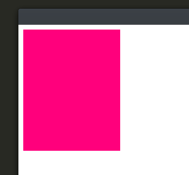

{width="96em"}

# Drawing shapes and lines

!!! warning ""
    The drawing APIs are a work in progress but still usable. Some parameters might change order and so on in the near future. These changes will be clearly marked.   

## Drawing contexts

In the [intro guide](../guide), a concept called **service APIs** was mentioned, which are general purpose tools that can be used directly. Drawing contexts are one of these services!

!!! note ""
    `:::js import "luxe: draw" for Draw, PathStyle, LineJoin, LineCap`   

The first step in using the `Draw` API is to create a drawing context. Think of it like a canvas to draw on. 

To create a context, we have to tell the canvas where to draw, and in our case, which world to draw into. To do this we ask the world for it's 'render set'. This is telling the canvas to draw inside our world, when the world is drawn. We're ready to draw a shape!

```js
var context = Draw.create(World.render_set(world))
``` 


!!! note ""
    In practice, if you're drawing UI, you would use `app.ui` for the world argument, and if drawing into the game world, use `app.world`.

## Drawing a box

We'll start by drawing a box, using `:::js Draw.quad(context, x, y, z, w, h, angle, color)`.    
<small>Keep reading if you don't see any drawing happening.</small>

```js
  //create the drawing context in the game world
var context = Draw.create(World.render_set(app.world))
  //draw a quad to the context
Draw.quad(context, 10, 10, 0, 200, 250, 0, [1, 0, 0.487, 1])
```

When you run this code, nothing shows up! 

This is because the context is waiting for more drawing so it can operate efficiently. When we are done drawing, we call `:::js Draw.commit(context)` to finalize the drawing and commit it to the context. This will make it show up on screen, **and it will stay there until you call commit again**. 

Let's make the box visible:


```js
var angle = 0
  //a nice pink color
var color = [1, 0, 0.487, 1]
  //create the drawing context in the game world
var context = Draw.create(World.render_set(app.world))
  //draw a quad to the context
Draw.quad(context, 10, 10, 0, 200, 250, angle, color)
  //we're done drawing for now, draw it!
Draw.commit(context)
```

When you run this, you should see the box show up, something like this:



## When to commit?

The reason the drawing context keeps our drawing going once we've committed it is because it allows us to draw a lot more, very efficiently. 

For example, if you were making a game that had a grid in the world, drawing the grid every frame has a cost. Instead, we can draw the grid once, up front, and let the context keep it rendered for us. Or if we had a game with a scrolling star field in the background, we can draw a lot of stars _just once_, and have them stay. 

This makes the drawing _persistent_, but what about drawing dynamically? 

To draw something different every game update (during your `tick` function), **you can call `:::js Draw.commit(context)` every tick**. Let's draw a block that changes size each frame.

!!! note ""
    When you call commit, it takes any drawing that was done since the commit before that, and draws it into the canvas. Any drawing that is committed, will stay visible until the next commit, at which point it will be cleared. **This means if you want to clear a context, just call `commit` without drawing!**

## Drawing a dynamic box

For this example, we'll be using time to animate something. So let's `import "luxe: io" for IO` in our `game.wren` before running this.
We also move the variables to class variables, so that we can see them from the tick function.


```js

  construct ready() {

    _angle = 0
      //a nice pink color
    _color = [1, 0, 0.487, 1]
      //create the drawing context in the game world
    _context = Draw.create(World.render_set(app.world))

  } //ready

  tick(delta) {

      //calculate a small bounce using time
    var bounce = (IO.timestamp() * 3).sin * 25
    var height = 200 + bounce

      //draw a quad to the context
    Draw.quad(_context, 10, 10, 0, 200, height, _angle, _color)
      //we're done drawing for now, draw it!
    Draw.commit(_context)

  }

```

With that drawing happening, we should now see a box animating like the one shown below.

<span style="display:block; font-size:0.8em; width:100%; text-align: center;"> If the video below won't load, <a href="https://i.imgur.com/uEcGrkB.mp4" target="_blank">view it here instead.</a></span> <br/>
<video preload="auto" controls="" loop="loop" style="max-width:90%; width:auto; margin:auto; display:block;">  
  <source src="https://i.imgur.com/uEcGrkB.mp4" type="video/mp4"></source>
</video>

## Multiple contexts

We can use multiple contexts to build layers in our game or UI, and they can all coexist. For example, if our UI in the game displayed a number that changes all the time, we can draw that part dynamically in it's own context. The rest of the UI might not change at all, so we can draw that in it's own context, up front, just the one time.

It is very common to have several contexts around! That's what they're for.

## Conclusion

The drawing contexts are useful for more than just in game or UI items! 

You'll find that drawing debug information with the contexts is a very useful tool while making games. They're a multi purpose tool, useful for making entire games with, drawing optional debug details, or using to add layers to your worlds.
