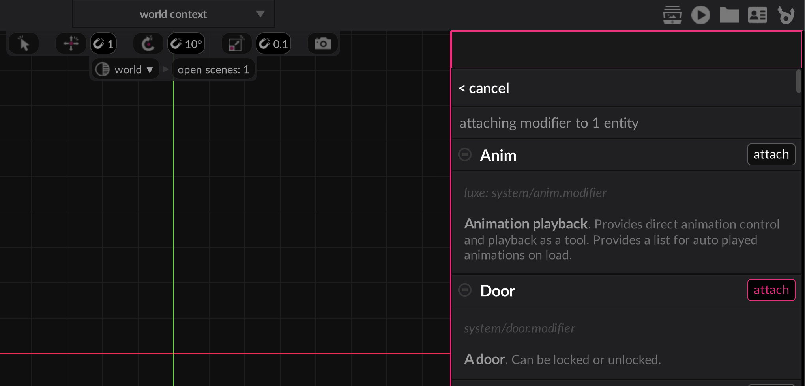

{width="96em"}

# Custom modifiers

!!! note ""
    The moving parts involved with custom modifiers are still evolving behind the scenes.   
    This shouldn't affect existing systems you create much (if at all).

    The core shape of the idea is there, though all the customization, flexibility and workflow
    will improve over time.

## Step 1. A modifier.lx file

This is the only step needed to get a new modifier set up. 
If we're making a **system** to keep track of how thirsty an entity is, we can make a `modifier/thirst.modifier.lx` file.
This file describes inputs and data for the system, stuff to display in the editor etc.

```js
modifier = {
  script = "modifier/thirst"
  description = "Makes an entity able to express thirst."
  field = "thirst"
  display = "Thirst"  //the display in the editor
  class = "Thirst"    //The code generated name for the modifier API
  block = {           //The data for the modifier
    fields = [
      { name="amount" type="number" default=0 } //how thirsty currently
      { name="max" type="number" default=1 }    //the max for amount
    ]
  }
}
```

Once you have this file, run `luxe build` (or run), which will generate a `modifier/thirst.wren` and `modifier/thirst.modifier.wren`.
The important file is `modifier/thirst.wren`. This is the code for your system. Below shows what it looks like by default, 
and the comments elaborate on what goes where and why. 

### The editor side

At this point, you can already attach your modifier to entities in the editor. 




Or via code, you can also already `import "modifier/thirst" for Thirst` and then do `Thirst.create(entity)`.

### The modifier system code

```js
import "luxe: io" for IO
import "luxe: world" for World, Entity, Modifiers, ModifierSystem

//User facing API
//This is what the user of your modifier will interact with
class Thirst {

  static create(entity) { Modifiers.create(This, entity) }
  static destroy(entity) { Modifiers.destroy(This, entity) }
  static has(entity) { Modifiers.has(This, entity) }

} //Thirst

//Your modifier system implementation.
//This speaks to the engine and your user facing API
//to do the actual work. You'll get notified when things change
//in the world and respond to them here.
class ThirstSystem is ModifierSystem {

  construct new() {
    //called when your system is first created.
  }

  init(world) {
    _world = world
    //called when your modifier is created in a world
  }

  destroy() {
    //called when your modifier is removed from a world
  }

  attach(entity, data) {
    //called when attached to an entity
  }

  detach(entity, data) {
    //called when detached from an entity, like on destroy
  }

  tick(delta) {
      //called usually once every frame.
      //called when the world that this modifier lives in, is ticked
    each {|entity, data|
      //use data.*
    }
  } //tick

} //ThirstSystem

var Modifier = ThirstSystem //required
```

## Step 2: Make it do something

An empty modifier isn't that interesting, let's make it slowly increase thirst.

One important thing to understand about modifiers is that **a single system deals with multiple entities** (one to many).
That means our thirst modifier is managing thirst for any entity that has it attached, rather than a single entity.

This has many benefits, including performance and access/visibility. An example would be if we wanted to know the most thirsty entity in a world.
This is something our system can trivially answer, rather than making gameplay code try to find + iterate instances.

### The user facing API

Assuming that we'll want to code something somewhere that needs to know how thirsty an entity is, 
we can make our API offer that information. [API concepts](../../../guide/concepts/#api-patterns) covers this a bit,
our API is a static one atm. We'll add functions to get and set the `amount` and `max` to our API.

```js
class Thirst {

  static create(entity) { Modifiers.create(This, entity) }
  static destroy(entity) { Modifiers.destroy(This, entity) }
  static has(entity) { Modifiers.has(This, entity) }

  static get_amount(entity) {
    var thirst = Modifiers.get(This, entity)
    return thirst.amount
  }

  static set_amount(entity, value) {
    var thirst = Modifiers.get(This, entity)
    thirst.amount = value
  }

  static get_max(entity) {
    var thirst = Modifiers.get(This, entity)
    return thirst.max
  }

  static set_max(entity, max) {
    var thirst = Modifiers.get(This, entity)
    thirst.max = max
  }

} //Thirst
```

### System logic

Now the user of our system can access the values. 

Next we'll want to implement some logic in the system. Our system `:::js class ThirstSystem is ModifierSystem`
has the `tick` function, which is where we can implement logic that happens over the time. 
Since we want our thirst to change over time, we'll implement it here. 

_Note: this isn't realistic code, just an example._ 
The first thing we'll do is rename `data` to `thirst` for clarity.
Notice that we're operating on all entities that have `thirst` attached.

```js
  tick(delta) {
      //called usually once every frame.
      //called when the world that this modifier lives in, is ticked
    each {|entity, thirst|
      //use thirst.*
      if(thirst.amount < thirst.max) {
        thirst.amount = (thirst.amount + (2 * delta)).clamp(0, thirst.max)
      }
    }
  } //tick
```

To be continued...
