{width="96em"}

# Using tilemaps

In this tutorial we'll:

- Create a tile map
- Add visuals to it to paint with
- Paint some tiles, make some brushes
- Use that tile map in the world
- Add collision to it using the Arcade modifier

**Assets**

**This tutorial is using the [Amarelo](https://adamatomic.itch.io/amarelo) tilesheet.** 

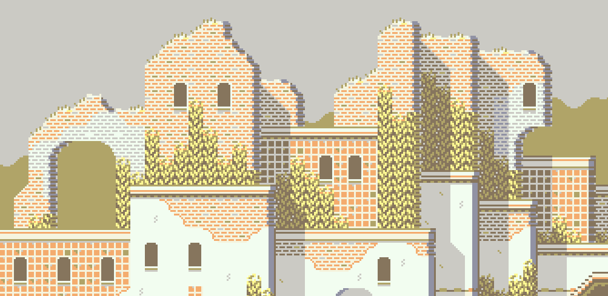

You can grab it for free from the link above, or save the image below into your project.

!!! note "The image is small because it is pixel art. We'll use the `pixel` outline to work at this scale"

## Create the project

We'll use the launcher to create the project, and use the pixel project outline.
When creating the project, is offers the choice of a background color. We'll pick custom,
and match the background color to the tiles. You can use `#cbcac5` as the color.

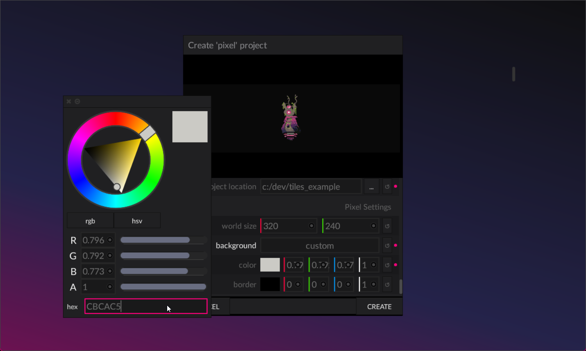

## Tiles editor context

We can find the tile editor using the context menu:

Once we enter it, this is what it looks like:

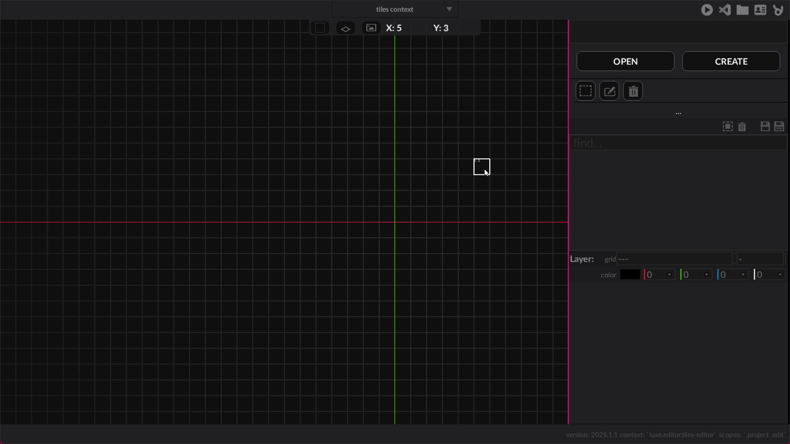

## Create a tilemap

We'll need a tiles asset to paint into. The editor can open and edit multiple at once, but we'll just need one for now.
Omni has a create button just for this, so let's use it to create a tiles asset.

This will present you with the asset location, where we'll name our asset `outside` and hit the create 'tiles' asset button.

Once we do, we'll see something along these lines: The brush tool is selected, and it has a visuals panel with no visuals yet.

!!! note "Tiles visual assets"
    
    When you create tile based games, it's often common for multiple areas in a game to share the same visuals.

    If you had a snowy outdoor tile set, it can often be used in a few different tile map assets around different locations in the game. 
    In luxe there is a **_tiles visual asset_** that can be shared across tile maps, and one is created for your tiles by default (for now).

!!! warning "WIP: Note there are multiple assets involved, so make sure to save all!"

## Adding visuals

Since there was a visual asset created for our tiles, we can go straight to adding visuals. 

Let's take a walk through adding regular images (often used to break up the tile grid), and tile sheets (multiple tiles packed into one image).

When the brush tool is active, and a visual asset is selected, there's a `+` button to add tile visuals.

Once we hit the `+` button we'll be presented with a list of options to add:

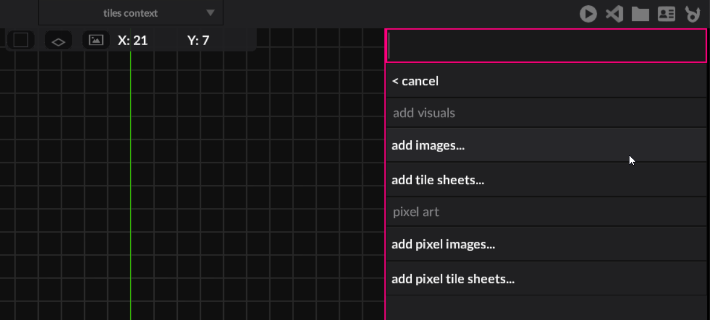

!!! note "We have added some images from the tutorial project for example"

### adding images

If we choose `add images...` we'll be presented with the asset picker, which allows us to select _multiple_ assets at once.

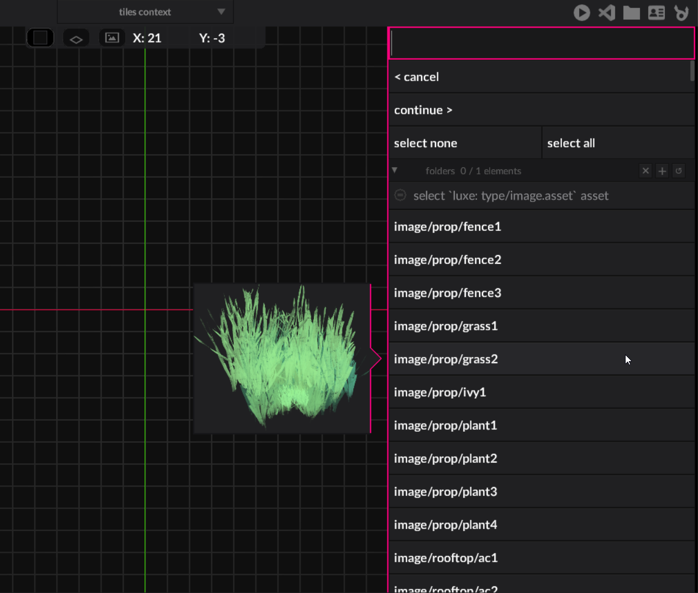

Selecting an asset will highlight it, allowing us to pick a few, and then hit continue. We'll not do this yet, and use `select none` to cancel the test selection.

Instead, since we have `image/prop` and `image/rooftop` folders, let's say we want to add just the rooftop assets for now. We can use the folders filtering to limit the list:

We can add multiple folders if we like:

Once we have filtered our list, we can use select all, and multi select to add or remove items from the selection.

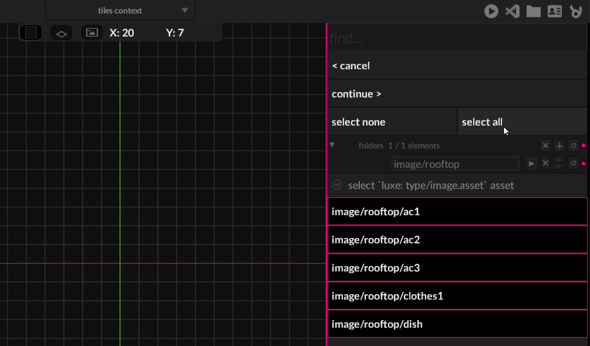

If you select `continue >` we are given the chance to customize the visuals, typically the **uv** and **size** field. The size is how big the actual tile will be when painted as a tile, so this is typically something to take note of. It defaults to the image size, for our example we'll change it to 10x smaller, e.g `29.3 x 22.7`.

If you select the `all` button, you can quickly edit the uv or size of any of the added visuals in one go.

Once we're `done >` we can see the visuals have been added to our tile palette, this is where we can select a tile to paint with. 

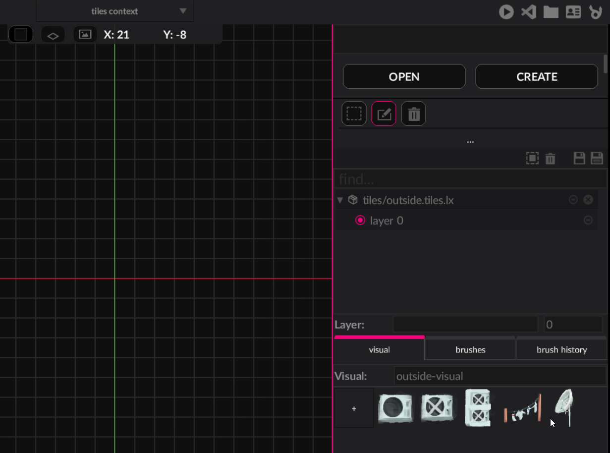

Selecting our new image and painting with it will allow us to treat the image like a tile.

Selecting an existing tile that was painted on the tile map will allow you to customize the individually painted tiles. You can make one bigger or smaller, different colors, offsets and so on at the tile level.

### adding tile sheets

The process for adding a tile sheet with mutliple tiles is very similar, all the filtering and selecting is the same, the important thing is what happens in the customize page. 

First choose add tile sheets (pixel this time!):

We'll go pick our tiles image by searching for it, then hitting `continue >`

!!! bug "Ignore the weird sorting for now when searching!"

The customize page shows our tiles image with a small grid overlayed on top. 

Since we know our tilemap has `8` tiles across, and `11` tiles down, we can enter this. If you're not sure, you can see a realtime preview of the grid as you change these:

If you only know the tile size in pixels, you can change the `input` to `as_size`, which will let you input pixel size for the tiles. Our are 8x8 which was calculated automatically by the grid, and the grid would be auto calculated if we input a size.

If we hover an individual tile on the grid we can see a preview of that tile:

And finally, the advanced section has settings for if your tiles have padding, or a margin on the image. We don't need this here, but it is there:

Once we select `done >` we will see all the individual tiles added to our tile palette, allowing us to paint with them.

## Tile grid size

If we paint a tile we should notice that it doesn't fit as expected!

If you select the tilemap itself, instead of a layer to paint on, you can configure the grid size of the tile map as well as the background color. Our grid should be 16x16 for this one, and immediately it updates to look correct:

## Brushes

The benefit of tile maps, is that painting tiles is all about the sum of parts. We combine small repetitive pieces into much larger images.

This is very often a recursive process. We combine 4 tiles to make a window. We combine 2 windows and a door to make a house. We combine many houses to make a city and so on. 

To facilitate this workflow, luxe tiles work based on combining tiles into brushes. This doesn't just apply when you make a brush manually, it actually applies to every operation. Painting is brush based, copy takes the selection and makes a brush, cut creates a brush and so on.

### brush history

Any time you do an operation that creates a brush, the brush history panel will remember it, so you can return to it and use it to build more elaborate things:

You'll also be able to save that brush into an asset, so that it's reusable across tile maps + sessions using the save icon. After that it'll exist in the brush tab instead of brush history! Making brushes reusable is important, but a significant amount of the brushes can be temporary because you can always select and copy them.

This is also true while painting, using a corner of the tilemap to compose a complex brush, then copying it out, optionally saving it is a very important part of the workflow!

### making a brush

We'll start by painting a window. For this we used flip (++f++ or ++v++ key by default) and rotate (++r++) to reuse the same tile in different ways.

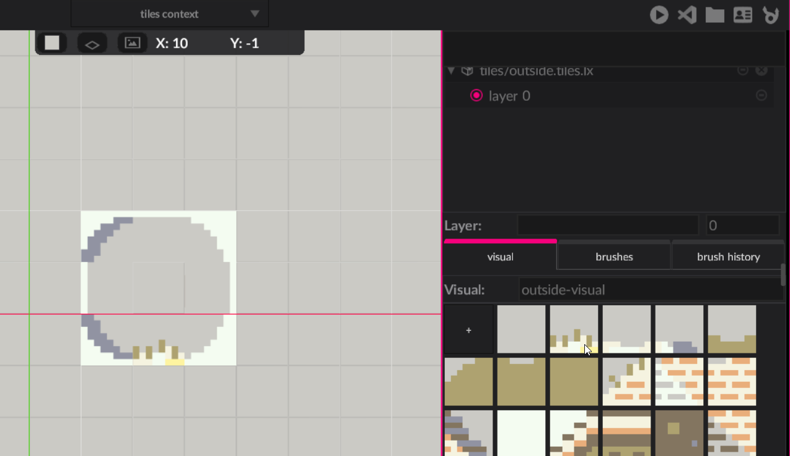

We switch to the select tool by pressing ++q++ or using the select tool icon.

We can drag a rectangle in order to select the region of tiles we care about:

When we release the rectangle each tile will show as selected:

When we press copy (++ctrl+c++) it will copy our selection into a brush, and we can now paint with the whole window as a brush!

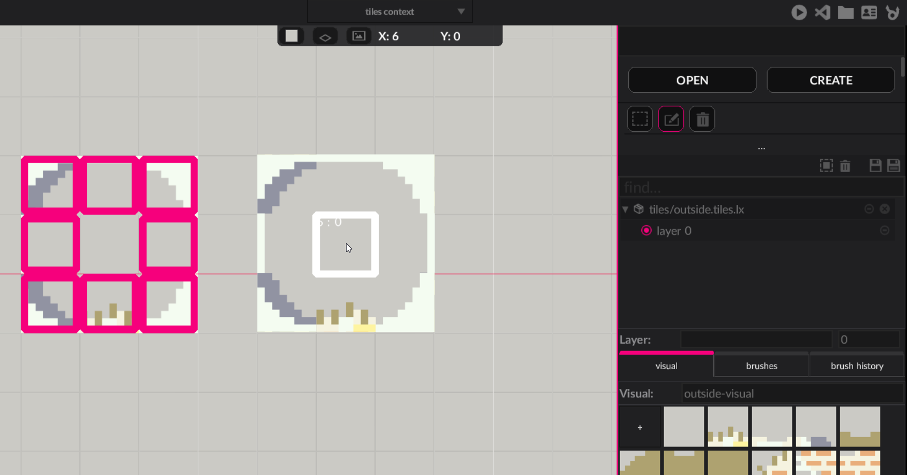

If we draw with the brush around on the tile map you'll notice that the brush will be treated as a whole unit, it won't paint over itself, so we can lay down windows side by side easily:

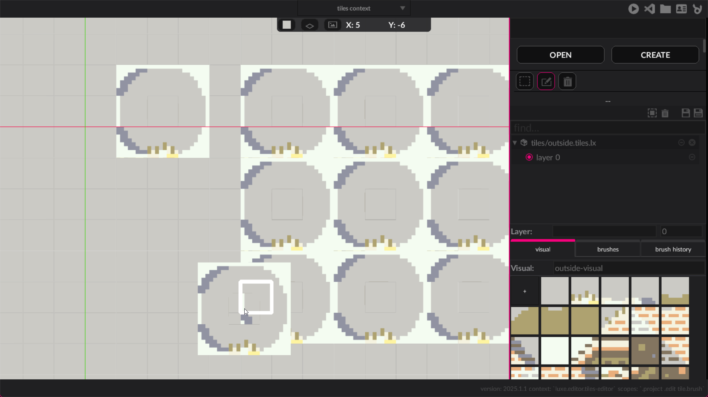

You can control this behaviour from the top toolbar, there's a few modes. Selecting the icon will cycle through modes for painting.

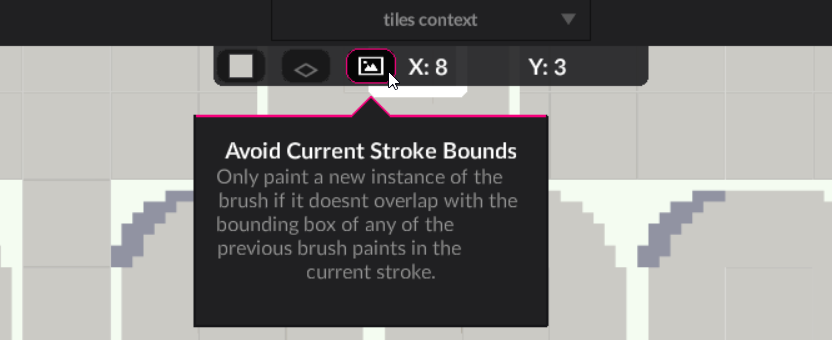

And as mentioned, we created a brush by copying, so it shows in the brush history.

## The tiles modifier

To use the tile map we just created, we use the typical workflow using modifiers in the world editor. 

Create an entity, attach the `Tiles` modifier, and select the tiles asset you created.

!!! bug "Automatic updates/hot updating of the tiles assets in the world are still being finalized, you might need to reload the editor to see the latest version of your tilemap."

To demonstrate, here's a painted tilemap:

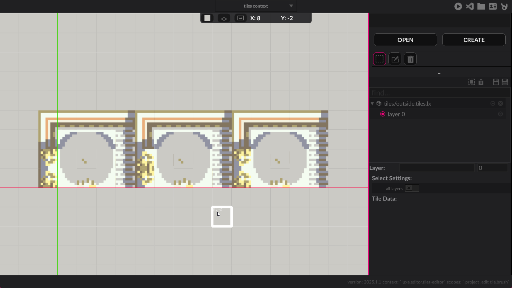

Once we attach them to an entity, we can see and use them in the world:

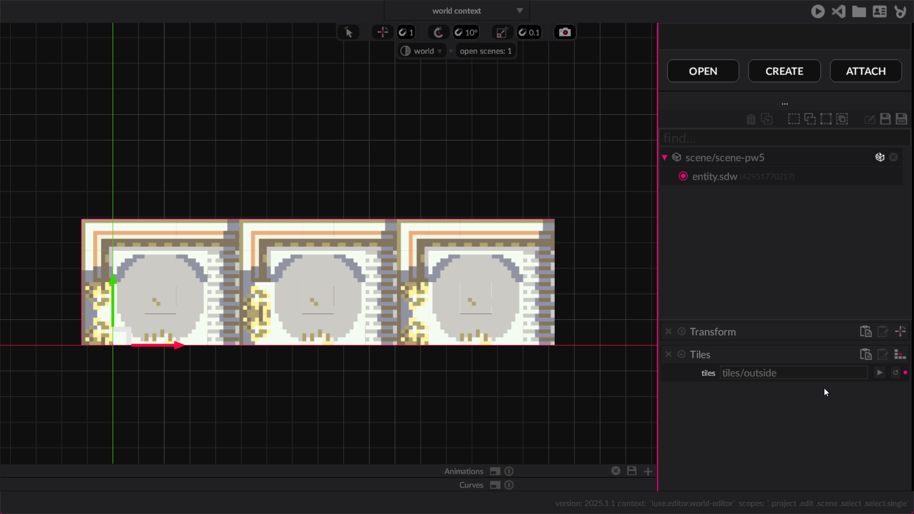

And since they're an entity with a modifier, we can duplicate, scale, transform them as usual using `Transform`.

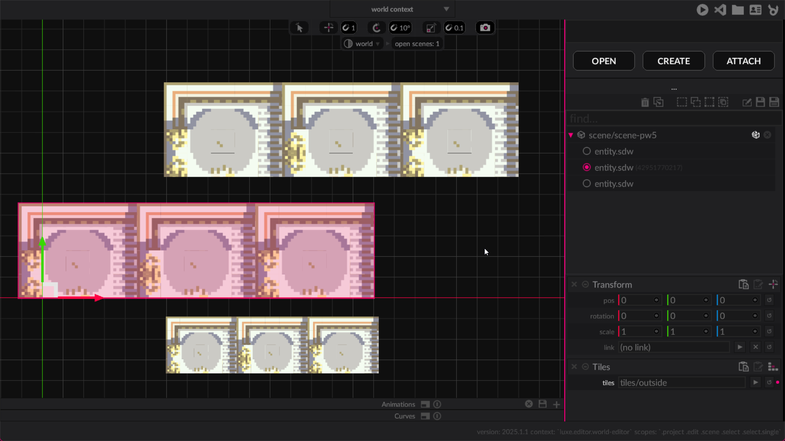

## Tile collision with Arcade

If you're using the arcade collision module, it provides a modifier that can convert tiles into solid shapes.
This combines nearby tiles into rectangles to make the least amount of rectangles.

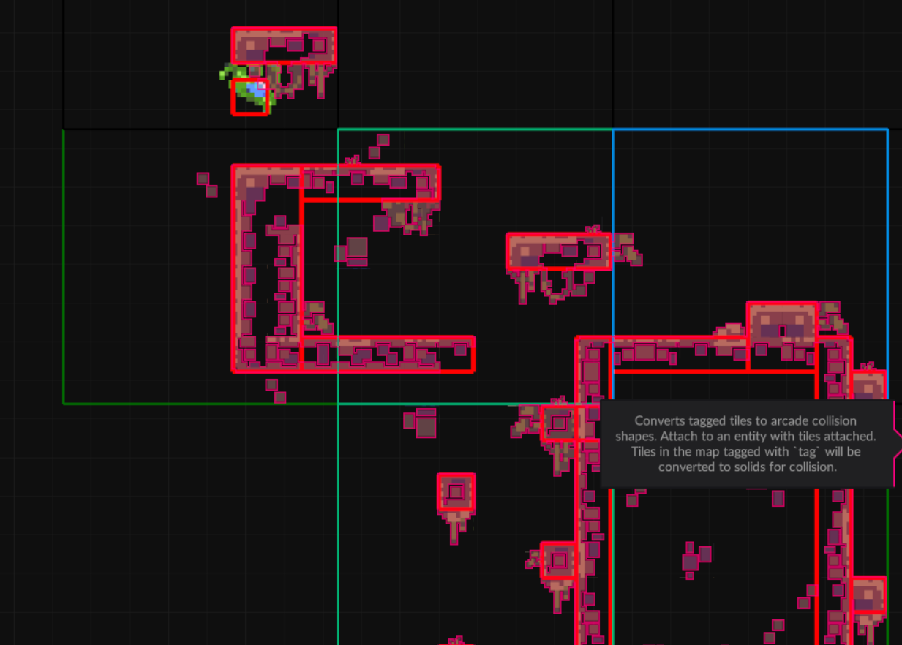

### tile tags

To start, we have to tag our tiles with a tag. The default one the arcade tiles collision uses is `solid`. 
We select the tiles we want to be solid collision, and edit the tags to include `solid`.

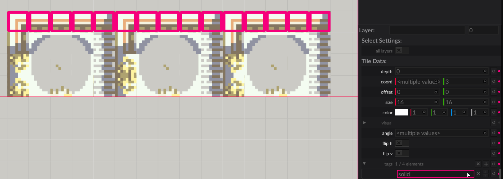

### arcade collision

In the world editor, you attach the `Arcade: Tile collision` modifier it to the entity with the `Tiles` on:

Once you have, you can match the tag so that the collision is automatically generated!

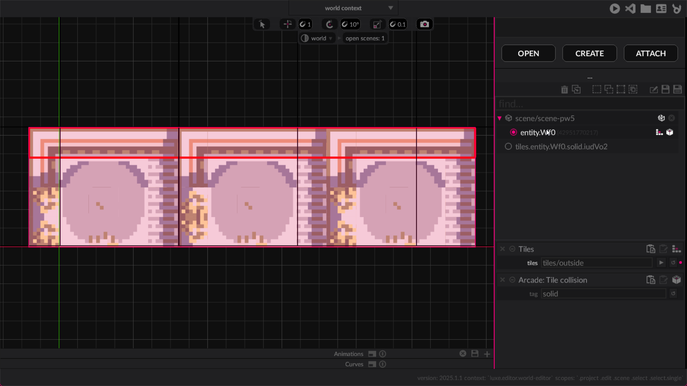

## New tile editor

Note that this iteration of the tile editor is brand new, please report any issues, workflow quirks and so on. We'll be polishing it up as we go! 

