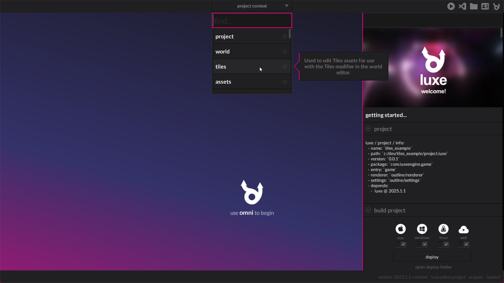
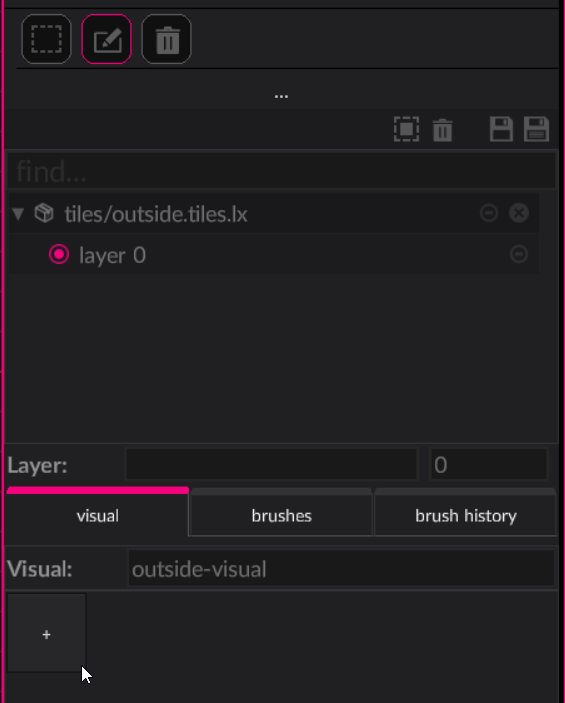
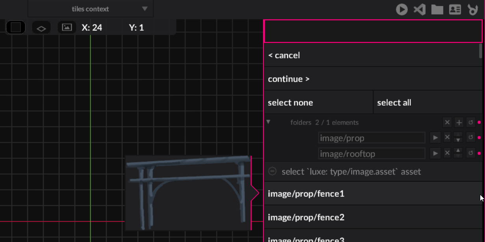
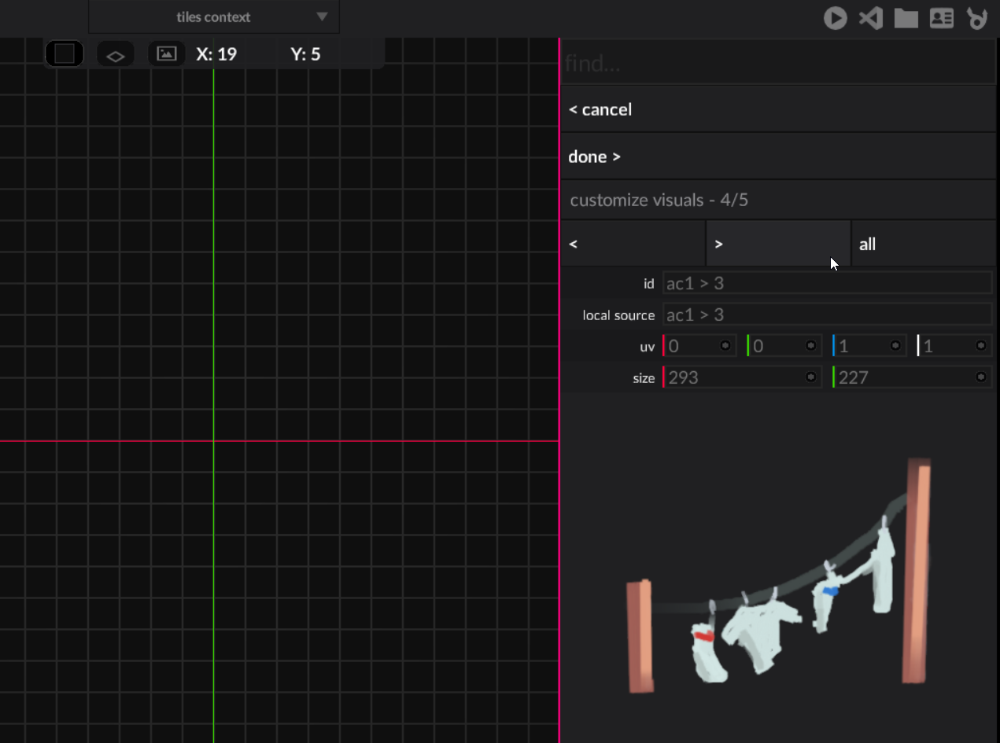
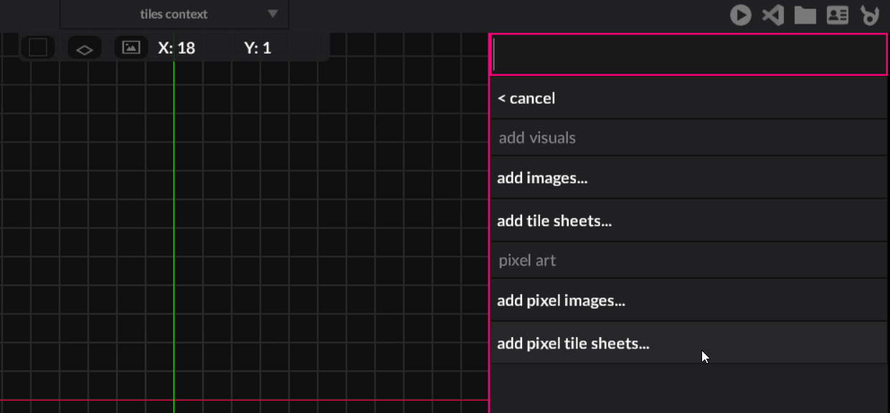
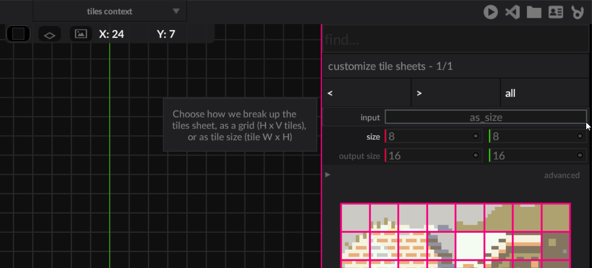
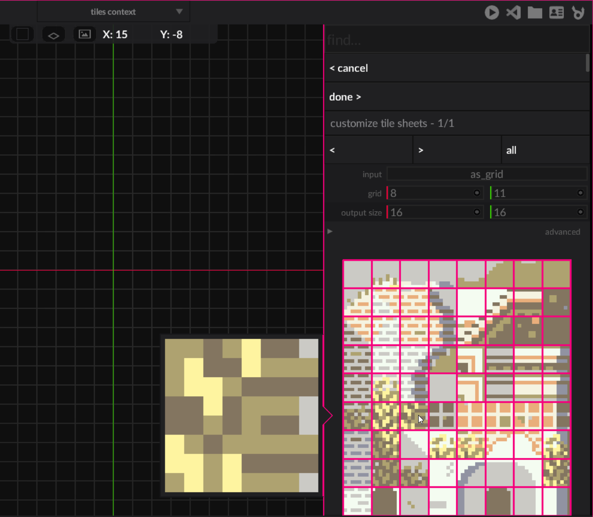
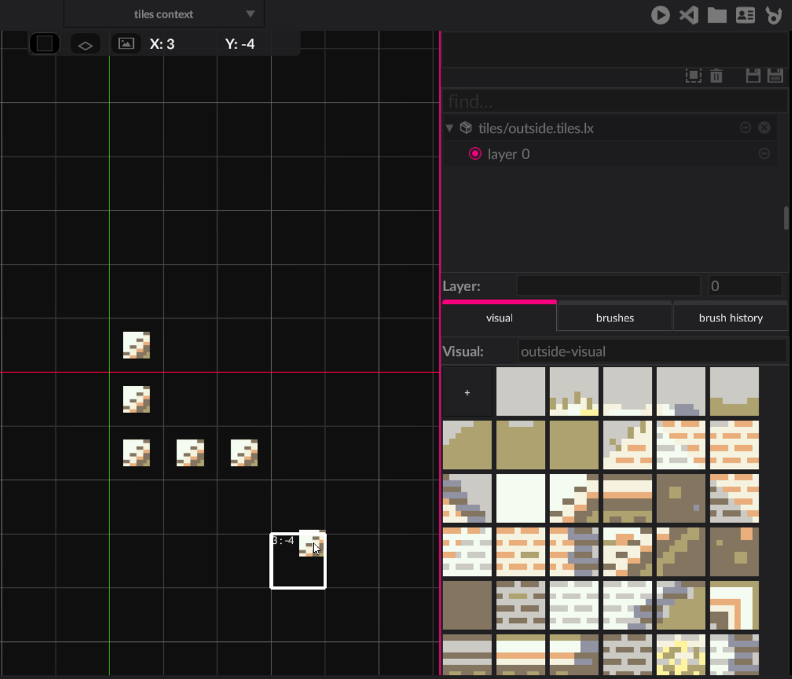

{width="96em"}

# Using tilemaps

In this tutorial we'll:

- Import a tile sheet
- Create a tile map
- Use that tile map in the world
- Add collision to it using the Arcade modifier

**Assets**

**This tutorial is using the [Amarelo](https://adamatomic.itch.io/amarelo) tilesheet.** 

You can grab it for free from the link above, or save the image below into your project.

!!! note "The image is small because it is pixel art. We'll use the `pixel` outline to work at this scale"

## Create the project

We'll use the launcher to create the project, and use the pixel project outline.
When creating the project, is offers the choice of a background color. We'll pick custom,
and match the background color to the tiles. You can use `#cbcac5` as the color.

## tiles editor context

We can find the tile editor using the context menu:

Once we enter it, this is what it looks like:

## create a tilemap

We'll need a tiles asset to paint into. The editor can open and edit multiple at once, but we'll just need one for now.
Omni has a create button just for this, so let's use it to create a tiles asset.

This will present you with the asset location, where we'll name our asset `outside` and hit the create 'tiles' asset button.

Once we do, we'll see something along these lines: The brush tool is selected, and it has a visuals panel with no visuals yet.

!!! note "Tiles visual assets"
    
    When you create tile based games, it's often common for multiple areas in a game to share the same visuals.

    If you had a snowy outdoor tile set, it can often be used in a few different tile map assets around different locations in the game. 
    In luxe there is a **_tiles visual asset_** that can be shared across tile maps, and one is created for your tiles by default (for now).

!!! warning "WIP: Note there are multiple assets involved, so make sure to save all!"

## adding visuals

Since there was a visual asset created for our tiles, we can go straight to adding visuals. 

Let's take a walk through adding regular images (often used to break up the tile grid), and tile sheets (multiple tiles packed into one image).

When the brush tool is active, and a visual asset is selected, there's a `+` button to add tile visuals.

Once we hit the `+` button we'll be presented with a list of options to add:

!!! note "We have added some images from the tutorial project for example"

### adding images

If we choose `add images...` we'll be presented with the asset picker, which allows us to select _multiple_ assets at once.

Selecting an asset will highlight it, allowing us to pick a few, and then hit continue. We'll not do this yet, and use `select none` to cancel the test selection.

Instead, since we have `image/prop` and `image/rooftop` folders, let's say we want to add just the rooftop assets for now. We can use the folders filtering to limit the list:

We can add multiple folders if we like:

Once we have filtered our list, we can use select all, and multi select to add or remove items from the selection.

If you select `continue >` we are given the chance to customize the visuals, typically the **uv** and **size** field. The size is how big the actual tile will be when painted as a tile, so this is typically something to take note of. It defaults to the image size, for our example we'll change it to 10x smaller, e.g `29.3 x 22.7`.

If you select the `all` button, you can quickly edit the uv or size of any of the added visuals in one go.

Once we're `done >` we can see the visuals have been added to our tile palette, this is where we can select a tile to paint with. 

Selecting our new image and painting with it will allow us to treat the image like a tile.

Selecting an existing tile that was painted on the tile map will allow you to customize the individually painted tiles. You can make one bigger or smaller, different colors, offsets and so on at the tile level.

### adding tile sheets

The process for adding a tile sheet with mutliple tiles is very similar, all the filtering and selecting is the same, the important thing is what happens in the customize page. 

First choose add tile sheets (pixel this time!):

We'll go pick our tiles image by searching for it, then hitting `continue >`

!!! bug "Ignore the weird sorting for now when searching!"

The customize page shows our tiles image with a small grid overlayed on top. 

Since we know our tilemap has `8` tiles across, and `11` tiles down, we can enter this. If you're not sure, you can see a realtime preview of the grid as you change these:

If you only know the tile size in pixels, you can change the `input` to `as_size`, which will let you input pixel size for the tiles. Our are 8x8 which was calculated automatically by the grid, and the grid would be auto calculated if we input a size.

If we hover an individual tile on the grid we can see a preview of that tile:

And finally, the advanced section has settings for if your tiles have padding, or a margin on the image. We don't need this here, but it is there:

Once we select `done >` we will see all the individual tiles added to our tile palette, allowing us to paint with them.

## tile grid size

If we paint a tile we should notice that it doesn't fit as expected!

If you select the tilemap itself, instead of a layer to paint on, you can configure the grid size of the tile map as well as the background color. Our grid should be 16x16 for this one, and immediately it updates to look correct:

