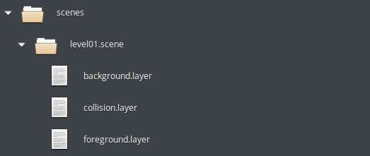

# Creating a scene

## World, Scenes, Layers

We saw the relationship between _things_ in the [intro guide](../guide). The world contains entities, which have modifiers attached.

In the previous tutorials, we created an entity via code. Now, we'll use the editor to create a scene with multiple entities, and then load that scene from code.

This can be used to make levels, menus, and more.

## Scene assets

**A scene is like a container for entities.** It contains entities already configured with their modifiers attached, ready to be loaded into the world.

!!! note ""
    You can load multiple scenes into the world at once!

Scenes are a little bit different to other assets because they are a folder, and not a file. **We still refer to a scene as an asset**, which means we speak about the scene by it's asset id, just like other assets. For the example below, we use `scenes/leve01` (without the extension).

A scene folder contains a list of _layers_, where a layer is an asset that contains a list of entities. Each layer is loaded when the scene is loaded, and we don't refer to a layer asset directly, it is a part of the scene asset.

??? note "Why is the scene a folder?"
    The scene is a folder is for workflow reasons. 

    A scene needs to contain multiple layers so that multiple people can work on the same scene, without modifying the same file. This enables teams to build levels without file conflicts. It is also because we want to be able to only load a subset of a scene in the editor, say, just the trees + the ground, rather than the entire scene. This keeps workflow rapid.

## An example scene

Imagine a 2D game with a sky in the background, and a foreground that the player runs along. We also have some collision information, that is loaded with the scene. In your project folder, it will look something like this:



## Loading a scene
We can add an import the `Scene` API from the world:
```js
import "luxe: world" for Entity, Sprite, Scene
```

With our example in place, we can now load `scenes/level01` into the game world. To do this, we use `:::js Scene.load(world, scene_asset)`, like this:

```js
Scene.load(app.world, "scenes/level01")
```

And that's it! The entities in the scene should exist in the world. We can use `:::js Scene.unload(world, scene_asset)` to remove any entities that the scene created (that are still around).

## Querying for entities

Now that we've loaded our scene, we might want to grab some entities that it created in the world, and manipulate them. There are a few ways to do this.

### Name

Entities typically have a name assigned, which means we can find them in the world by name. We can fetch an entity like this:

```js
var spawn_location = Entity.get_named(app.world, "start")
```

However, be aware that the name of an entity is not unique. There can be two or more entities named `start`. Which one will you get back?
The `Entity.get_named(world, name)` function will return the first one it finds, so it's not well defined. We might want to fetch _all_ the entities named `start`, which `Entity.get_named_all(world, name)` will do: 

```js
var start_locations = Entity.get_named_all(app.world, "start")
  //we now have a list of possible entities we can use.
  //(the pick random function is just for example sake)
var start_location = pick_random(start_locations)
```

### Tags modifier

If you attach a `Tags` modifier to your entity, you can fetch all entities with a given tag using `:::js Tags.list(world, tag)`. So for instance, any entities tagged with "tree" would be:

```js
var trees = Tags.list(app.world, "tree")
  //lets filter the trees, say, to ones > 10 units on Y
trees = trees.where {|tree| Transform.get_pos_y(tree) > 10 }.toList
  //now we have a few trees we can modify
trees.each {|tree| Tags.add(tree, "above_10") }
```

### UUID

Each entity does have a unique ID, even if it's name is shared. You'll see these `uuid` inside the scene files.

Typically you don't interact with these directly, but if you have a uuid you can fetch the entity via `:::js Entity.get(uuid)`. This one doesn't need a world, because a uuid is unique to all entities in any world.

## Creating a scene in editor

For now, here is a very short video showing how to create a scene with some entities in.
If the video below won't load, <a href="https://i.imgur.com/GZfOY4H.mp4" target="_blank">view it here instead.</a>

<video preload="auto" controls="" loop="loop" style="max-width:90%; width:auto; margin:auto; display:block;">  
  <source src="https://i.imgur.com/GZfOY4H.mp4" type="video/mp4"></source>
</video>
