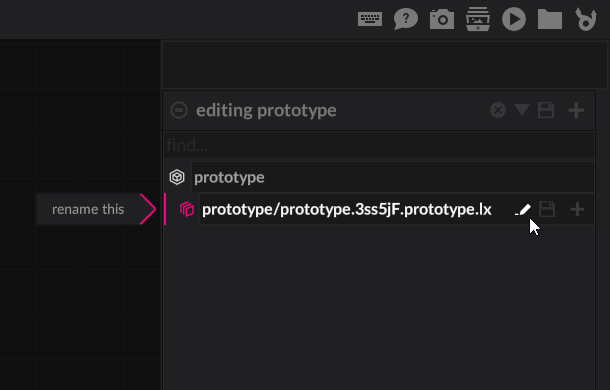
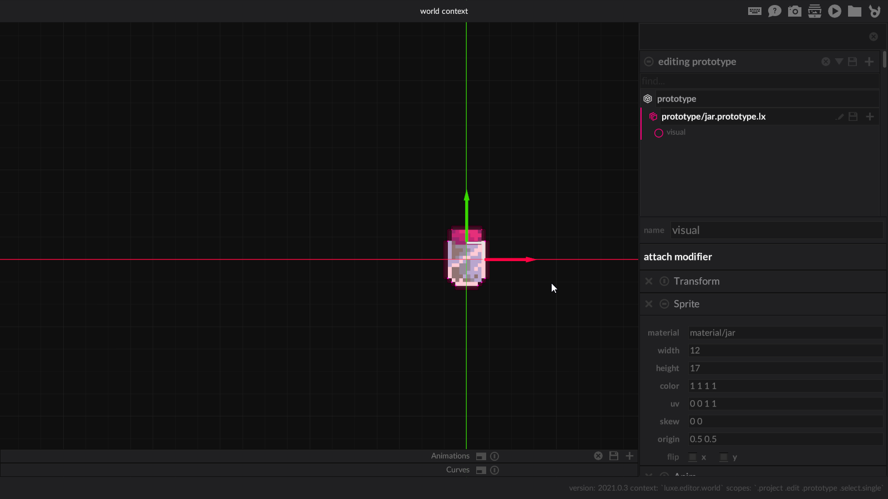
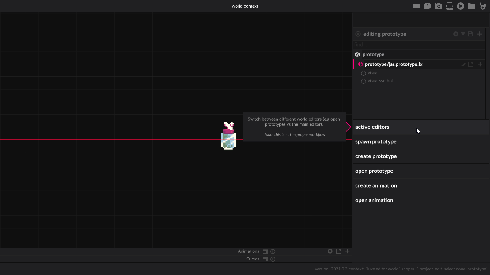
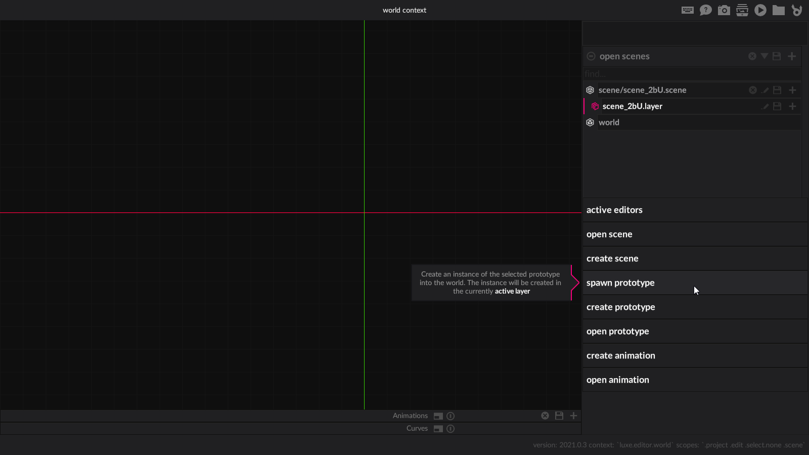
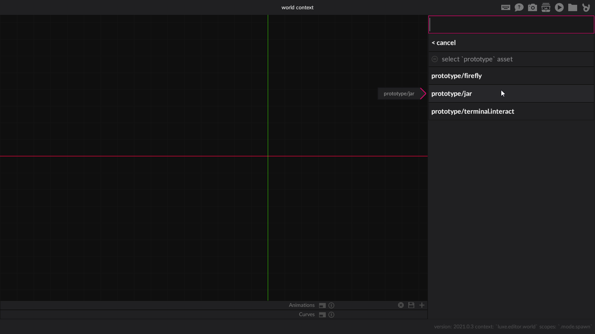
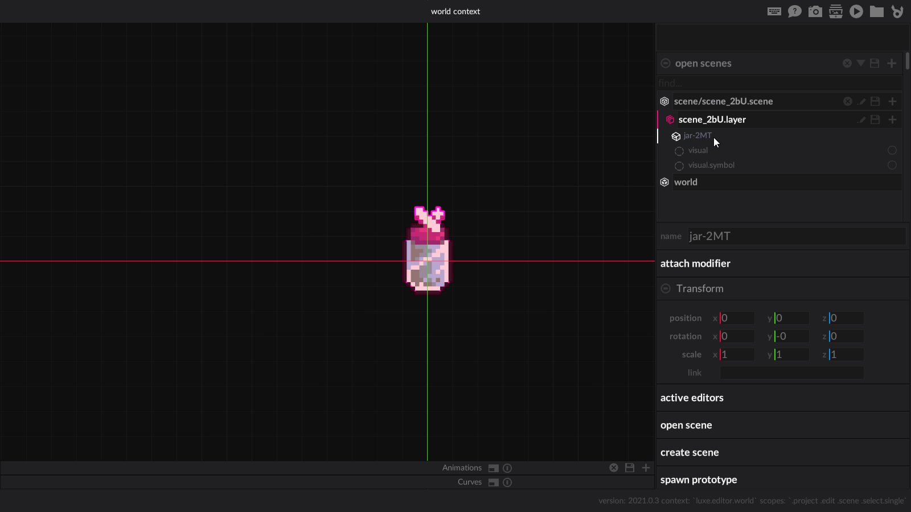
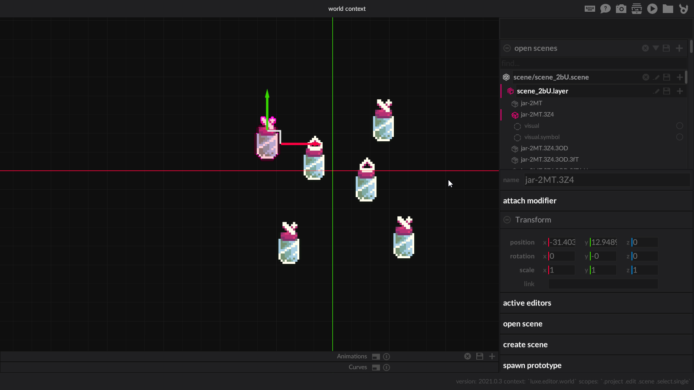
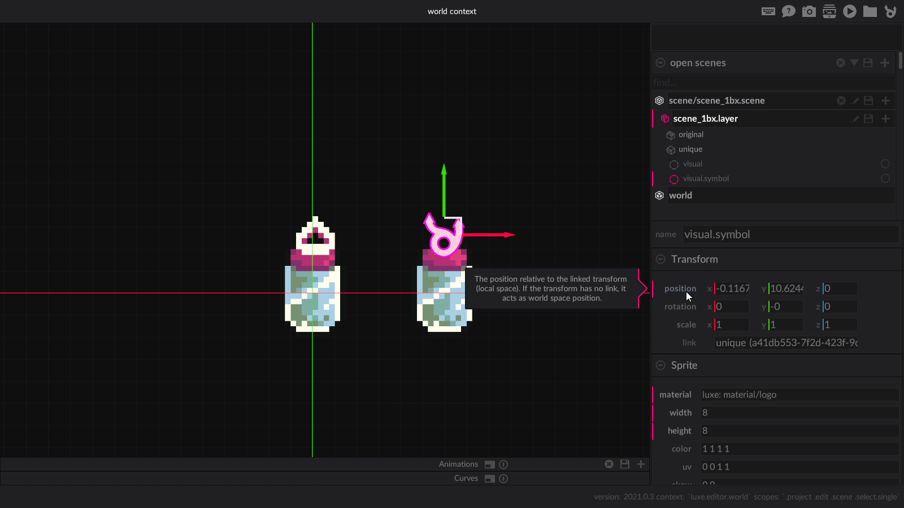
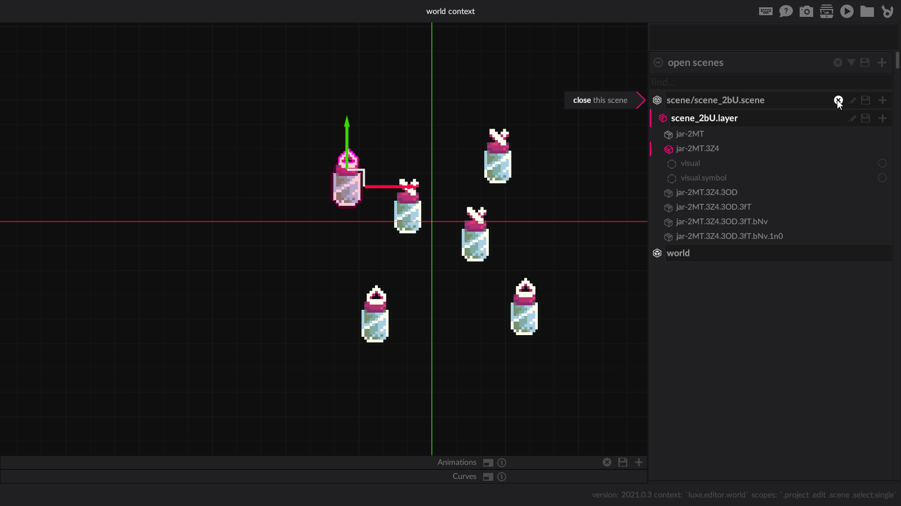

{width="96em"}

# creating prototypes

!!! example "outcome"
    In this step we'll see how to use the editor to create a prototype,
    then create an instance of it in code.

## create a jar prototype

### A prototype is ...

A prototype is a reusable bunch of entities with their modifiers already
configured, which we can create copies of in the world. 

!!! note ""
    Prototypes are a work in progress as you'll see, but are still useful and go a long way.

Similar to a template, they can also be used as a shared base
with variations added on top. For example in a card game, 
you might have a card prototype that defines all the behaviours of a card,
and then a bunch of variations that extend that and customize the costs, 
images, effects and more.

!!! note ""
    The word prefab is sometimes used for a similar concept.

### creating a prototype

In omni, there's a **create prototype** option. 

Clicking it will create a new world, separate from the main world editor, where you edit the prototype in isolation.

{: loading=lazy }

We're going to rename our prototype to `prototype/jar`. The familiar pencil icon is on the prototype name.

{: loading=lazy }

{: loading=lazy }

Editing a prototype is basically the same as editing a scene. We need two entities, 
one for the jar visual, and one for the symbols on the jar that we'll control separately.  

We'll create an entity and name it `visual`, and give it the following modifiers:
  
  - Anim
  - Transform
  - Sprite 

And change the sprite **material** to `material/jar`. That's it for the jar itself.

{: loading=lazy }

Next we'll create an entity called `visual.symbol`, and give it the same modifiers.

We'll set the Sprite **material** to `material/symbols`, which should show the two symbols side by side.
Change the **width** value to `9`, so that the sprite is a square `9x9`. This will squash the image but
we're going to play an animation.

On the `Anim` modifier, select the **add** field and select `anim/symbols` which will start animating in the editor.

And lastly, we move the entity to `x 1 y 9`, either by changing the values on the `Transform`
or using the move gizmo (don't forget to set the snap value to 1).

{: loading=lazy }

!!! tip "save the prototype"

## using a prototype from code

Now that we've made an asset, we'll use it from the code similarly to how we did with a scene.

!!! tip "switch back to code, inside area1.wren"

To instance a prototype in the world, we'll use 

```js
Prototype.create(world: World, asset_id: String, instance_name: String)
```

It returns an entity that acts as the root of the prototype, where destroying the root cleans up all entities created by the prototype,
moving the transform on the root moves all entities connected to it (e.g ones with a transform but no explicit `link`).

This root is the representation of the jar as a single distinct thing.

Create a method called `create_jar` in `area1.wren` which is where we'll call this. 

### Prototype.create

We know in this particular area there will only ever be 1 jar, so we can store the instance in a field called `_jar`.
We can start by checking if a previous jar exists, and destroy it if so. 

Then, we'll instance a new one and set it's position near to the player position temporarily, for testing. 

```js
create_jar() {

    //If a jar exists, remove it from the world
  if(_jar) Entity.destroy(_jar)

    //instance a new jar into the world
  _jar = Prototype.create(_world, "prototype/jar", "jar")

    //temporary: set it to the player position
  var player_pos = Transform.get_pos(_player)
  Transform.set_pos(_jar, player_pos.x, player_pos.y + 64, player_pos.z + 1)

} //create_jar
```

We're going to call this somewhere more specific later, but for now we'll add temporary code to create the jar
when you press the space key. In the `tick` method, add the code to do that:

```js hl_lines="5 6 7"
tick(delta) {

  if(!_player) return

    //temporary: debug create a jar
  if(Input.key_state_released(Key.space)) {
    create_jar()
  }

  update_terminals()

} //tick
```

!!! tip "run the game and press space"

Now as we move around we can press space to see our jar appear where we are at the time.

<video preload="auto" autoplay controls="" loop="loop" style="max-width:100%; width:auto; margin:auto; display:block;">  
  <source src="../../images/tutorial/intro/create-prototype-5.mp4" type="video/mp4"></source>
</video>

We'll be configuring this instance further in the next step, but let's take a quick look at prototypes in the editor.

## instancing a prototype in editor

Since we're using the above prototype from code, 
it might be good to take a brief detour into seeing how prototypes are used in the editor when placing them in scenes, 
and the known issues associated with that.

Currently, to switch between a prototype and the world editor, there's an **active editors** button in omni.
This will show a list of editors that are active, where you switch to or from the world editor.

{: loading=lazy }

The world editor is called `luxe.editor.world` at the moment.

{: loading=lazy }

This takes you back to the world editor, but where is the option to instantiate an instance of a prototype?
In order to spawn a prototype, you need to have an **active layer**, and if there is no scene open, there is no active layer.

We'll create a temporary scene to experiment with, so no need to save it. Use **create scene** to get an empty scene and an empty layer, 
which will be marked as active automatically.

{: loading=lazy }

Once an active layer exists, the **spawn prototype** button shows in omni as well.

{: loading=lazy }

Choosing it will show the asset selector as usual, where we'll choose `prototype/jar` to spawn.

{: loading=lazy }

This creates an instance of the chosen prototype in the world. 

A prototype looks a little different to a regular entity in that it's collapsible,
and has a list of entities that came with it. When you instance a prototype, 
what you get in return is an entity that acts as the collective root, with the entities under it attached to it's transform.

That means if you select the jar and move it around, the visuals follow along.

{: loading=lazy }

If you select the root and duplicate it several times, you'll see several instances in the world.
Each of these instances are currently identical to each other.

!!! note ""
    At the moment, changing the prototype doesn't update live instances just yet, closing and reopening the scene, or restarting the editor would be required short term.

!!! warning "deleting prototype instances has no undo"
    Deleting an instance of a prototype doesn't work with undo at the moment. If you undo a delete on a prototype it will create a mess in the scene and break things. This will be addressed soon.

{: loading=lazy }

Each instance of a prototype can be customized in place, meaning that the instance in the scene can be unique by overriding the values set in the prototype.

In the below example, two instances were created, and renamed for clarity.

On the second instance the `visual.symbol` was changed: The animation was removed, the material and sprite size was changed, and the position was changed. You can see these overrides in omni have a pink highlight on the left hand side, which indicates they differ from the original prototype.

!!! note ""
    Currently you can't say "reset to prototype" on the overrides.

{: loading=lazy }

Once we're done experimenting we can close the temporary scene we created, and that will clear the world editor again.

{: loading=lazy }

## next up

In the next step, we're going to add a module to our project for some physics + collision, 
and make our jar fly into the area from the edge of the screen.