{width="96em"}

# using the editor to create a scene

!!! example "outcome"
    In this step we'll create a scene with a background image, and load it into our game.
    This involves creating an entity and attaching modifiers just like before, but using the editor.

To get started, we're going to [open the project in the luxe editor](../create-and-run-a-project#running-the-project-via-the-editor).
As described in the linked guide, we do this via the luxe launcher, by clicking the project we created.

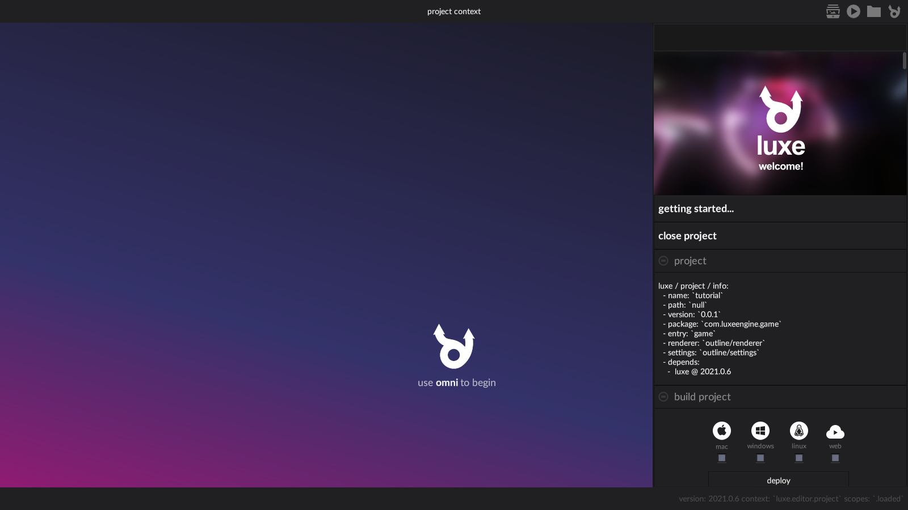{: loading=lazy }

## finding the world editor

The luxe editor has multiple **contexts** in which you can do different tasks, for example editing scenes is done in the **world context** while tilemaps are edited in the **tiles context**. 

To create a scene, we'll be using the **world context**. 
To navigate to the world context we can click the _project context_ text in the center of the top bar.
This shows a list of available contexts, and we want to select the world option.

{: loading=lazy }
{: loading=lazy }

!!! info "context switcher shortcut"
    You can press and hold `ctrl/cmd` and then press `backtick` to cycle through contexts. 
    This works like regular 'alt-tab'/window switching in your OS.

    The key is a.k.a 'console key'. Often on the same key as `~`. The key under `escape` and to the left of `1`.

Once selected, you'll be presented with the world editor. 
This is where we create and edit scenes for our game.

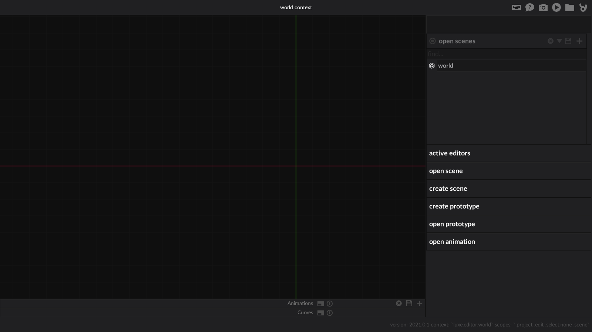{: loading=lazy }

## creating a new scene

In **omni** (the menu on the right hand side of the editor), there's a **create scene** option.

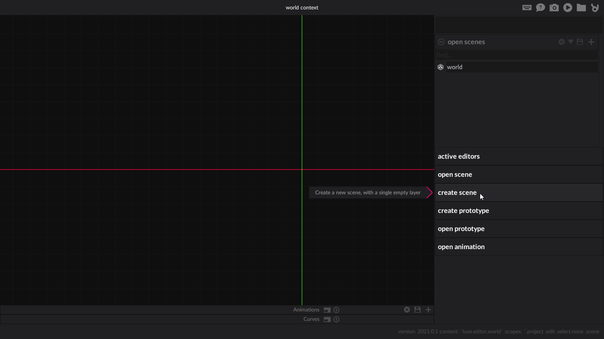{: loading=lazy }

You can also use the big + icon on the top right, to the right of 'open scenes'.
**This view is called the 'scene outline'.**

{: loading=lazy }

When you select it, you'll see a pink notification top left, 
and the new scene under the 'open scenes' section in the scene outline.

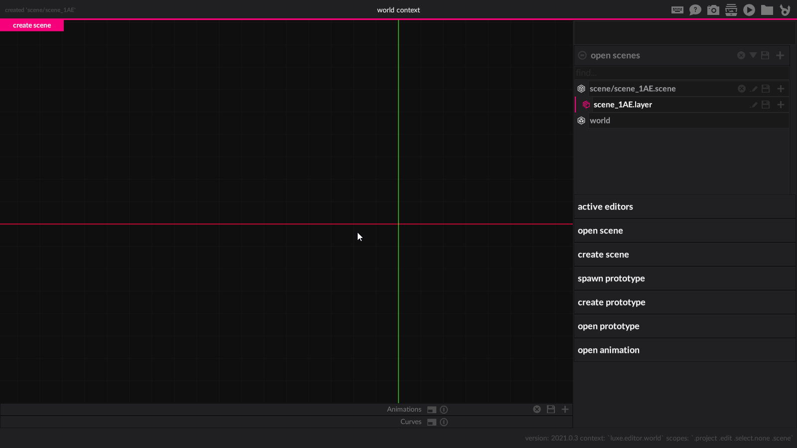{: loading=lazy }

!!! note ""
    The `+` on each _type_ of item in the scene outline creates one of what it contains.
    
    For example, the scene outline contains scenes, a scene contains layers, a layer contains entities.
    The `+` on top of the scene outline creates a scene. The `+` on a scene creates a layer. And the `+` on a layer
    creates an Entity.

## Scene, Layer, Entity...

You'll notice that the scene created a _layer_ inside of it. **A layer is an organisational tool,** 
which contains a list of entities.

Layers are used to group related entities together, allow multiple people to edit the same scene at the same time, 
and a lot more. 

!!! note ""
    A layer is not connected to the drawing order or other hierarchy in this form.

Below we'll give the scene + the layer a name. You can skip this if you're familiar.

### renaming the scene

To rename the scene, click the pencil on the right of the scene in the scene outline. 

This will toggle editing of the name. To stop editing, click the pencil again, 
unfocus the text field, or press the enter key. To cancel the change, press the escape key.

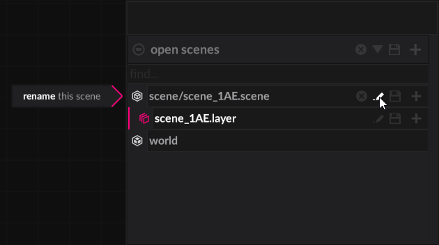{: loading=lazy }

!!! tip "We'll name our scene '`scene/area1`'"

This name matches the _asset id_ we'll use later to load the scene. 
The `.scene` extension is automatically added for us when we commit the change.

{: loading=lazy }
 
### renaming the layer

Similarly, to rename the layer, click the small pencil icon on the layer in the scene outline.

{: loading=lazy }

!!! tip "We'll name our layer '`background`'"

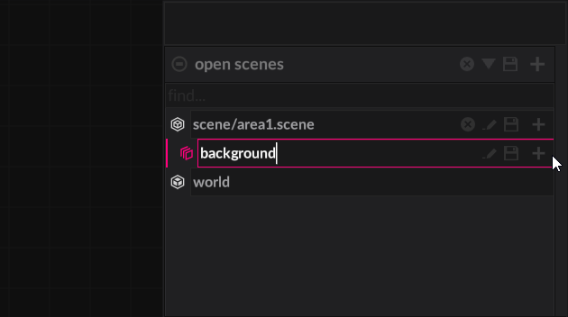{: loading=lazy }

Now the layer and the scene have a name. Note however, they don't exist in the project yet. 
The editor allows creating transient (not saved) scenes for experimenting. Let's save the scene next.

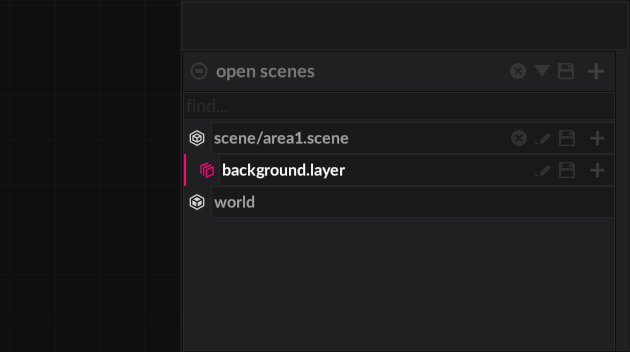{: loading=lazy }

## saving the scene

When you create a scene in the editor, it won't be created in the project until you choose to save it.
This allows experimenting without affecting actual scenes or layers in your game content.

To save the scene you can **select the save icon on the scene** itself in the scene outline.

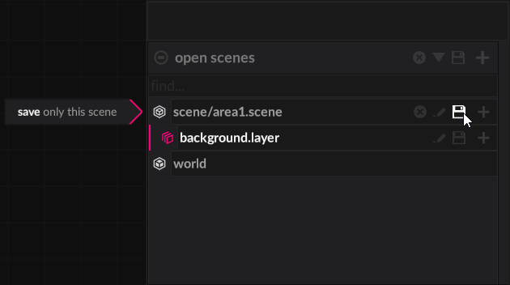{: loading=lazy }

You can also use the **save icon on the top of the scene outline** to save all open scenes.

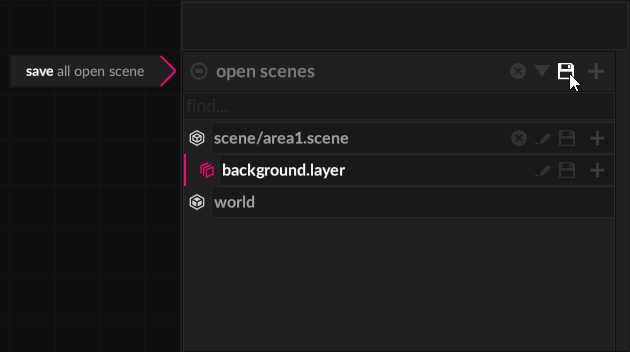{: loading=lazy }

And of course, you can use ++ctrl+s++ or ++cmd+s++ **(when the mouse is not over omni)**.

!!! warning "Currently, when the mouse is over omni (the sidebar menu), shortcut keys are ignored, which is a bug."

!!! tip "look for the pink notification to confirm"

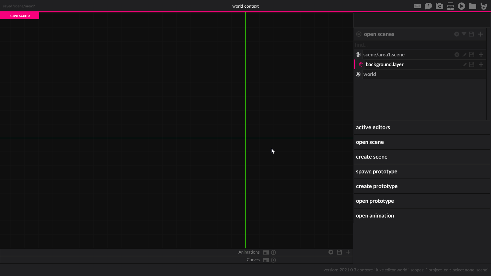{: loading=lazy }

## creating an Entity

We're going to need an Entity to display our background image in our scene.

To create an Entity inside a layer, we click the `+` icon on the layer we want to add an Entity to.
In our case, the `background.layer` is where we want it.

{: loading=lazy }

The Entity is automatically selected for us, which will show the properties of the entity below the scene outline. 
When an Entity is selected you can see it's name in omni, just below the scene outline. This is currently where you edit the name of an entity.

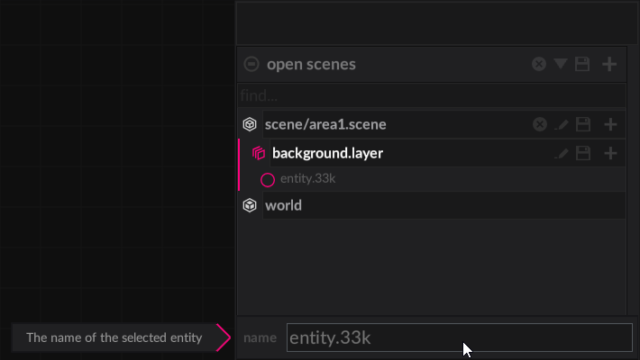{: loading=lazy }

!!! tip "We'll name our entity '`background_image`', since it's the background image"
    
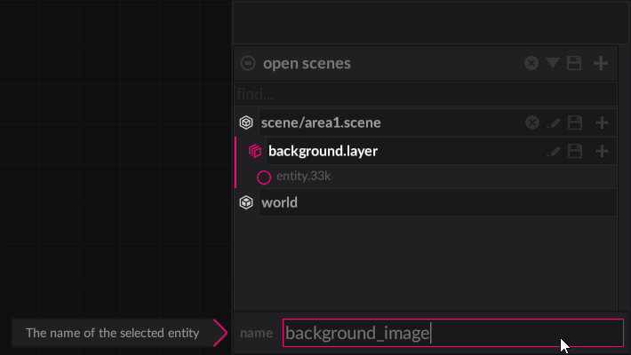{: loading=lazy }

Once the change is committed, you'll see the new name in the outline as well.

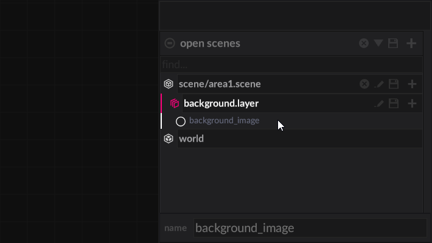{: loading=lazy }

!!! info "selecting an Entity"
    You can select an Entity by clicking it's name in the scene outline, or if it has visuals in the world editor view,
    you can click on them directly in the scene. To select an Entity behind another, clicking repeatedly will cycle through 
    the entities under the cursor. You can also filter the scenes to find things by name.

## attach a Sprite modifier

Just like in the previous step of the tutorial, we can display an image by attaching a `Sprite` modifier on our Entity.
To do that in the editor, we select an Entity (ours should still be selected) and select **attach modifier...** in omni.

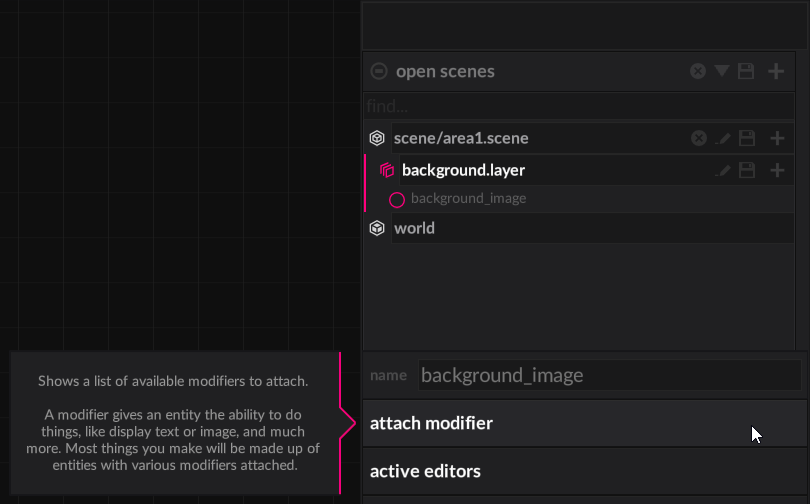{: loading=lazy }

This brings up a list of available modifiers we can attach.   

{: loading=lazy }

We can easily filter this list using keywords, like if we type 'image' we can easily find the `Sprite` modifier.

!!! tip "click the attach button on the Sprite modifier"

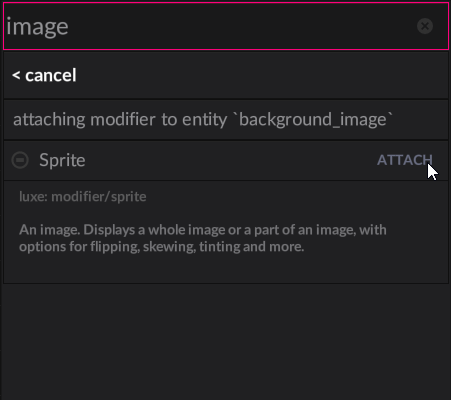{: loading=lazy }

The result you'll see is a luxe logo in the middle of the world editor view.
**Also note the `Sprite` modifier section in omni**. Omni displays the modifiers attached to the selected 
Entity under the scene outline, where you can edit the properties for the modifier.

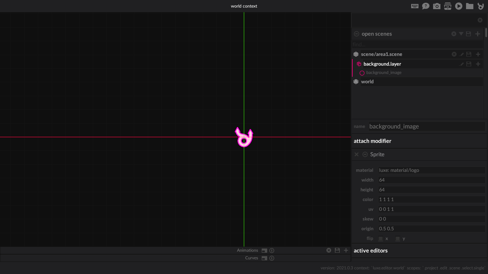{: loading=lazy }

### choosing a material

Since we want to display our scene background, we need to change the material the Sprite is using.

The project outline comes with the `material/background` material asset for us to use for this purpose.
In the Sprite modifier section in omni, select the material field to change the value.

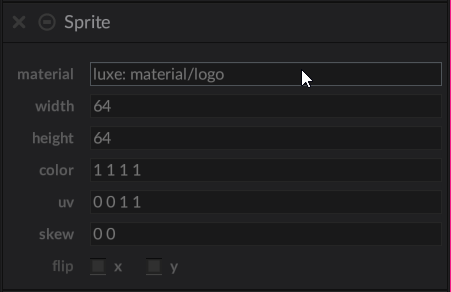{: loading=lazy }

This will bring up a list of available materials in the project to select from.


Just like before, we can type to filter the list. By typing 'background' we can reach the one we want quickly.

!!! tip "click the `material/background` material to select it"

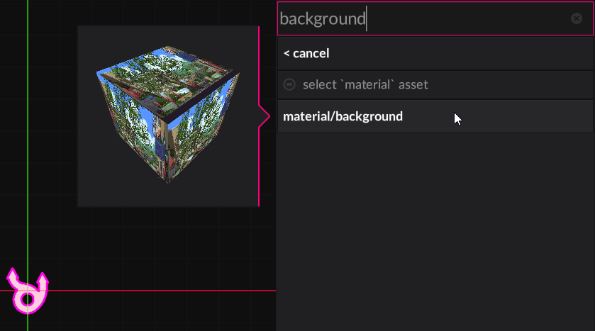{: loading=lazy }

This will change the material property and the world editor scene view will show the new material on the sprite.
When changing the material, the sprite will resize to match the image size from the material. You can see the 
sprite width and height fields are now different too.

{: loading=lazy }

### adjusting the origin

In the Sprite modifier section in omni, we can set the origin of the sprite to control where it displays relative to it's position in the world.
The default origin is centered, but sometimes we need a sprite to be bottom left, like now, or sometimes bottom center.

The origin x and y values are expressed in the `0...1` range. `0, 0` means bottom left. `0.5, 0.5` means centered, and `1, 1` would be top right. 
As an example, to display the sprite centered on x but bottom on y, we'd use `0.5, 0`.

!!! note "Y+ is up"
    Note that in luxe the 2D origin for our world is `0,0`, which is bottom left, and y values go upward visually when increasing in value.

The background image is already located at the world space origin of `0, 0` (because it has no `Transform`). What we'd like to do is display it
bottom left as well, since our world starts at 0, 0 and goes to the right and up. If we leave it centered, half the image is off screen by default.

To fix that, we set the origin to `0 0`.

!!! tip "set the origin to `0 0`"

{: loading=lazy }

## attach a Transform modifier

Just like before, to control the position of our Entity we can attach a Transform modifier.

We use **attach modifier...** button in omni again, and this time search for 'transform'.

!!! tip "click the attach button on the Transform modifier"

{: loading=lazy }

### set the sprite position

You'll see another new modifier section for Transform in omni now, with the settings for the Transform.
This is where we'll set the position.

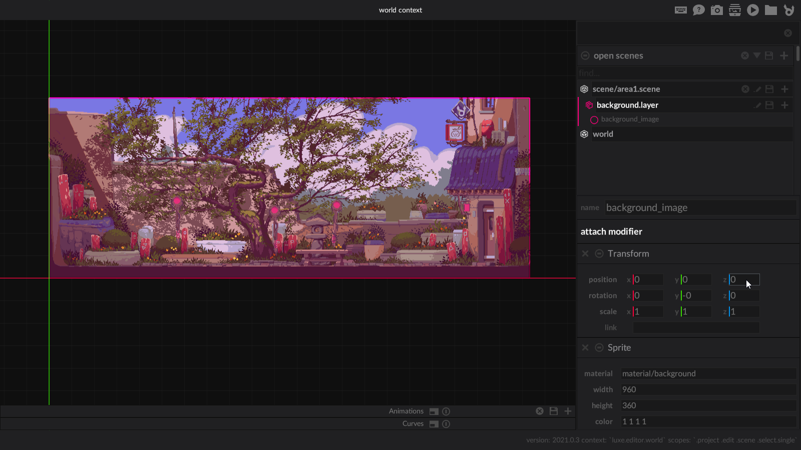{: loading=lazy }

In this case, we only need to set the `z` value for our sprite which controls the render order (referred to as `depth` for 2D).
Since we want this sprite to be behind everything else, we'll set the depth to `-1`. Our player
we created was automatically at depth `0`, so it will be in front. By default, a bigger depth value is closer to camera.

!!! tip "set the `z` value to `-1`."

{: loading=lazy }

### transform gizmos

If you press the ++w++ key in the world editor scene view, the **Transform gizmo** will show up, as you can see in the above image (under the mouse cursor).

The gizmo is draggable and allows moving the entity around in the world editor scene view. 
This is an alternative option for moving things rather than typing exact positions in the Transform section.

There are other gizmos, ++e++ will activate rotation, ++r++ will activate scale and ++t++ will activate a combined gizmo with all three, shown below.

{: loading=lazy }

## loading the scene in game

!!! tip "don't forget to save your scene in the editor"

To load the scene, we'll return to the code editor. 

This part is short and sweet, since `Scene.load(world: World, scene_id: String)` is all we need! 

A scene is loaded into a world, so much like before, we'll use the _game world_ `app.world` provided
by the project outline. The `id` of the scene is `scene/area1` which was the name we chose above.

Let's revisit our `ready` function, and just before we create the player, we'll load the scene we just created.
The code to do that is highlighted below.

```js hl_lines="13"
class Game is Ready {

  construct ready() {

    super("ready!")

    app = App.new()
    
      //set the background color to black
    app.color = [0, 0, 0, 1]

      //load the scene for the area
    Scene.load(app.world, "scene/area1")

      //create an entity
    var player = Entity.create(app.world, "player")
      //get the material for the player from the Assets
    var material = Assets.material("material/player")
      //attach a Sprite to the entity to display it
    Sprite.create(player, material, 58, 136)
      //attach a Transform to the entity to position it
    Transform.create(player)
      //set the position to the center of the screen
    Transform.set_pos(player, app.world_width/2, app.world_height/2)

  } //ready
  ...
} //Game
```

!!! tip "run the game to see the background behind our character"

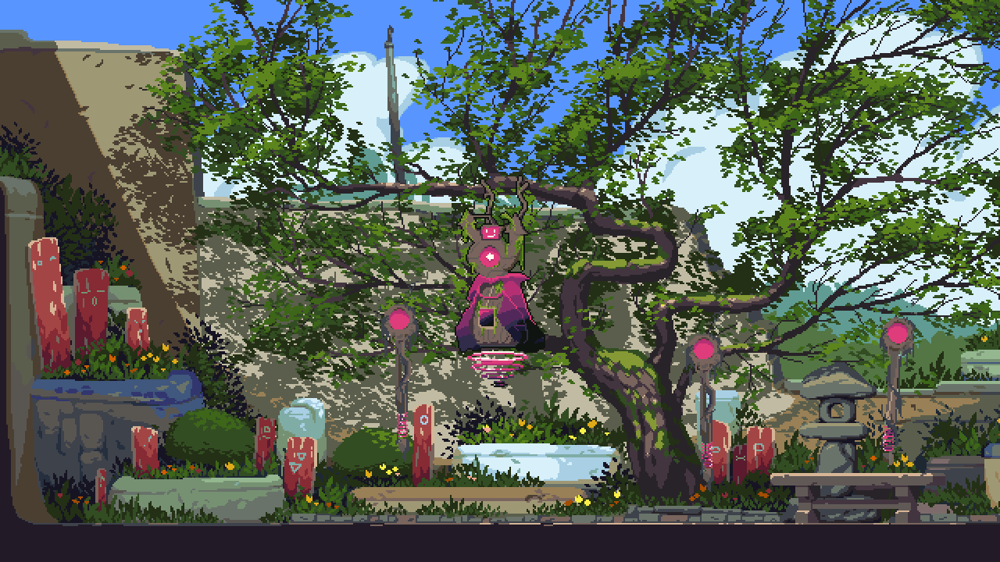{: loading=lazy }

## next up

In the next step, we'll go back to our code and load the scene into the game.