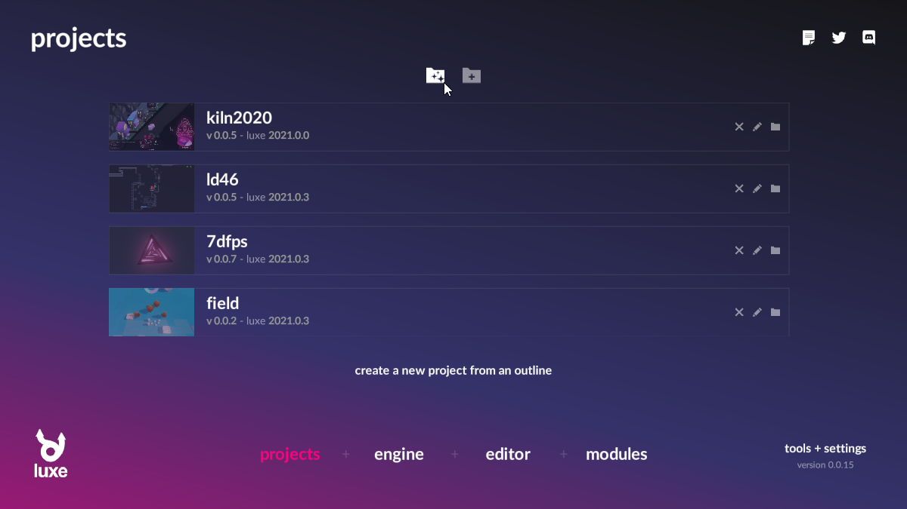
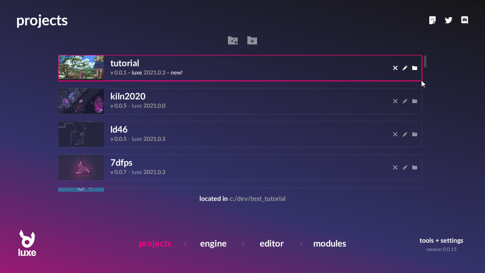
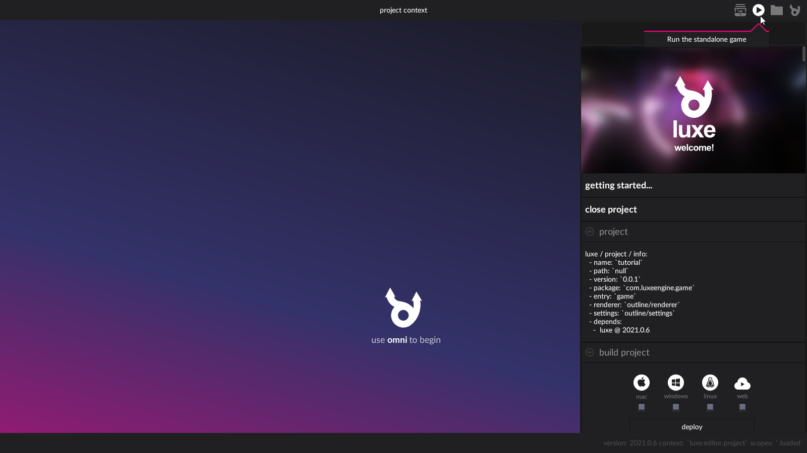
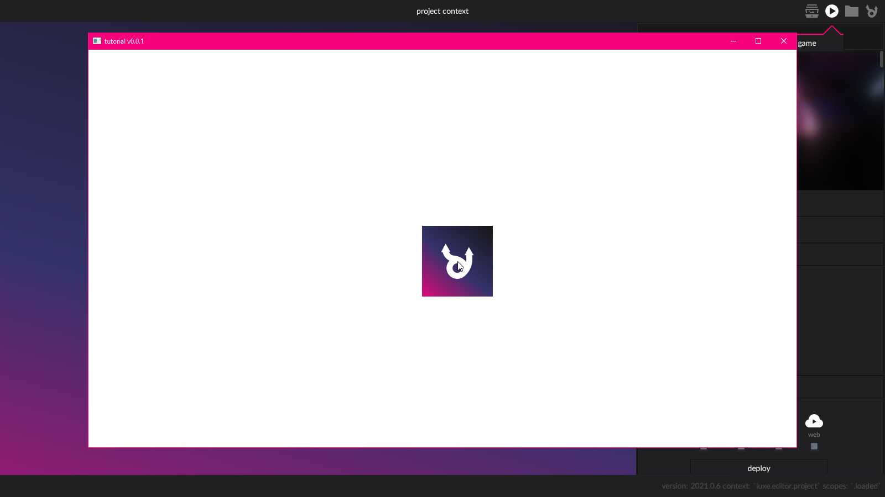
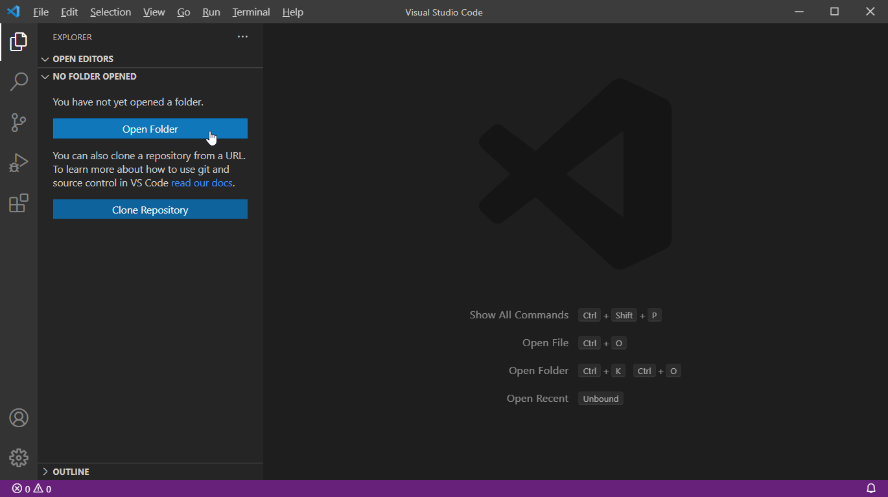
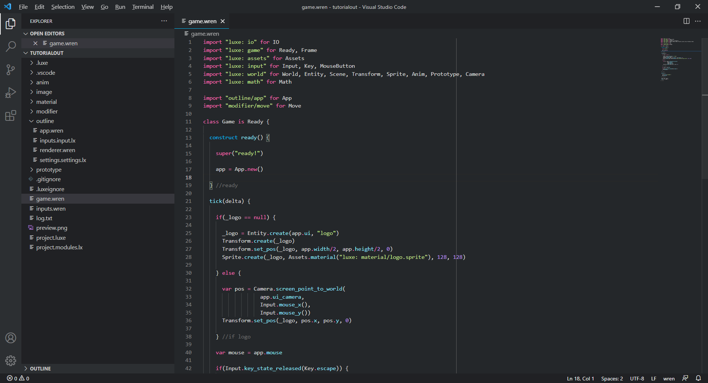
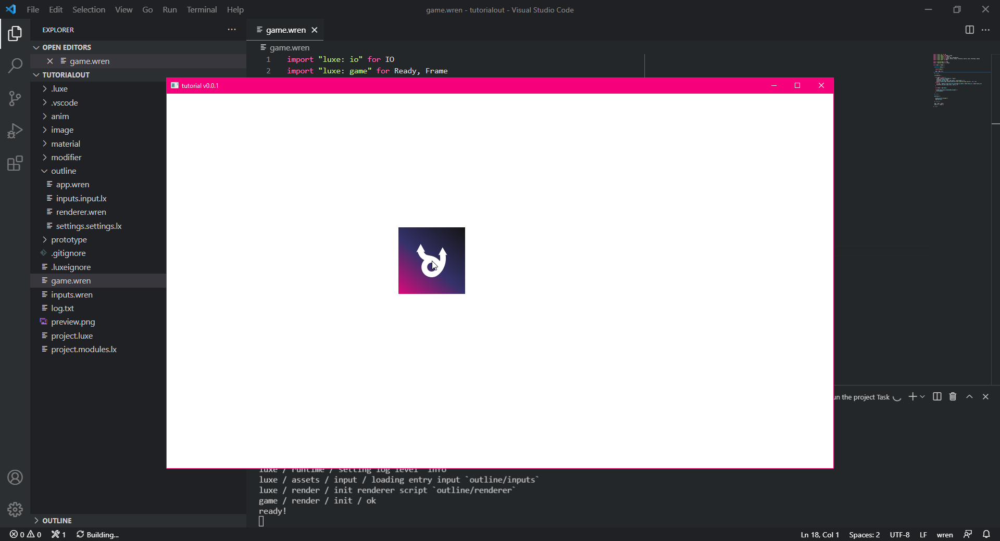

{width="96em"}

# creating a project

!!! example "outcome"
    In this step we'll **create a new project from the tutorial project outline**.
    We'll also see how to open + run it via code as well as the editor.

## A project outline

Projects are typically created from a **project outline**, which is a
template for a _type_ of project. 

For example, a first person 3D game and a 2D pixel art game have
very different needs, so the outline configures sensible defaults for a project. 

## Where do outlines come from?

Project outlines are made available from _modules_ that are installed via the [luxe launcher](../../../guide/launcher). 
Since luxe is a module too, it provides some outlines to get started with.

One of those is the outline intended to be used with this tutorial!

## Creating a new project

**Typically, you create a project via the [luxe launcher](../../../guide/launcher).**

The create project button is in the middle of the **projects page** on the launcher.

{: loading=lazy }

Selecting it will present a list of available project outlines to choose from.

!!! check "which outline do we want?"
    **Select the tutorial project outline for this tutorial.**

{: loading=lazy }

The list of available outlines shows which module they originate from (and the version), as well as a short description.
Once you select an outline, a folder selection dialog will be presented so you can choose where to save it. 

**You're saving a project into an empty folder**, so create one first and then select the new empty folder you just made to save the project. 

<small>:todo: The flow here could be better, so it shows a intermediate dialog which has validation and clarity.</small>

{: loading=lazy }

Once created, the new project will be listed at the top of the projects page.
From here you can open the folder using the folder icon, or click the project to open it in the editor.

## Running the project via the editor

!!! note ""
    make sure you have the required [editor version installed](../../../get) 

When you click the project in the launcher, it'll open the project in the editor.

{: loading=lazy }

From there, the top right corner of the editor has a play button. 
This play button will run your game as a standalone application.

!!! note ""
    The first time you run a project might take a few seconds
    to show, but every time after that should be quick.

{: loading=lazy }

The new window that opens is your game running in standalone mode.

!!! note ""
    The editor will not respond to input while the game window is running.
    Quit the game to return to the editor window.

{: loading=lazy }

## Running the project via code

!!! note ""
    make sure you have the [luxe vscode extension installed](../../../get#installing-ide-support) 

The first step is to **open a folder**, using the _Open Folder_ button or _File_ menu.
Select the project folder you just created. 

{: loading=lazy }

Once open, you should see the project files on the side bar, such as `game.wren`, `project.luxe` and so on.
Click the `game.wren` file to open it, this is where our game begins.

{: loading=lazy }

Now we can run the game via Tasks - using the `Terminal -> Run Build Task ...` menu item.
The project is configured that the default build task is to run the game.

!!! note ""
    Take note of the 'Run Build Task...' keyboard shortcut in the menu (usually `ctrl/cmd + shift + B`).   
    It can be much faster to iterate via the keyboard shortcut.

{: loading=lazy }

The game window should pop up with the standalone game.

!!! note ""
    The first time you run a project might take a few seconds
    to show, but every time after that should be quick.
