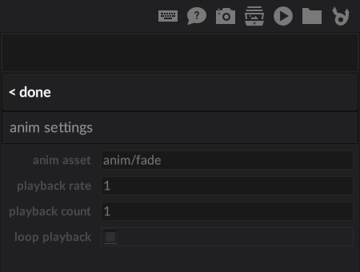
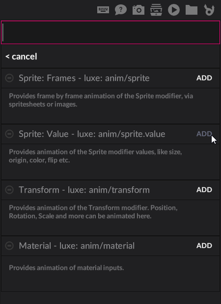
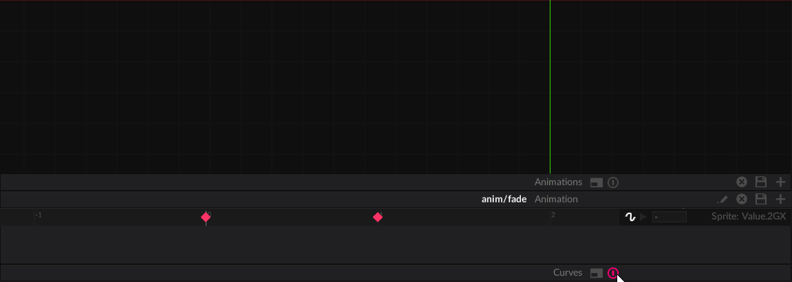
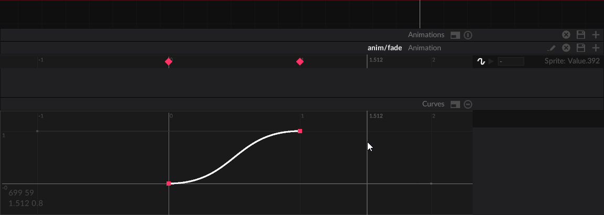
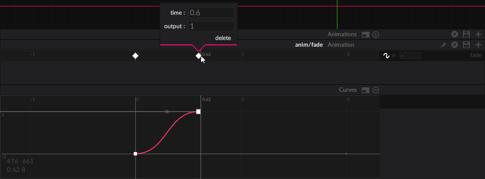
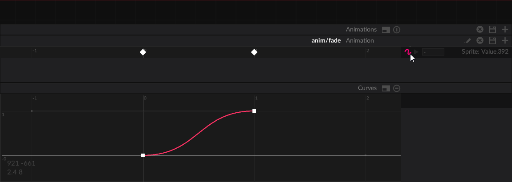
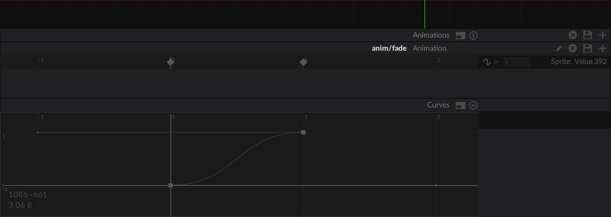
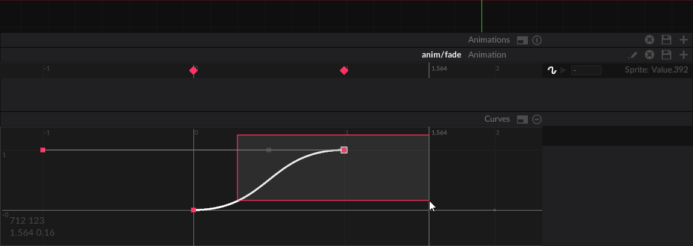

{width="96em"}

# scene scripts

!!! example "outcome"
    In this step we'll see how to create an animation with a curve
    for fading things in and out, and make our terminals fade in when we're nearby.

## creating a curve animation

Previously we made a sprite frame animation, but now we're going to make a sprite _value_ animation.

The `Sprite: Values` track type allows us to animate properties of the Sprite modifier directly, like 
the origin, color or size. 

Many animation tracks are based on curves, including this one, so we're gonna do a quick tour of the curve animation.

!!! note ""
    The curve animation editor is a work in progress. It's missing several key features that will be coming along the way.
    It works well enough for simpler animations like these.

!!! tip "create a new animation asset and name it `anim/fade`"

The new animation we created also isn't going to loop, so uncheck the **loop playback**.
This enables the **playback count** field which we'll leave at 1.

{: loading=lazy }

We'll add a track to it like before, except this time we choose **Sprite: Value**.

{: loading=lazy }

This creates keys frames on the track which are different from the sprite frames. 
If you hover the diamond shapes you'll see a small panel with properties of the keyframe.

{: loading=lazy }

The curves panel is hidden by default, if you click this collapsed icon the curves panel will pop up. 

{: loading=lazy }

The curves panel has a curve shown between our key frames.

{: loading=lazy }

For our actual fade animation, we don't need to change anything except move the end keyframe to time `0.6` seconds.
Hover the second keyframe, and change the time value.

{: loading=lazy }

And we can rename our track to fade, by clicking the name of the track and changing it.

{: loading=lazy }

!!! tip "don't forget to save the animation"

## curve animation tour

There's a small curve icon on our track, if you hover the track it will highlight in the curve view.

{: loading=lazy }

If you select that icon, it will toggle the curve being active/editable in the curve view.

{: loading=lazy }

You can drag a region to select the key frames in the curve view. Dragging the selected keyframes (or handles) will rearrange the keys.

{: loading=lazy }

If you press and hold `ctrl/cmd` and click, it will create a new keyframe. If you `ctrl/cmd` and click on an existing keyframe, it will remove it.

{: loading=lazy }


## fading the terminals

!!! tip "switch to the code to continue"

What we're going to do is make it so that when the player walks nearby a terminal, it fades in, and when they move away it fades out.

### accessing the player 

We'll need to know where the player is located, so for now we'll grab the player from the world in the `new` method.

```js hl_lines="4"
construct new(world) {

  _world = world
  _player = Entity.get_named(_world, "player")
  
  setup_terminals()

} //new
```

### enter/exit behaviour

Since this part of the game is fairly simple, we don't need to use collision or anything, we can instead use a simple distance check.

For each terminal, check if the player is within range of a certain distance, and mark the terminal as active. We'll create a new method called `update_terminals(delta)`, which is where we'll add this. 

We'll call it from the `tick` method as well, and while we're there, add a check to make sure we don't update if the player is not found (for example, in the editor).

```js hl_lines="1 7 9"
update_terminals() {

}

tick(delta) {

  if(!_player) return

  update_terminals()

} //tick
```

Now we can add some code to check if the player is nearby a terminal. 
The `Math.within_range(value: Num, min: Num, max: Num)` method is easy to use for this,
we can calculate the range based on the terminal `x +/- range`.

```js
update_terminals() {
  
  var range = 48
  var player_x = Transform.get_pos_x(_player)

    //for each terminal, check if the player is in range
  _terminals.each {|terminal|
    var terminal_x = Transform.get_pos_x(terminal)
    var min = terminal_x - range
    var max = terminal_x + range
    var in_range = Math.within_range(player_x, min, max)
  }

} //update_terminals
```

To know if this worked, we'll add some temporary code to show or hide the terminal Sprite by changing it's alpha (opacity).
Setting alpha to 0 makes the sprite invisible, and 1 makes it visible (0.5 would be faded).

```js hl_lines="12 13 14 15 16"
update_terminals() {
  
  var range = 48
  var player_x = Transform.get_pos_x(_player)

    //for each terminal, check if the player is in range
  _terminals.each {|terminal|
    var terminal_x = Transform.get_pos_x(terminal)
    var min = terminal_x - range
    var max = terminal_x + range
    var in_range = Math.within_range(player_x, min, max)
    if(in_range) {
      Sprite.set_alpha(terminal, 1)
    } else {
      Sprite.set_alpha(terminal, 0)
    }
  }

} //update_terminals
```

Now, all terminals should be invisible, and show only when we're within range. Next, we're going to make them fade instead.

<video preload="auto" autoplay controls="" loop="loop" style="max-width:100%; width:auto; margin:auto; display:block;">  
  <source src="../../images/tutorial/intro/fading-terminals-0.mp4" type="video/mp4"></source>
</video>

### making an Name helper

For fading, since we're checking every frame, we're going to want to store a visible flag on each terminal. That way, it only tries to fade on the first frame you enter, and the first frame you leave, rather than every time.

In a previous step we added a `Values` modifier to each terminal entity. 
This is a great place to store that value, since we don't need to create a whole system for storing simple per-entity values.

To access our values we use a _key_ (a name for our value), but instead of using a `"string"` directly, we'll make a class to represent the various keys and names we have. This is an important and useful pattern with several benefits, like keeping our code consistent, it works with code completion and more. 

!!! note ""
    You could consider this very similar to an Enumeration in other languages, as we'll see.

In our `area1.wren` file, we'll add a new class. We can add it after the `import` section, and before `class Scene`.

```js
//imports

var RNG = ...

class Name {

}

class Scene {
  ...
}
```

This class will hold various names, but for now we have a few values we know about: 
 - `id` - the value we added to the terminals in the editor
 - `visible` - the one we're adding
 - `terminal` - which we used to fetch the terminals
 - `player` - which we used to fetch the player

A `static` method in a class is called on the class itself, in other words, you use `Name.visible` to access the method. The method returns a _constant_ value, it's returning a string directly to use. 

```js
class Name {
  static id         { "id" }
  static visible    { "visible" }
  static terminal   { "terminal" }
  static player     { "player" }
}
```

### updating the player

Let's update our `new` method to use `Name.player` in place of `"player"`.

```js hl_lines="4"
construct new(world) {

  _world = world
  _player = Entity.get_named(_world, Name.player)
  
  setup_terminals()

} //new
```

### updating the terminals

Inside `setup_terminals`, we can change `"terminal"` as well.

```js hl_lines="3"
setup_terminals() {
  
  _terminals = Tags.list(_world, Name.terminal)
  scramble_terminals()

} //setup_terminals
```

### making a Fade helper

We're going to use one shared function to handle both fading in and out, 
though using a boolean value (true/false) to represent the direction can be confusing at times, 
it would be nicer to use something like `Fade.In` and `Fade.Out`. We've just learned how!

!!! note ""
  We can't use `Fade.in` with a lowercase `i` because `in` is a keyword in Wren, so we use a capital letter here.

Just below the Name enum, let's add another one, and this time we can use numbers for the values.

```js
class Name {
  static id         { "id" }
  static visible    { "visible" }
  static terminal   { "terminal" }
  static player     { "player" }
}

class Fade {
  static In   { 0 }
  static Out  { 1 }
}
```

### terminal visible state

Before we start, we should make our terminals hidden by default, so that we can test the fading properly.
Back inside our `scramble_terminals` function, add one line to hide the terminal while fetching the positions.

```js hl_lines="7"
scramble_terminals() {

    //create a list of positions, 
    //by asking each terminal for its position.
  var positions = []
  for(terminal in _terminals) {
    Sprite.set_alpha(terminal, 0)
    var pos = Transform.get_pos(terminal)
    positions.add(pos)
  }

  ...

} //scramble_terminals
```

The next step is making a method to handle the fading, it will look like this:

```js
fade(entity, direction) {
  
}
```

Then we need to call it from our `update_terminals` method:

```js hl_lines="11 13"
update_terminals() {
  
  var range = 48
  var player_x = Transform.get_pos_x(_player)

    //for each terminal, check if the player is in range
  _terminals.each {|terminal|
    var terminal_x = Transform.get_pos_x(terminal)
    var min = terminal_x - range
    var max = terminal_x + range
    var in_range = Math.within_range(player_x, min, max)
    if(in_range) {
      fade(terminal, Fade.In)
    } else {
      fade(terminal, Fade.Out)
    }
  }

} //update_terminals
```

Soon we can play our fade animation, but we're first going to want to deal with that `visible` state.

We'll use `Values.get(entity: Entity, key: String, default: Any)` to fetch the value that's stored.
If no value is stored, we get the default.

We'll also use `Values.set(entity: Entity, key: String, value: Any)` to store the state on the entity.

To make sure our logic is working, we'll also set the sprite alpha like before with some debug code.
We'll also print a message to the log, so we can see that it only gets called once on enter, and once on exit.

```js
fade(entity, direction) {

    //fetch whether this entity want's to be visible or not
  var visible = Values.get(entity, Name.visible, false)
    //If we're already fading out, do nothing
  if(direction == Fade.Out && !visible) return
    //If we're already fading in, do nothing
  if(direction == Fade.In && visible) return

    //update the visible flag to be based on whether 
    //we're fading in (true) or out (false)
  Values.set(entity, Name.visible, direction == Fade.In)

    //temporary debug code
  var alpha = 0
  if(direction == Fade.In) alpha = 1  
  Sprite.set_alpha(entity, alpha)
  System.print("fade %(direction)")

} //fade
```

### fading a terminal

Now we can play our fade animation! We'll remove the temporary code and replace it now.

When you play an animation via `Anim.play`, it returns a live instance of the animation
that you played. This instance can be changed or queried (like volume, speed, pitch etc).

The only thing we need to do for now, is make sure that when we're fading _out_, we play
the animation in reverse. For now, to do that, we set the animation `rate` to `-1`.

!!! note ""
    Because the animation asset has a rate as well, we ask the `anim` for it's rate and then multiply
    it with -1 to make sure the rate in the asset is respected. For example, if the asset said the rate was 10, 
    we'd want to play the animation with a rate of `-10` rather than 10 times slower at `-1`.

```js hl_lines="16 18 19 20 21" linenums="1"
fade(entity, direction) {

    //fetch whether this entity want's to be visible or not
  var visible = Values.get(entity, Name.visible, false)
    //If we're already fading out, do nothing
  if(direction == Fade.Out && !visible) return
    //If we're already fading in, do nothing
  if(direction == Fade.In && visible) return

    //update the visible flag to be based on whether 
    //we're fading in (true) or out (false)
  Values.set(entity, Name.visible, direction == Fade.In)

    //play the animation, but this time we store the return value
    //which is the active/playing animation.
  var anim = Anim.play(entity, "anim/fade")
    //If fading out, reverse the animation
  if(direction == Fade.Out) {
    var rate = Anim.get_rate(entity, anim) * -1
    Anim.set_rate(entity, anim, rate)
  }

} //fade
```

And with that, our terminals fade in and out nicely when the player comes near them.

<video preload="auto" autoplay controls="" loop="loop" style="max-width:100%; width:auto; margin:auto; display:block;">  
  <source src="../../images/tutorial/intro/fading-terminals-1.mp4" type="video/mp4"></source>
</video>

## next up

We'll revisit the terminals later, but for now we're ready to move on to adding our jar to the game, and learning to use prototypes to do that.