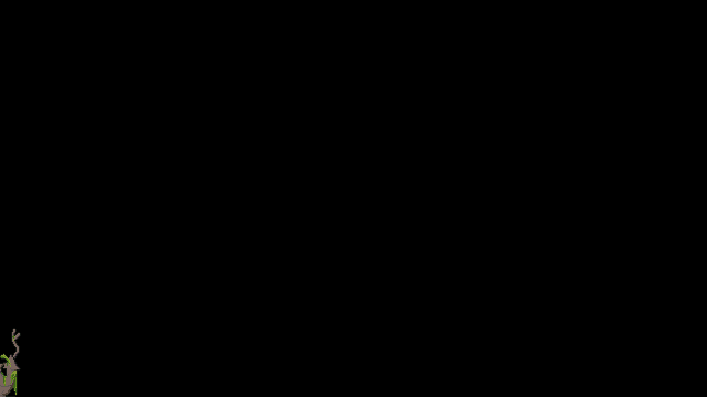
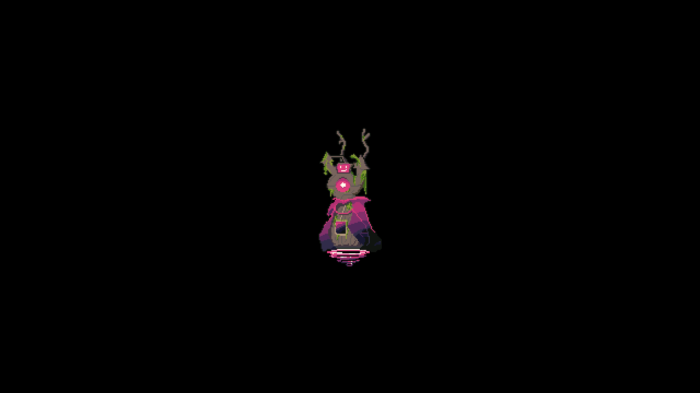

{width="96em"}

# displaying things on screen

!!! example "outcome"
    In this step we'll change the background color of the window, and display an image on screen.

To get started, we're going to [open the project in the code editor](../create-and-run-a-project#running-the-project-via-code).
And like in the linked guide, we're going to open the `game.wren` file, which is our game's entry point.
The `game.wren` file contains a `ready` function, which is where we'll make our changes.

```js
class Game is Ready {

  construct ready() {

    super("ready!")

    app = App.new()

  } //ready
  
  ...

} //Game
```

## changing the background color

Let's try a small change to see something happen. The project outline provides 
us with the `app.color` property that we can set to change the background color.

The highlighted lines below show the code added to change the background color to black.
Add the line to your ready function as shown below.

!!! tip "run the game to see the color change"
    Feel free to experiment with the color value to see how it responds.

```js hl_lines="10"
class Game is Ready {

  construct ready() {

    super("ready!")

    app = App.new()
    
      //set the background color to black
    app.color = [0, 0, 0, 1]

  } //ready

  ...

} //Game
```

!!! info "Color syntax"
    Above, we used the `[ ]` list syntax to create a color. These values are 
    for [`red`, `green`, `blue`, `alpha`] in that order, and are values between 0 and 1.
    Pure red that's half transparent would be `[1, 0, 0, 0.5]` and white would be `[1, 1, 1, 1]`.

The exciting result:
{: loading=lazy }

## World, Entity, Modifier ...

In the [intro guide](../../../guide), the concept of an Entity was described.

> An Entity is how we talk about a unique thing, 
> which makes it the basic building block of making games in luxe! 

As well as the concept of modifiers...

> An entity just exists, it can't do anything yet.
> To make an entity do something, we attach modifiers to it!
> A modifier describes something you want the entity to be able to do.

In luxe, an Entity is **the unit of work**. It's typically what you
use to achieve most things. They exist in a World.

For example, to display an image on screen, we'll use the **Sprite** modifier, and **attach** it to an Entity.

!!! note ""
    The term `Sprite` is usually used to describe an image in 2D games.

## creating a player Entity

To create an Entity we'll need a World for it to exist in.

The project outline provides a _game world_ for us called `app.world`, which we can use.
To create an Entity we can use the `Entity.create(world: World, name: String)` function.
The function returns the Entity to us, so we store it in a variable called `player`.

And that's it! We have an Entity ready to do things with.

```js hl_lines="13"
class Game is Ready {

  construct ready() {

    super("ready!")

    app = App.new()
    
      //set the background color to black
    app.color = [0, 0, 0, 1]

      //create an entity
    var player = Entity.create(app.world, "player")

  } //ready
  
  ...

} //Game
```

## displaying a Sprite

We're going to attach a character sprite to our `player` Entity. 
To do that we'll use the **`Sprite` modifier**, which offers a create function like this:

```js
Sprite.create(entity: Entity, material: Material, width: Num, height: Num)
```

The `entity` is our `player` Entity, `width` and `height` are the size in _world units_, so what do we specify for `material`?

**A Material describes how something looks** when drawn on screen. For example, which image to draw, and how.

!!! note ""
    We'll learn more details about materials later, including how to create them.

In this tutorial the material for the character is provided to us by the project outline. 
The material is loaded as an `Asset`, so to access it we use the `Assets.material(id: String)` function.
Our material id is `material/player`, which refers to a material file in our project. 

!!! note "" 
    You can look inside the file by opening `material/player.material.lx` in the code editor.

```js hl_lines="4 6"
    //create an entity
  var player = Entity.create(app.world, "player")
    //get the material for the player from the Assets
  var material = Assets.material("material/player")
    //attach a Sprite to the entity to display it
  Sprite.create(player, material, 64, 128)
```

!!! tip "run the game to see the sprite"
    Pay attention to the bottom left hand corner of the window, the sprite is positioned at the origin (0, 0).

{: loading=lazy }

## moving the player Entity

The next step is to give our Entity a position. To do that, we attach a **`Transform` modifier** to our Entity. 

This will give the Entity a position as well as a rotation and scale. The Transform modifier is a key part of making games, since it allows us to manipulate the space within a world, and allows us to link things so that the move together.

Attaching a Transform is done via `Transform.create(entity: Entity)`.

We can then change the position via `Transform.set_pos(entity: Entity, x: Num, y: Num)`. 

```js hl_lines="8 10"
    //create an entity
  var player = Entity.create(app.world, "player")
    //get the material for the player from the Assets
  var material = Assets.material("material/player")
    //attach a Sprite to the entity to display it
  Sprite.create(player, material, 64, 128)
    //attach a Transform to the entity to position it
  Transform.create(player)
    //set the position to the center of the screen
  Transform.set_pos(player, app.world_width/2, app.world_height/2)
```

The project outline also provides `app.world_width` which is the size of our world on screen, in world units.
We'll use that as a convenience to move the Entity to the middle of the screen.

!!! tip "run the game to see the sprite center screen"

{: loading=lazy }

## next up

In the next step, we'll look at creating an Entity and attaching modifiers using the editor.