{width="96em"}

# scene scripts

!!! example "outcome"
    In this step we'll see how to use scene scripts to add scene-specific
    code to an area. We'll play an animation on an entity in the editor,
    and use a random number generator to randomize the terminals we'll create.

## creating terminals

!!! tip "open the `scene/area1` scene in the editor"

In this game, there are these terminals in the background that the player interacts with.
The background image contains the base of the terminal, so we're going to implement the 'screen' part.
The screen will display a symbol on it which is an entity with a sprite attached.

Since we're going to make 3 (nearly) identical terminals, it's a good idea to make one terminal with it's
modifiers set up, and then duplicate it twice and change the other ones in small ways.

### the first terminal

!!! tip "create a `terminals` layer in the scene"

First up, we'll organize our terminals into their own layer since they're related.
We create the `terminals` layer and inside it create a new entity called `terminal.0`.

On this entity, attach the following modifiers:

  - Anim
  - Sprite
  - Transform
  - Values
  - Tags

Next, we can set the material for the sprite to `material/symbols`, which is provided by the project outline.
You should see something like this, where the new sprite is down in the bottom left corner of the scene. 
(This also shows modifiers collapsed to make space).

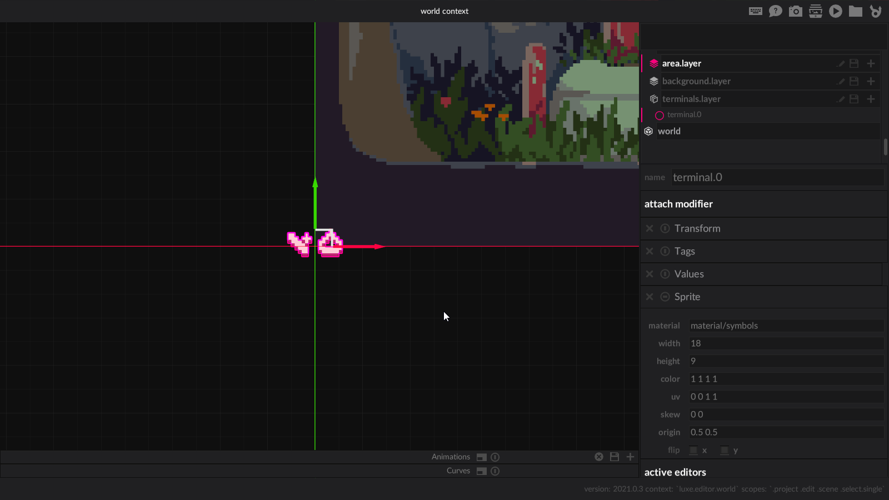{: loading=lazy }

### changing the UVs

Our sprite is showing two symbols side by side, because they're packed into a single image for animation.
If we want to display just a single symbol, we can use the **uv** field on the Sprite modifier.

This value is in `0...1` range, but represents a rectangle, as `x0 y0 x1 y1`. `x0, y0` is top left of the rectangle,
and `x1, y1` is bottom right of the rectangle (not width and height).

The default value of `0 0 1 1` shows the full image. If we want to display half the image on the x axis,
we change the third part to 0.5 like `0 0 0.5 1`. 

{: loading=lazy }

Changing the value shows the left hand symbol in the image now, but it's squashed, because our size is set to show
two symbols. Change the **width** field to be `9`, to match the height.

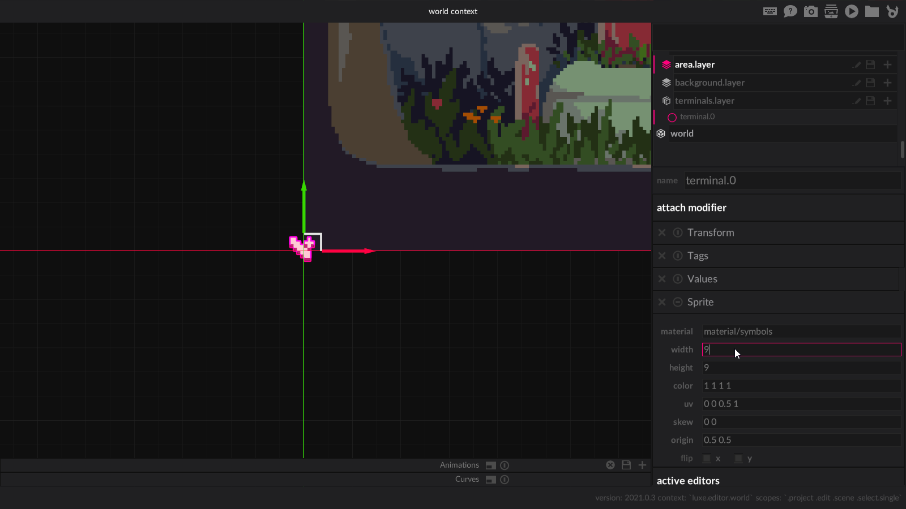{: loading=lazy }

### positioning the terminal

Now that we're going to move an entity around in the editor, it would be good to make sure the positions are snapped to pixels, 
since that's good for pixel art. Pressing the space bar when you have a translate (or full transform) gizmo active will show a small settings panel.

This panel has settings for the gizmo, like world vs local transform, or our goal: snapping. Setting the snap for `x` and `y` to `1` will make sure we never get sub-pixel movements using the gizmo.

!!! note ""
    The gizmo doesn't remember this setting across editor sessions, if you restart the editor, you have to set the snap again.

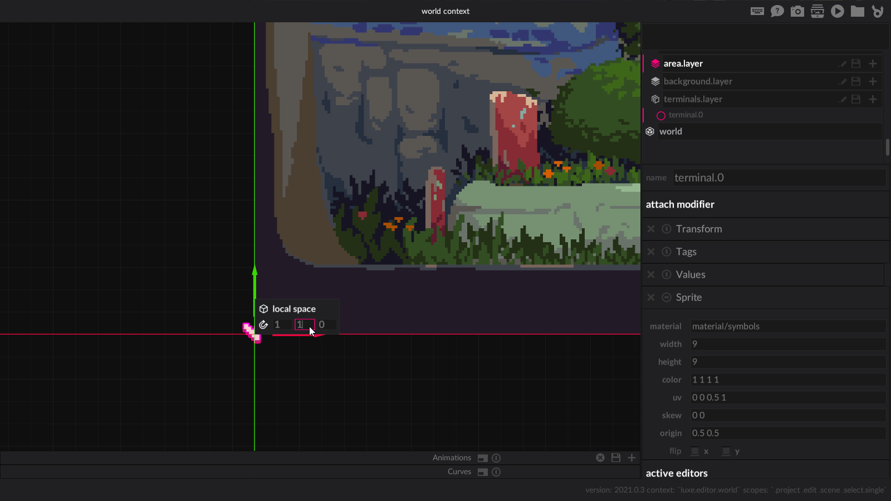{: loading=lazy }

If you move the sprite around and watch the transform x and y values, they'll always be whole numbers (no fractions), which is what we want.
Move the sprite around to the terminal screen area, and place it in the middle. This should be at position `256, 154`.

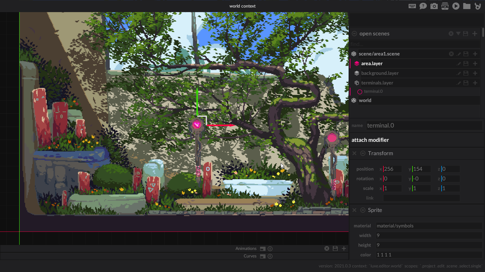{: loading=lazy }

If you deselect the entity you'll see the symbol is nicely centered.

{: loading=lazy }

### tagging the terminal

We added a `Tags` modifier which allows us to give tags to an entity. We'll later use this to grab the terminals from the scene in code.

For this case, we only need one tag, `terminal`. To add a tag, you enter it into the field on the tags modifier and then press enter or click the `+`.

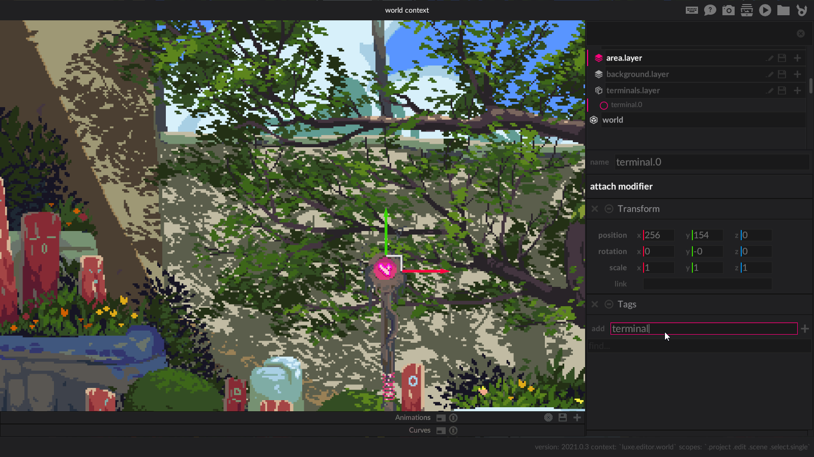{: loading=lazy }

Once you hit enter, the tag is shown in the area below, and can be removed with the x on the right of the tag.

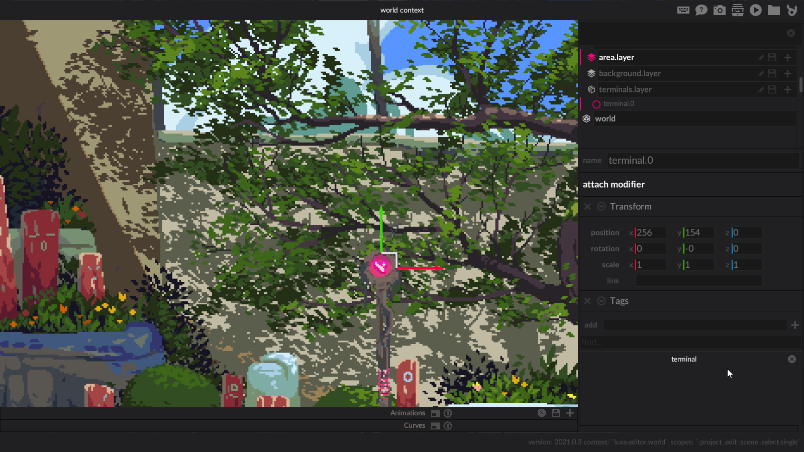{: loading=lazy }

### adding values to the terminal

We also added a `Values` modifier, which let's us store arbitrary values with an entity using a key (name).
We'll add a value called `id` and give a number as `0`. We'll use this later to identify the terminals once we shuffle them around.

First, select the 'unknown' label next to **type**, it's the type of value we want to add.

{: loading=lazy }

This shows a few types we can choose, we'll use **number**, so select that.

{: loading=lazy }

Then we enter the name and value we want to store, and press enter or click the `+` to add it.

{: loading=lazy }

Once added, it shows below the find text area, and has an `x` to remove it if needed.

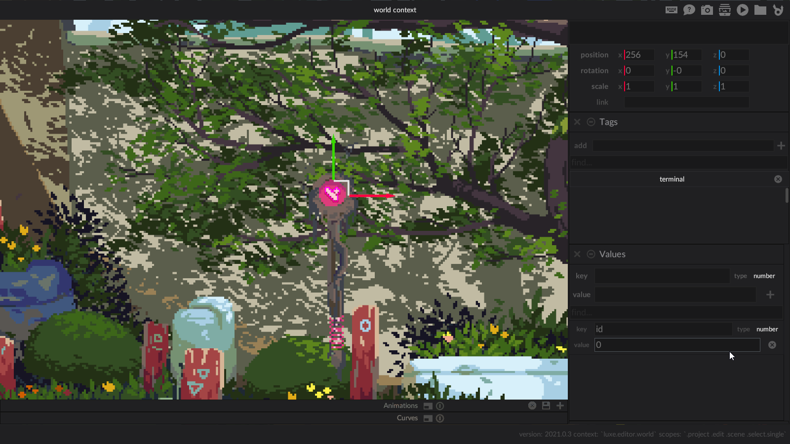{: loading=lazy }

### duplicating the terminal

Currently, you can duplicate one or more selected entities by pressing `ctrl/cmd` + `D`.
With the `terminal.0` entity selected, duplicate it twice.

This will add two new entities into the outline, with some random letters appended to the name.

!!! note ""
    They're stacked on top of each other in the scene view, you can use the transform gizmo to move them after each duplicate, if preferred.

{: loading=lazy }

Let's rename them to `terminal.1` and `terminal.2`, it doesn't matter which is which yet.

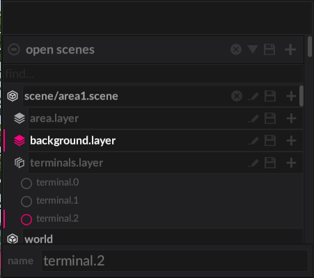{: loading=lazy }

### updating the values

We'll need to update the Values modifier on each to be `1` and `2` for the `id` value. 
Select the entity to change, enter the new value and press enter or unfocus the field to change it.

{: loading=lazy }

### updating the UVs

For the game concept, the terminal with an id of 0 is special and shows a scrambled symbol animation.
The second terminal shows the first symbol and the third one shows the second symbol.

For now, the special terminal is the original we made and we can leave it as is.

`terminal.1` is also already showing the correct symbol, the first one, so we only need to update `terminal.2`.
Select `terminal.2` and update it's UV value to be `0.5 0 1 1`. This moves the start of the rectangle left by half the image (0.5),
and the end of the rectangle to the end of the image at 1.

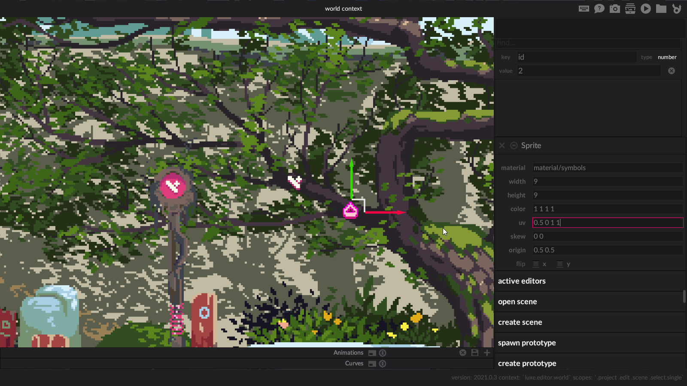{: loading=lazy }

### updating the positions

Lastly, we can place the other terminals over their base.

This should be:

  - terminal.1 - x `451` y `135`
  - terminal.2 - x `575` y `146`

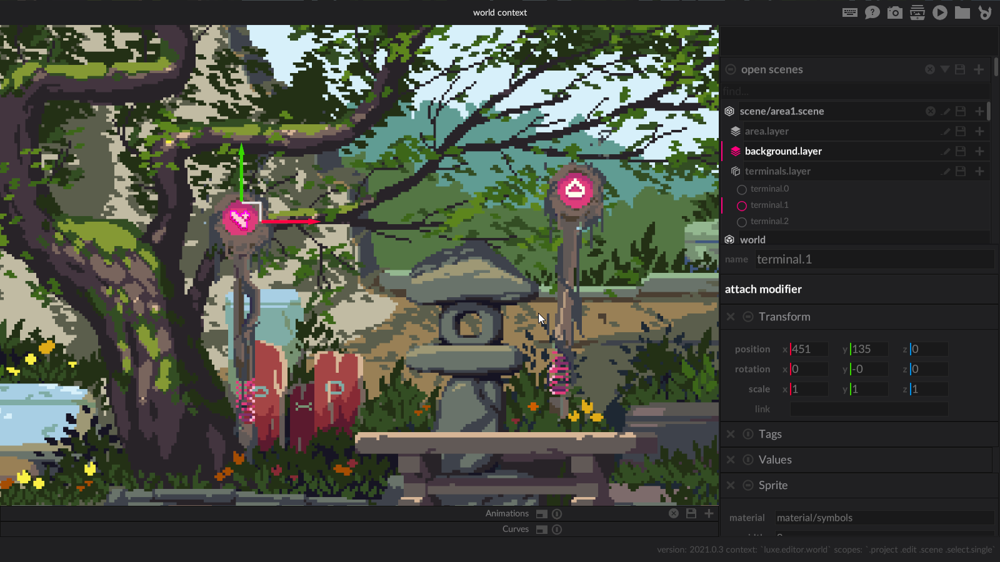{: loading=lazy }

## animation auto play

For the terminals, we added an `Anim` modifier to each. 
For the special terminal, we'll use this in the editor to auto play an animation.
The other two will use the Anim modifier for fading in and out.

Select the `terminal.0` entity and navigate to the Anim modifier in omni.

Selecting the **add** field will pop up an animation asset selector.

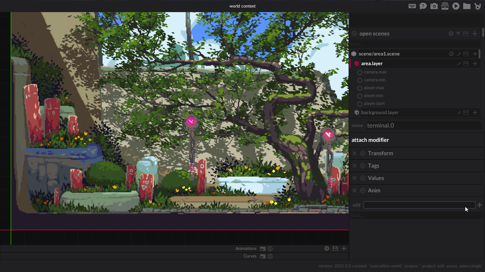{: loading=lazy }

We can as always filter, select `anim/symbols`, which the project outline has provided.

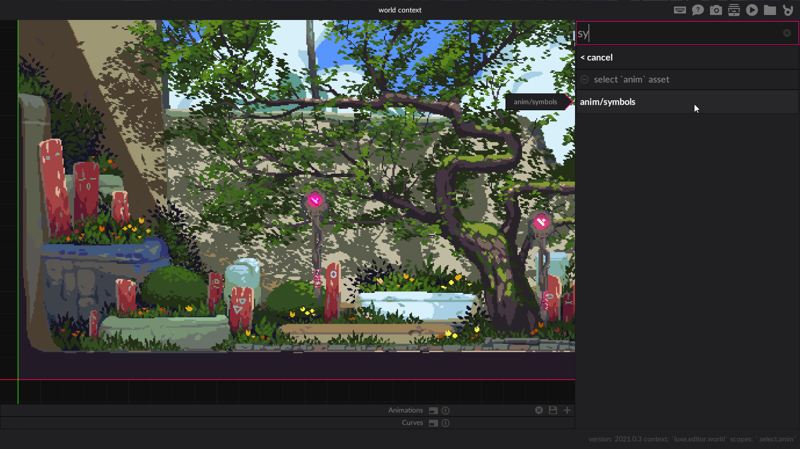{: loading=lazy }

The animation will now play in the editor.

!!! note ""
    Some animation tracks won't apply their changes in the editor unless in preview mode, like
    Transform tracks. Editing a scene with moving objects can be tricky.

<video preload="auto" autoplay controls="" loop="loop" style="max-width:100%; width:auto; margin:auto; display:block;">  
  <source src="../../images/tutorial/intro/create-terminals-18.mp4" type="video/mp4"></source>
</video>

If you use the **open animation** button in omni, you can open this animation to see that it's just two simple frames from our symbols material.

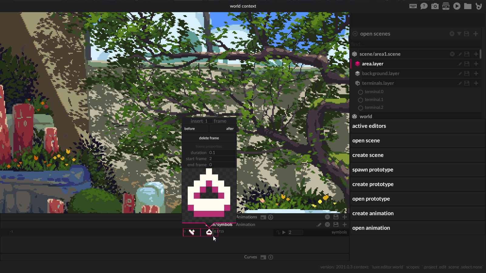{: loading=lazy }

If you run the game you'll see the symbols in the scene, as well as the animated one.

<video preload="auto" autoplay controls="" loop="loop" style="max-width:100%; width:auto; margin:auto; display:block;">  
  <source src="../../images/tutorial/intro/create-terminals-20.mp4" type="video/mp4"></source>
</video>

## what is a scene script?

!!! tip "make sure to save the scene, and then exit the editor"

Often when you create games, it can be convenient to have logic specific to an area of the game
that doesn't leak into the game core systems. Like maybe there's a very specific set of rules or hardcoded behaviour
for this one door in this one room, it can be good not to add that specific behaviour to the door system.

Instead, we can use a Scene Script, which is a Wren script that belongs to a specific scene.

When the scene is loaded, so is the script, and the lifetime of the script is tied to the scene. 
This also means the scene script can make assumptions about what has been loaded etc, since it's
guaranteed to exist while the scene is loaded, and is executed after the scene is ready.

The majority of what we'll add next for the tutorial is going to live in the scene script.

## creating a scene script

!!! tip "open the project in code"

Mentioned earlier in the tutorial, a scene asset is actually a folder inside your project. Inside the folder are the layer files for the scene.

This folder is also where the scene script lives, we create a Wren script with the same name as the scene inside the scene folder.
In our case the scene is called `scene/area1.scene/`, so we create a new file at `scene/area1.scene/area1.wren`.

In VS Code at least, we can select the scene folder, and click the new file icon on the top of the sidebar.

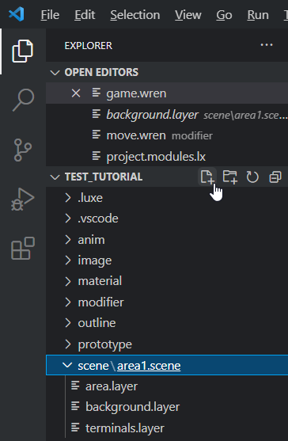{: loading=lazy }

Then we can name the new file `area1.wren`

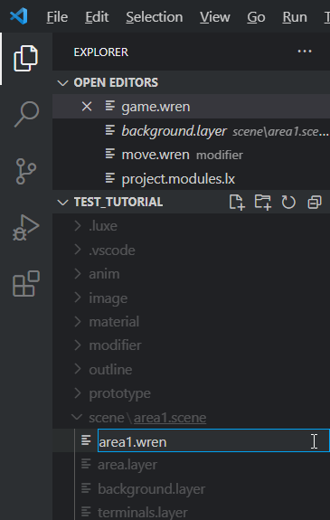{: loading=lazy }

The next step is to add the required code to the file, so that it works as a scene script.
The script is shown below. 

!!! note ""
    It's important that the class be named `Scene`, and that it has `construct new(world)`, `tick(delta)` and `destroy()`.

For now, we'll also add a bunch of the imports we'll need up front, and we'll import additional ones later.

```js
import "luxe: io" for IO
import "luxe: game" for Game, Frame
import "luxe: assets" for Strings, Assets
import "luxe: input" for Input, Key
import "luxe: math" for Math
import "luxe: world" for World, Entity, Transform, Prototype
import "luxe: world" for Tags, Values, Sprite, Anim, AnimEvent
import "random" for Random

class Scene {

  construct new(world) {

    _world = world
    
    setup_terminals()

  } //new

  setup_terminals() {

  }

  scramble_terminals() {

  }

  tick(delta) {

  } //tick

  destroy() {

  } //destroy

} //Scene
```

If you run the game now, you should see that hello message printed in the log.

{: loading=lazy }

## using tags to fetch terminals

Now that we have our terminals set up, and a place to add area specific code, we can fetch the terminals and store them.
Instead of grabbing them via name though, we'll use the `Tags` modifier to get a list of all entities tagged with `terminal`.

Let's make a method called `setup_terminals()` in our `Scene` class, and call it from the `new` method.

```js hl_lines="7 11"
class Scene {

  construct new(world) {

    _world = world
    
    setup_terminals()

  } //new

  setup_terminals() {

  } //setup_terminals

  ...

} //Scene
```

Inside `setup_terminals`, we'll use `Tags.list(world: World, tag: String)` to get a list of entities with the tag.
We'll store those in a field so we can access them later. Previously, we used the tag `terminal` in the editor, 
so that's the tag we'll pass to the query.

```js hl_lines="3"
setup_terminals() {
  
  _terminals = Tags.list(_world, "terminal")

} //setup_terminals
```

## randomizing the terminals

### creating a random number generator

Our actual goal here, is to hide all the terminals, and then randomize them so that each time we play it's a little bit different.
That involves setting their alpha to 0 so that they're not visible, and changing the positions of each entity randomly to a different spot.

In our list of imports, you may have noticed [Random](https://wren.io/modules/random/random.html), a class for random number generation. This class comes from Wren and we can use it to generate random numbers as well as shuffle a list.

!!! note ""
    As an opportunity to learn more concepts, we'll store it in a _module scope_ variable. Variables outside of a class in Wren are at the Module level (a Module being a wren script/file typically). Variables in Module scope must be named with a Capital letter to be seen inside of a class.

We'll make a variable called `RNG` and store our random instance there.

```js
var RNG = Random.new()

class Scene {

  ...
  
}
```

### randomizing a list

Our approach to changing the positions randomly is this: make a list of the positions for each terminal, shuffle the list around, and then assign each terminal a position from the shuffled list. 

We'll do this inside another method, called `scramble_terminals`, cos we want to also do this later each time a certain thing happens, to make the gameplay a bit more interesting.

```js
scramble_terminals() {

    //create a list of positions, 
    //by asking each terminal for its position.
  var positions = []
  for(terminal in _terminals) {
    var pos = Transform.get_pos(terminal)
    positions.add(pos)
  }

    //use our Random instance to shuffle the list
  RNG.shuffle(positions)

    //now we loop over the positions, and assign them to a terminal
  for(i in 0 ... positions.count) {
    var terminal = _terminals[i]
    var pos = positions[i]
    Transform.set_pos(terminal, pos.x, pos.y)
  }

} //scramble_terminals
```

And now we can call that inside `setup_terminals()`

```js hl_lines="3"
setup_terminals() {
  
  _terminals = Tags.list(_world, "terminal")
  scramble_terminals()

} //setup_terminals
```

If you run the game a few times, you'll notice that the terminals are often in different positions than where we created them in editor.

<video preload="auto" autoplay controls="" loop="loop" style="max-width:100%; width:auto; margin:auto; display:block;">  
  <source src="../../images/tutorial/intro/randomize-terminals-0.mp4" type="video/mp4"></source>
</video>

## next up

Next we're going to make the terminals fade in and out based on how close the player is to them, and keep track of the active terminal so we can interact with it later. 