{width="96em"}

# sprite animation

!!! example "outcome"
    In this step we'll see how to import images and materials in the editor.
    We'll create a sprite animation using the editor, and also learn to use 
    the `Anim` modifier to play it back from code.

## sprite frame animations

Our player character could use a bit of life, so we're going to add an idle animation
using a sprite sheet (multiple images packed into one). 

The image for the animation comes with the project outline, and was made with [Aseprite](https://www.aseprite.org/), 
which can conveniently export animations in this type of layout. It looks like this:

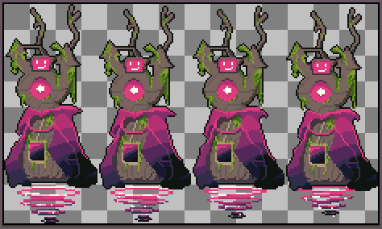{: loading=lazy }

The image contains 4 frames of animation inside one image, arranged horizonally. 
Below is another example which has clearer animation frames to show the idea. Often, they'll
be arranged in a grid (not just horizontally).

We're going to create an asset in the editor that references these animation frames
and displays them on a `Sprite`.

{: loading=lazy }

## importing a sprite

The _image_ for the animation is provided by the project outline, but to display an image
on a sprite we also need a luxe image asset and a material asset that tells the engine how we want it displayed. 

In the editor, we can use the asset import shortcut icon on the top bar to import a sprite.

{: loading=lazy }

When selected, we're presented with a bunch of options to create assets.
We'll choose the `Sprite` option to get started.

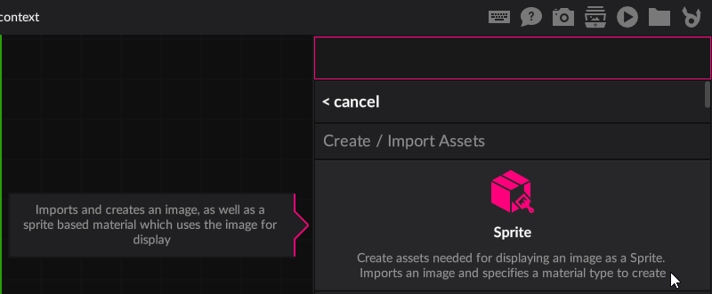{: loading=lazy }

That presents us with the following which we can fill out.

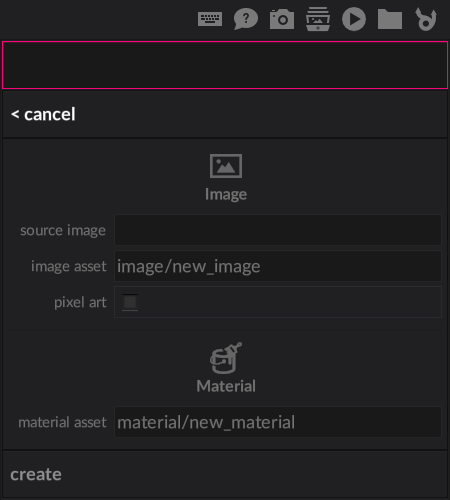{: loading=lazy }

For the **source image** field, select the `image/player.idle.png` file inside the project.

For the **image asset**, we're gonna make `image/player.idle` the name. 
The image asset actually already exists in the project outline but we'll overwrite it, 
so select the existing file and confirm when asked to overwrite (you'll also see a warning on the `create` button).

For the **material asset**, we're gonna make `material/player.idle` the name.
In both cases, we can navigate to the folder, and type the name without an extension and the editor will do the rest.

Here's what the result looks like before confirming.

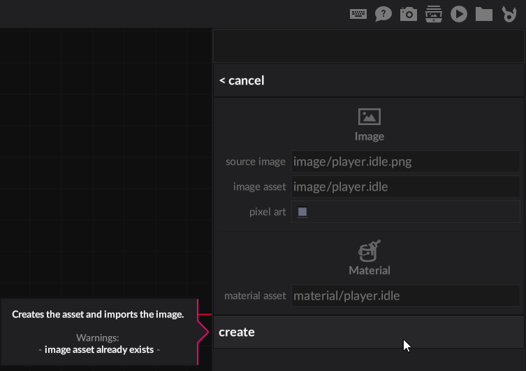{: loading=lazy }

And once created, you'll see the pink notification top left that it succeeded.

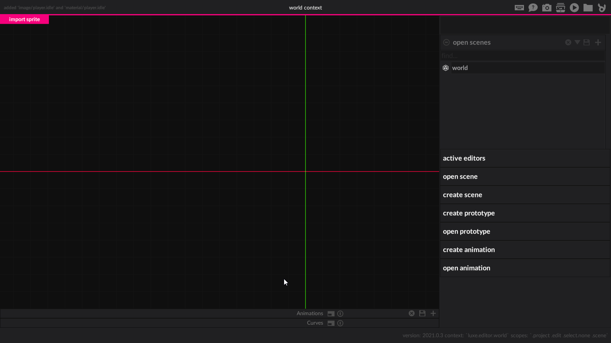{: loading=lazy }

## creating an animation asset

Animations are created inside of the world context.

To create our animation, we can use the `create animation` button in omni.

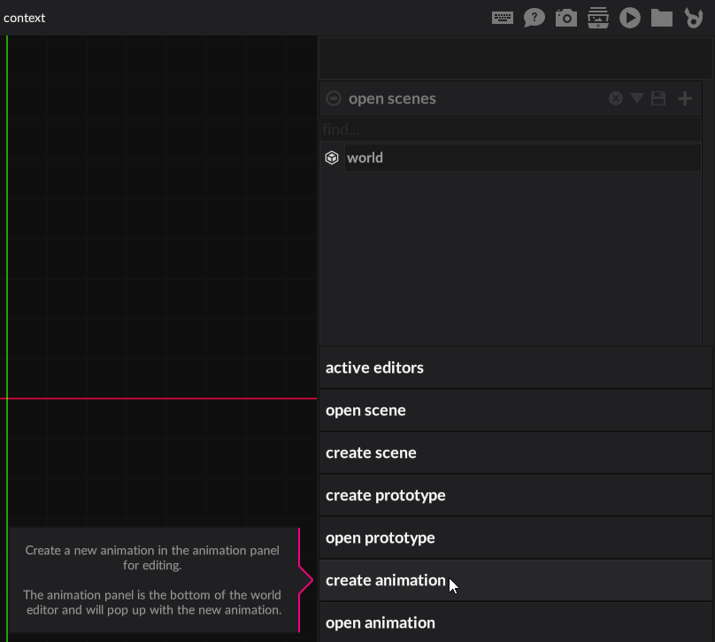{: loading=lazy }

Or we can use the `+` icon on the animation panel, located at the bottom of the world editor.

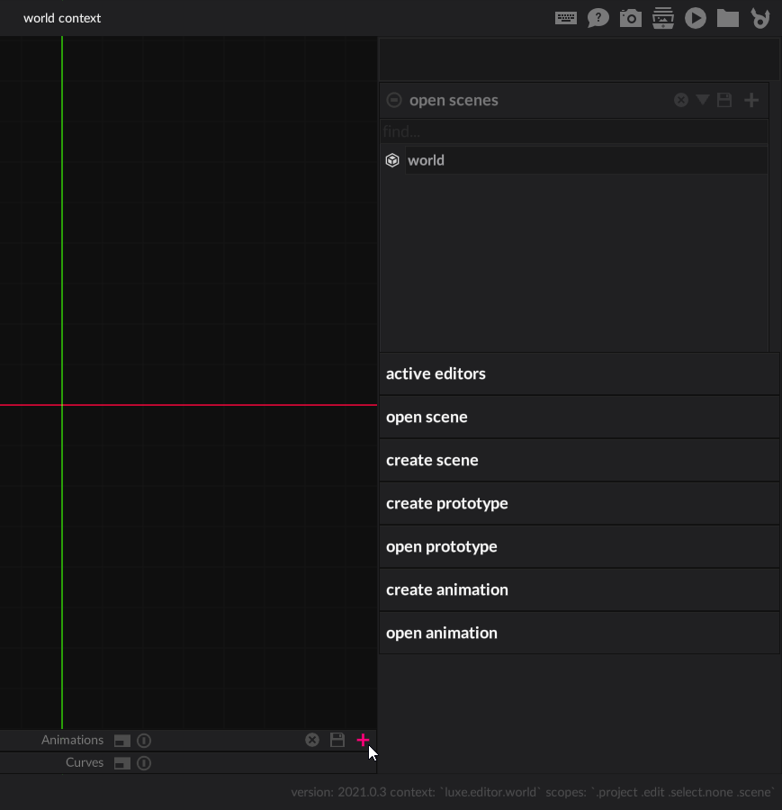{: loading=lazy }

Once selected, you'll see the animation panel pop up, and it will now show a single animation
without any tracks in it, and with a random name.

{: loading=lazy }

Let's configure the animation asset. There's an edit button (pencil icon) on the animation bar, select it to change the name and properties.

{: loading=lazy }

That will bring up the following settings in omni. We're going to name our animation `anim/player.idle`, so
select the **anim asset** field and select the `anim/player.idle` asset path to save it there.

The defaults for the other fields are good as is, so we can hit done to dismiss the animation settings.

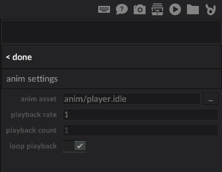{: loading=lazy }

## creating a sprite frame animation track

The next step is to create a sprite frame animation track within our animation. 
An animation can contain multiple tracks, but in this one we only need one track.

### adding the track

To create a track, click the + icon on the animation bar in the animation pane.

{: loading=lazy }

This shows a list of available track types in omni. We'll be using the **Sprite: Frames** track type.
Selecting `ADD` will add the track to the animation in the animation panel.

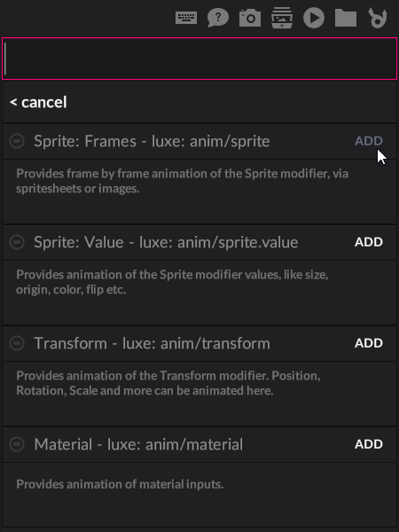{: loading=lazy }

It should look something like this, with a single frame of animation along the timeline.

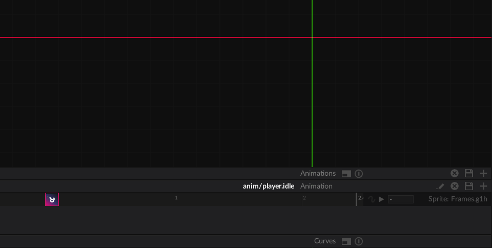{: loading=lazy }

If you hover that frame you'll see options for configuring it, or for creating new frames.

You can scroll the mouse wheel when the mouse is over the track to zoom in and out, and dragging with
the right mouse button held down will pan the timeline around.

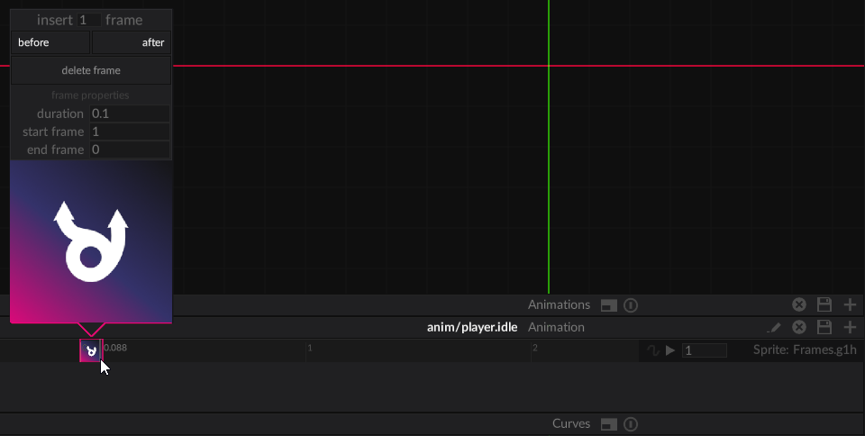{: loading=lazy }

### configuring the track

Currently, to configure the settings for a track you click the name of the track on the right hand side.

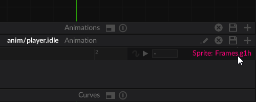{: loading=lazy }

This opens up the track settings in omni for you to edit.

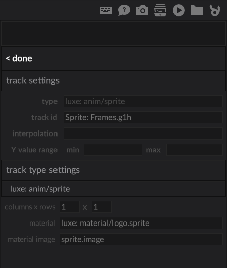{: loading=lazy }

The _track settings_ are shared by all tracks. Some tracks (like the sprite frames track) don't have certain settings, so those fields are disabled.
We only need to set **track id**, since it isn't super important in this case, we'll name it `idle frames`.

Then we have the _track type settings_, which are settings specific to this type of track.

The **columns x rows** setting controls tells the track how our image is laid out. 
If you remember from above, the idle animation is 4 frames laid out horizontally, so we enter `4 x 1`.

And finally we set **material** to `material/player.idle`, by selecting the field it will show a list of materials to choose from.
(We don't need to change material image).

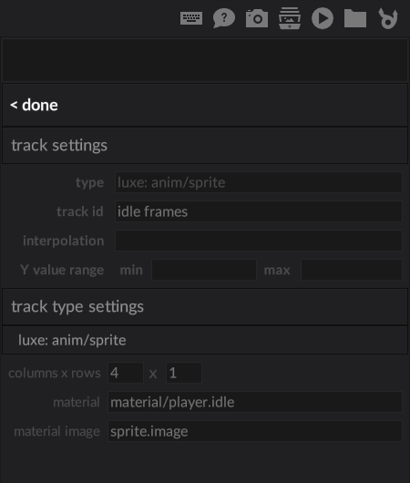{: loading=lazy }

As you change the values, you'll see the frames in the track update. Now when we hover the frame we can see that it's a single frame our player character.

{: loading=lazy }

### adding frames to the animation

This animation in particular is designed to be played forward, and then backward in a loop. 
To do that need to add some frames to our animation, starting with the forward part.

We can hover over the frame, and change **end frame** to `4`. 
What this does is make this frame a range of frames, of the same duration, from start frame to end frame.

!!! note ""
    When dealing with animation, frames start at 1 (not 0).

When you hover the other frames, you'll notice they don't have settings (only a preview). 
That's also why they're a bit dimmer and not highlighted, only those can be edited.

{: loading=lazy }

You can preview the animation to see how it looks by clicking the small play symbol on the track.

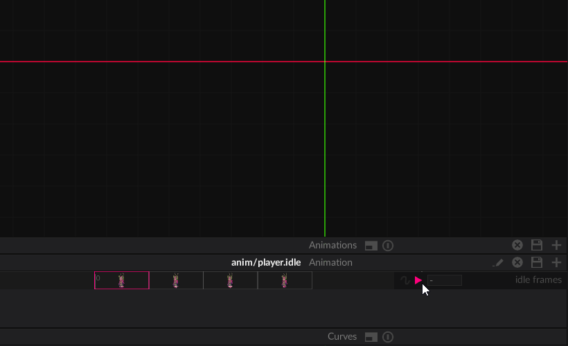{: loading=lazy }

This will change the world scene view to a temporary preview of the animation in isolation. You can then zoom the camera and get a closer look.
Press the stop button in the same location to exit the preview. 

!!! note ""
    Animation previewing is a work in progress

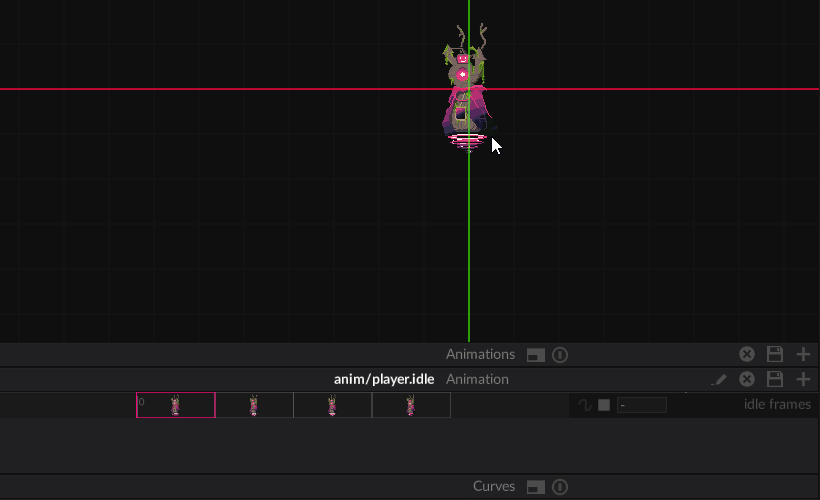{: loading=lazy }

The animation looks a bit too rigid, as mentioned it's meant to play backward again as well. To complete it, 
we'll add a rest frame after the first range, giving it a duration of `0.4` seconds.  

!!! note ""
    Time is always in seconds

To add a frame after the first one, hover the first frame and click the **after** button.
This will insert `1` frame after the selected one.

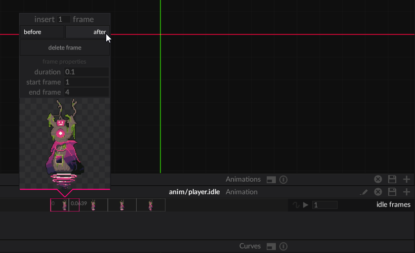{: loading=lazy }

For the new frame, set it's **duration** to `0.4` and **start frame** to `4`, since we want to display frame 4 for a bit longer.

{: loading=lazy }

And finally, we want to play the same frames but in reverse, so we add one more frame.
Set the **duration** to `0.2`, we'll go backwards a bit slower. Set **start frame** to `4` and **end frame** to `1` so it goes in reverse.

{: loading=lazy }

Don't forget to save the animation when you make changes. You can do that on the single animation or all animations by clicking the save icons on the right.

{: loading=lazy }

Now we can preview the animation as a whole again to see the result. 

<video preload="auto" autoplay controls="" loop="loop" style="max-width:100%; width:auto; margin:auto; display:block;">  
  <source src="../../images/tutorial/intro/add-anim-frames-preview.mp4" type="video/mp4"></source>
</video>

## playing the animation in code

!!! tip "make sure to save the animation in the editor"

Now that we have an animation asset, we can use it with the `Anim` modifier.
As with other modifiers, we attach it to our player entity. Since we made our
player entity in code, we'll switch back there to play the animation.

Back inside our `create_player` function, right at the end, we'll add the animation modifier
as well as play the animation we just created.

The `Anim` modifier provides a `play` function as `Anim.play(entity: Entity, anim_asset_id: String)`
which we'll use to start playing the animation.

```js hl_lines="6 8"
create_player() {

  ...

    //create an animation modifier to play animations
  Anim.create(_player)
    //play the idle animation asset
  Anim.play(_player, "anim/player.idle")

} //create_player
```

!!! tip "run the game to see the results"

<video preload="auto" autoplay controls="" loop="loop" style="max-width:100%; width:auto; margin:auto; display:block;">  
  <source src="../../images/tutorial/intro/play-anim-0.mp4" type="video/mp4"></source>
</video>

## next up

Im the next step, we'll fix the player floating in the sky, and add some basic camera follow behaviour.