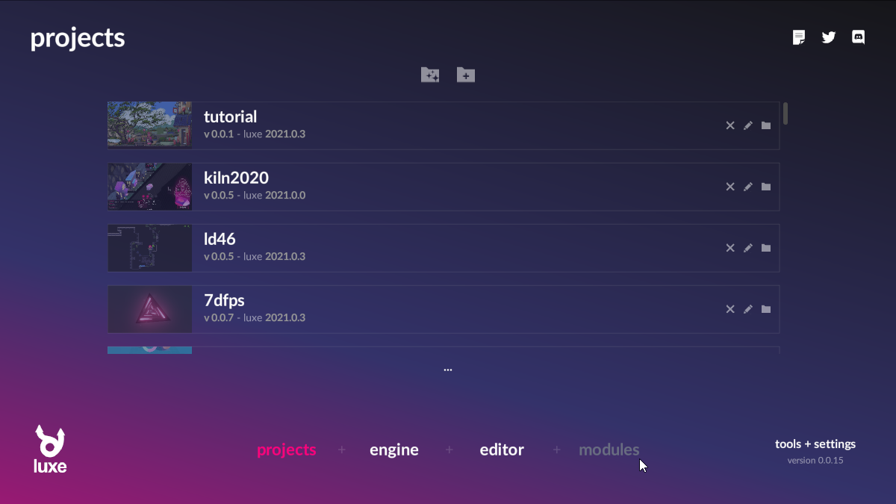
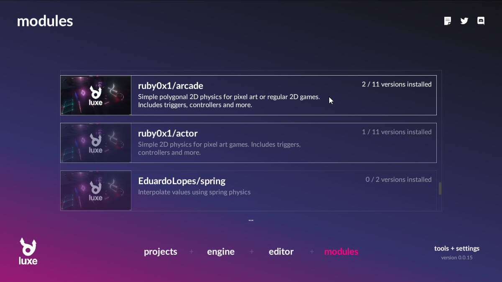
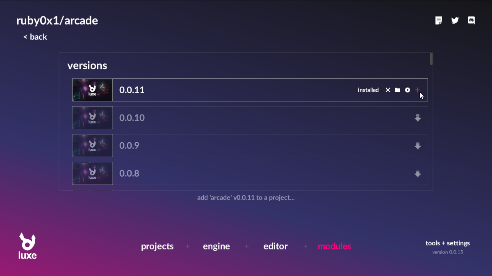
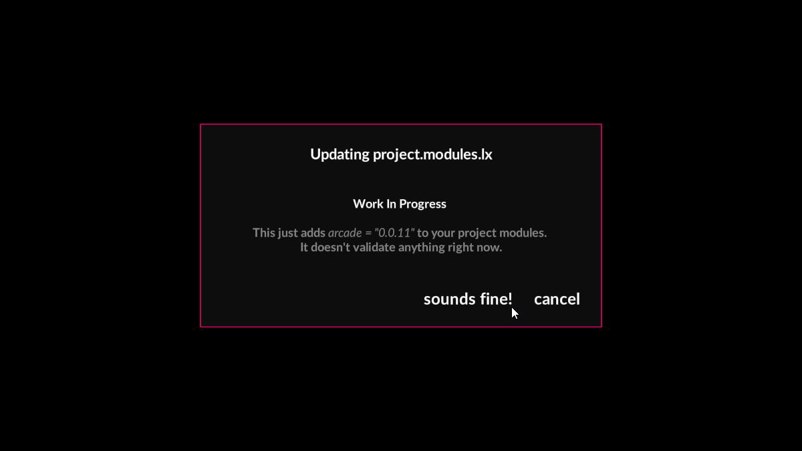
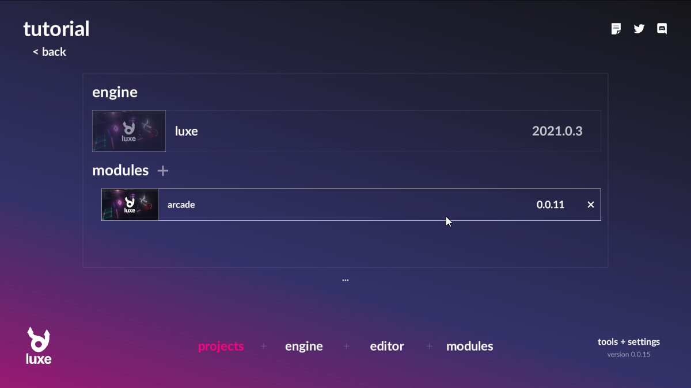
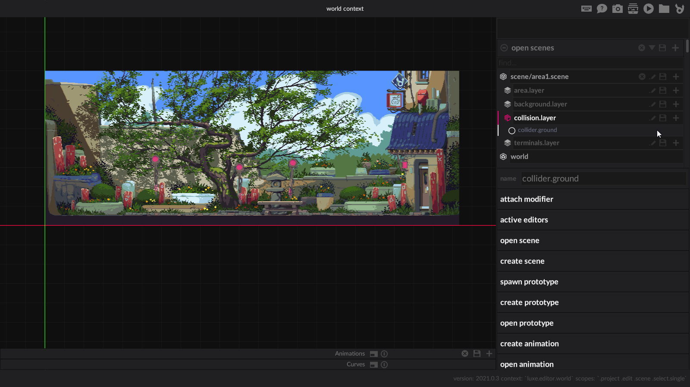
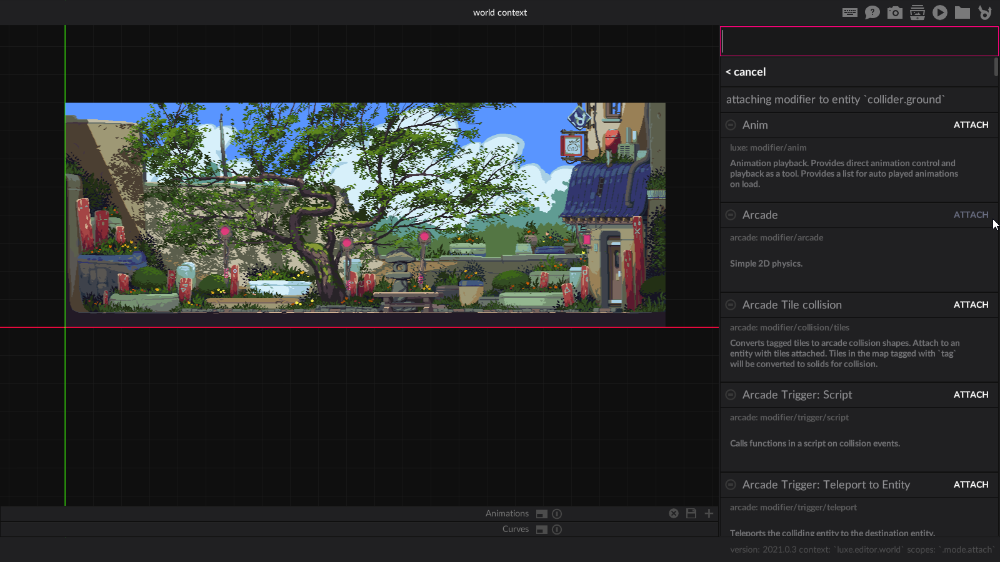
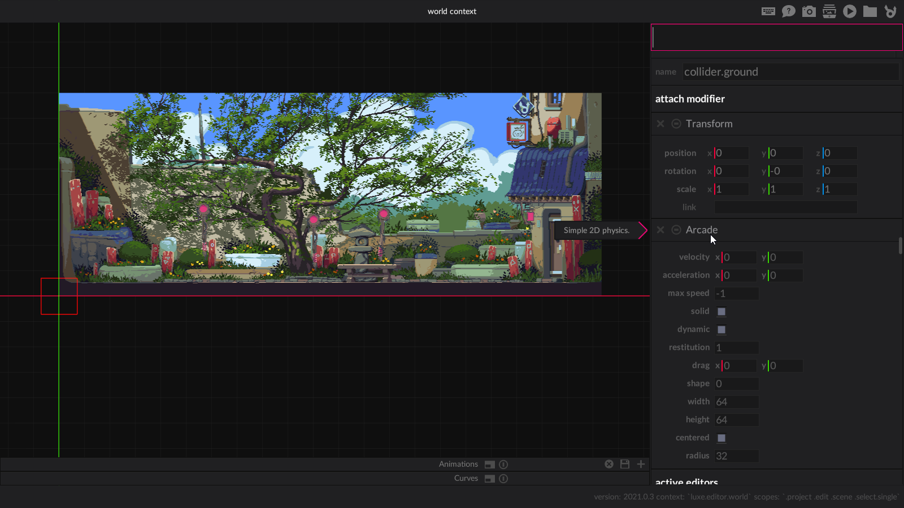
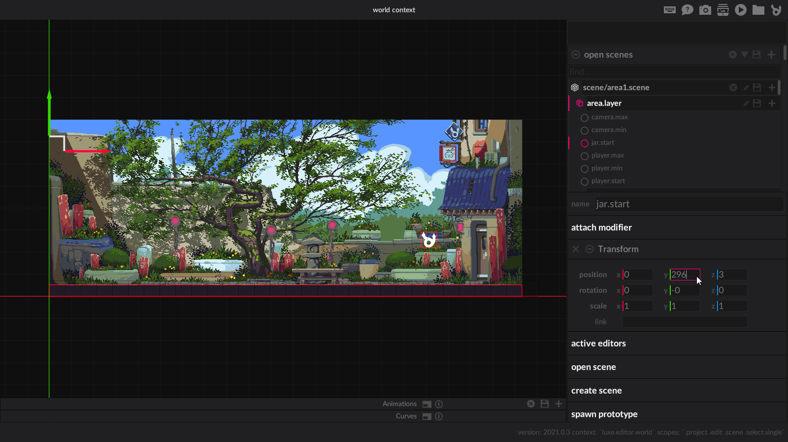
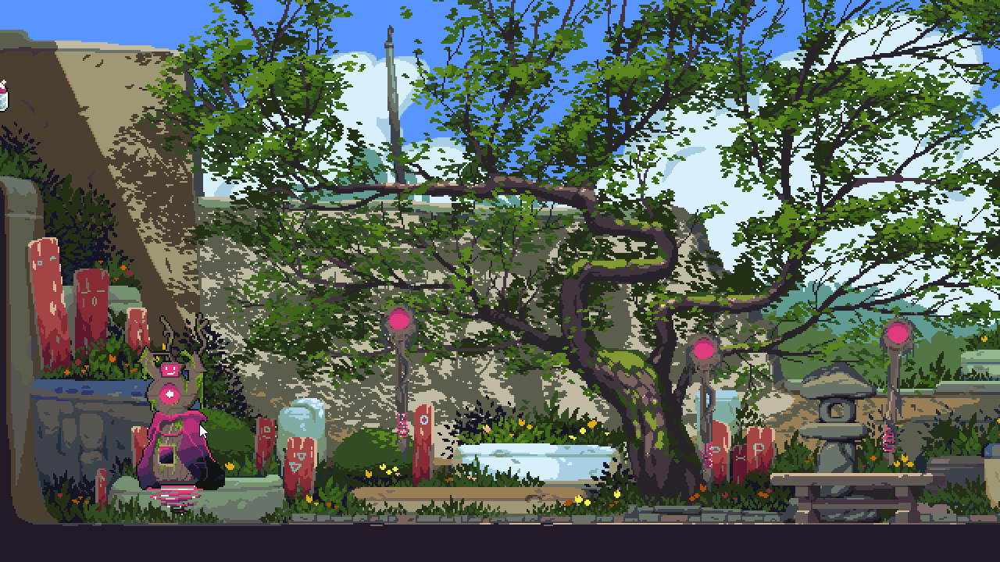

{width="96em"}

# using modules

!!! example "outcome"
    In this step we'll see how to use modules in our project by 
    adding a module that provides simple arcade style physics and collision.

## modules are...

A module is a separate bunch of scripts and assets that our project can depend on, 
which is where lots of behaviour, project outlines and editor tools will come from.

In practice, luxe itself is a module that provides the core engine behaviours.

For this tutorial, we're going to use a module called `Arcade` which provides 
simple physics and collision behaviors. We'll use it to make our jar respond to 
gravity, bounce on the ground, and to know when we've overlapped the jar and are 
close enough to interact with it.

## add a module via the launcher

!!! tip "close the editor when modifying a project's dependencies"

You can add a module to your project in two ways, the first is using the launcher.

Start by going to the **modules** page in the launcher.

{: loading=lazy }

This shows a list of available modules, navigate to find `ruby0x1/arcade`.
Clicking on a module will show available versions.

{: loading=lazy }

Install the latest version of the module, and once installed you'll see the `+` option on the module.
Selecting this to start adding it to a project.

{: loading=lazy }

A list of projects is shown on the next page, select your tutorial project to add it.

{: loading=lazy }

A confirmation pop up shows, which you can confirm.

{: loading=lazy }

This takes you to the project settings showing the module has been added.

{: loading=lazy }

## adding a module manually

Inside your project folder, there's a `project.modules.lx` file. This file contains the modules a project is using.
In it, you can add `arcade = "0.0.11"` or whichever version you're using in order to add it to the project as a dependency.

```js
modules = {
  luxe = "2021.0.3"
  arcade = "0.0.11"
} //modules
```

## using arcade modifiers

Now that we've added the dependency, we should be able to see the effects in the editor.

The arcade module provides several modifiers we can attach to an entity. One of the key ones being `Arcade`, 
which makes the entity behave as a body in the arcade physics system.

The first thing we'll use it for is adding a collidable floor to the area1 scene.

!!! tip "open the area1 scene in the editor"

### ground collider

We'll add a new layer, and call it `collision.layer`.

{: loading=lazy }

Inside it, we'll add an entity and call it `collider.ground` or similar.

{: loading=lazy }

When you go to attach a modifier to this new entity, you'll see new `Arcade` options.
Choose the `Arcade` modifier to make it into a body for the physics to use.

{: loading=lazy }

Once added, you'll see a red square in the bottom left of the scene area, this is the collision shape debug visualization.

{: loading=lazy }

The modifier provides a lot of options, but we only need to configure a few:

!!! note ""
    The arcade modifiers are work in progress and evolve with the progress on the engine.
    For example showing only relevant options vs all options, naming (restitution vs bounciness) and so on.
 
  - **centered** : false 
  - **dynamic** : false
  - **restitution** : 0 
  - **width** : 960
  - **height** : 24

{: loading=lazy }

## scene preview

While working in the editor, you can use the experimental _scene preview_ by **pressing the P key** in the world editor.

This duplicates any scenes you're editing into a new world and ticks the world, which means things like physics and animations will simulate.

!!! note ""
    This is different from playing the game, since this only affects open scenes.
    If you wanted your player to exist while using scene preview, you can for example, 
    create a scene with the player in and load it alongside the other scenes. 
    You could also create the player from code, etc.

### create a test entity

We can test our collider relatively quickly, by creating a temporary layer and entity.
Let's create a layer, add an entity to it, and attach the following modifiers to the entity:

  - Sprite
  - Arcade

!!! note ""
    The Arcade modifier will automatically add a Transform for us since it's required by Arcade

Change the Arcade modifier settings:
  
  - **acceleration** : `x 0 y -400` (gravity)
  - **width**/**height** : `32 x 32`

Change the Sprite modifier settings: 

  - **width**/**height** : `32 x 32`

Move the entity somewhere above the ground so it can fall and bounce.

!!! warning "always save before scene preview as it's experimental"

### iterating with scene preview

When we press the P key, it should show the logo falling to the ground and bouncing.
The default **restitution** value (bounciness) is `1` which means "bounce back the same distance".
If you change the value to `0.25` each bounce will be smaller than the height it fell from.

You can see this in action below, where the value is changed and scene preview is toggled several times to iterate on the value.

<video preload="auto" autoplay controls="" loop="loop" style="max-width:100%; width:auto; margin:auto; display:block;">  
  <source src="../../images/tutorial/intro/test-physics-0.mp4" type="video/mp4"></source>
</video>

## jar collectable collider

One more place we'll add a collider is the jar. 
We'll add a collider to the player from code too later, and when that collider comes nearby the jar, we'll overlap with this one. 

This will entail opening the existing jar prototype and adding a collider entity. There's an **open prototype** option in omni.

{: loading=lazy }

We'll create an entity called `collider.collect` and attach an `Arcade` modifier to it.
Then change the following settings:

  - **solid**: false
  - **restitution**: 0
  - **shape type**: 1 (circle)
  - **radius**: 16

{: loading=lazy }

## jar start position

Final task while we still have the editor open, let's add one more start entity for a position to `area.layer`.
We'll create `jar.start` and add a `Transform`. Set the position to `x 0 y 296 z 3`.

{: loading=lazy }

!!! tip "switch to the code"

In `create_jar` we'll use the same pattern as before, grab the entity and set the position.

```js hl_lines="7 8 9"
create_jar() {

  if(_jar) Entity.destroy(_jar)

  _jar = Prototype.create(_world, "prototype/jar", "jar")

  var jar_start = Entity.get_named(_world, "jar.start")
  var jar_pos = Transform.get_pos(jar_start)
  Transform.set_pos(_jar, jar_pos.x, jar_pos.y, jar_pos.z)

} //create_jar
```

Now when we press space bar, it shows up on the far left side at the top. 
Next we're gonna add physics to it so that it flies into the screen.

{: loading=lazy }

## jar physics

!!! note "workflow issue"
    The ideal workflow would be to configure the jar prototype in the editor.
    Because you currently can't configure the root entity in a prototype, 
    we'll have to put the configuration in the code. This will be fixed soon.

To make the jar a physics object, we attach an Arcade modifier as before.
We'll set the properties for the physics object here too.

Finally, we'll use the random number generator to generate a random velocity.
We want the jar to fly upward a little bit, and to the right, so we set a starting velocity
from random numbers in that range. This just adds a small amount of variation.

```js hl_lines="11 12 13 14 15 16 18 19 20"
create_jar() {

  if(_jar) Entity.destroy(_jar)

  _jar = Prototype.create(_world, "prototype/jar", "jar")

  var jar_start = Entity.get_named(_world, "jar.start")
  var jar_pos = Transform.get_pos(jar_start)
  Transform.set_pos(_jar, jar_pos.x, jar_pos.y, jar_pos.z)

  Arcade.create(_jar)
  Arcade.set_acc(_jar, [0, -400])
  Arcade.set_drag(_jar, [1, 1])
  Arcade.set_width(_jar, 12)
  Arcade.set_height(_jar, 17)
  Arcade.set_restitution(_jar, 0.6)

  var velocity_x = RNG.int(128, 256)
  var velocity_y = RNG.int(128, 180)
  Arcade.set_vel(_jar, [velocity_x, velocity_y])

} //create_jar
```

Now when we press space bar, we get a flying jar.

<video preload="auto" autoplay controls="" loop="loop" style="max-width:100%; width:auto; margin:auto; display:block;">  
  <source src="../../images/tutorial/intro/jar-physics-0.mp4" type="video/mp4"></source>
</video>

### physics debug keys

It can be useful to see the physics shapes in the game, and it can also be useful to slow down time to make sure things are making sense.

We can add two more debug keys into the `tick` method.

```js hl_lines="9 10 11 12 13 14 15 16 17 18 19 20"
tick(delta) {

  if(!_player) return

  if(Input.key_state_released(Key.space)) {
    create_jar()
  }

  if(Input.key_state_released(Key.key_0)) {
    Arcade.toggle_debug_draw_enabled(_world)
  }

  if(Input.key_state_released(Key.key_8)) {
    var r = World.get_rate(_world)
    if(r == 1) {
      World.set_rate(_world, 0.1)
    } else {
      World.set_rate(_world, 1)
    }
  }

  update_terminals()

} //tick
```

With that, we can see the debug visualizations for physics, and you can slow down time to see things in slow motion.

<video preload="auto" autoplay controls="" loop="loop" style="max-width:100%; width:auto; margin:auto; display:block;">  
  <source src="../../images/tutorial/intro/jar-physics-1.mp4" type="video/mp4"></source>
</video>

## next up

In the next step we'll use collision callbacks to pick up the jar, 
make the jar follow the player around and keep track of the state the jar is in.