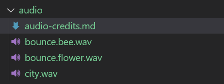
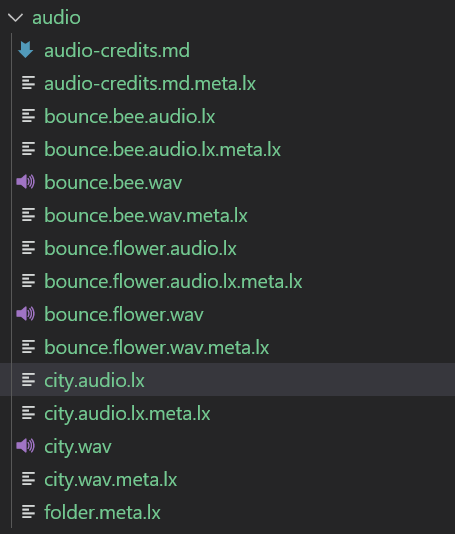

{width="96em"}

# Audio
Audio is a major and important part of making a game feel good. 
It is often underlooked and can make a huge difference in how a game feels.

!!! example "outcome"
    In this tutorial we'll **add audio to our bee game**.   
    We'll see how to import audio content, play sounds and use audio buses for volume control.

## Audio Roadmap

While the basic audio system is usable and works, there's a more extensive version we are implementing. It was designed/spec'ed with the good folks at [A Shell In The Pit](https://ashellinthepit.com/) as they have a lot of experience doing and implementing audio at our target scale. 

## Importing audio content

Since audio tends to be fairly straight forward from a content perspective, all we need to do is drop some audio assets into our project. When we build, the asset pipeline will automatically generate the necessary `audio.lx` metadata files for us to use!

For our bee game example, we're going to use a useful website called [Freesound.org](https://freesound.org) - they provide an invaluable service for getting audio to prototype with or use for your game. **Make sure you pay attention to the requirements for each sound that you download!**. 

!!! note ""
    It is good practice to credit every sound properly as well, even if it doesn't require it.

### Sounds we'll use

Instead of music, we're going to be using ambience. We know our game takes place above the rooftops, so we'd like a sort of city atmosphere. We also have a bouncing sound - one when the bee bounces without a flower, and one when we do bounce on the flower. In our case, we aim to find some sounds that don't require editing, and can be used roughly as is. 


- [City sound](https://freesound.org/people/klankbeeld/sounds/659752/) - [author](https://freesound.org/people/klankbeeld/) 
- [Flower bounce](https://freesound.org/people/Rudmer_Rotteveel/sounds/536409/) - [author](https://freesound.org/people/Rudmer_Rotteveel/)
- [Bee bounce](https://freesound.org/people/rvdw2004/sounds/709678/) - [author](https://freesound.org/people/rvdw2004/)

We'll bring these into a folder called `audio/` along with the credits file (this way when it's time to credit properly we can make sure we didn't forget anything):



If we run a build, we can see that the asset pipeline took care of generating the data needed to load + use the audio already:



## Playing some audio

The background sound is an easy one - we simply play it in the `ready` function in our game. 

!!! tip "Import the audio API in game.wren if it isn't there"

```wren
import "luxe: audio" for Audio
```

### Looping a sound

Often we'll want a sound to loop continously - the API makes this easy with `:::js Audio.loop(...)`. Like with other assets, we should see them in code completion when we go reach for one using the `Asset.audio` api like this:


That's it really! The basic usage of audio is really simple. There's also `:::js Audio.play` for one shot sounds.

!!! tip "Play the background sound right before you load the scene in your game!"

```wren hl_lines="1 2"
var bg_sound = Asset.audio("audio/city") 
Audio.loop(bg_sound)

Scene.create(world, Asset.scene("scene/level"))
```

### Bounce sound

When the bee collides with something, we'll play our bounce sound.
We already have a function that does stuff when we collide with something, so for now we just play our sound in here.

```wren hl_lines="6"
handle_collision() {
  
  Arcade.add_collision_callback(player) {|entity_a, entity_b, state, normal, overlap_dist|
    if(state != CollisionEvent.begin) return

    Audio.play(Asset.audio("audio/bounce.bee"))

  ...

  }
} //handle_collision
```

#### Sound spam
If you play the game and bounce around, you should hear the sound playing. This works well, but sometimes we land on a surface and it plays the sound way too many times in rapid succession! This is a common problem with audio, so we need to not play it too frequently. We'll do a very simple timer to prevent it spamming the sound.

To do that we'll add a new variable to our class:

```wren
var last_bounce: Num = 0
```

And change our audio play line to check how much time has passed, and don't play it if it was already played recently (we use 0.25 seconds):

```wren
if(World.time(world) > last_bounce + 0.25) {
  last_bounce = World.time(world)
  Audio.play(Asset.audio("audio/bounce.bee"))
}
```

### Flower sound

We also play an **additional** sound when we bounce on the flower. The sounds combining is intentional, as it should create a nice mix of sound in this case.

We already have code handling what happens when you bounce on a flower, so it's as easy as adding one line:

```wren hl_lines="3"
if(Tags.has_tag(entity_b, "flower")) {
  Anim.play(entity_b, "anim/bounce")
  Audio.play(Asset.audio("audio/bounce.flower"))
}
```

## The audio bus

It's common for games to have a volume slider for Sounds, Music and Voices as separate sliders. The term for that is "audio bus", we play sounds on the SFX bus and so on. We always have global volume control as well, as everything will eventually come out the main bus (global bus). So how do we do that in luxe?


!!! note ""
    It's possible your outline has created default buses for you! We'll cover how they're made either way.

### Creating a bus asset

Defining a bus is often done as an asset so it can be referenced easily in the Audio API. 
We'll do that inside `audio/bus/` by creating a `sounds.bus.lx` and `ambience.bus.lx`.

!!! tip "Create a file called `audio/bus/sounds.bus.lx`"
!!! tip "Create a file called `audio/bus/ambience.bus.lx`"

Inside both files, we have a very simple volume value! 

!!! note "Typically, we don't default sounds to 100% - this is bad practice. The user can adjust the audio themselves as needed."

```wren
bus = {
  volume = 0.75
}
```

### Using a bus asset

!!! bug "There should be a simpler API for playing the sound on a bus without many args, and the function to move a sound to a bus is missing on the Wren side of the API. This is a WIP!"

Here's the variant of `Audio.play` (and `Audio.loop`) that accepts a bus:

`:::wren Audio.play(source: AudioAsset, as3D: Bool, bus: AudioBus, volume: Num)`

Like before, we get the completion since our bus is an asset, and we grab it from `Audio.bus`:


!!! tip "Change your sound effects to use the sounds bus, and the city ambience to use the ambience bus!"

```wren hl_lines="3"
if(World.time(world) > last_bounce + 0.25) {
  last_bounce = World.time(world)
  Audio.play(Asset.audio("audio/bounce.bee"), false, Asset.bus("audio/bus/sounds"), 1)
}
```

And the ambience:

```wren
Audio.loop(bg_sound, false, Asset.bus("audio/bus/ambience"), 1)
```

!!! note ""
    Notice that each sound has it's own relative volume as well! The flower bounce sound, sounds a bit too loud compared to the bounce, so the flower bounce volume when playing the sound can be tweaked in the play call e.g to `0.5` volume.

## Setting the volumes

So we have a few layers of sound volumes to control:

### Individual sound volume

There's two places typically, on `play/loop` you can specify a volume to start with or you can use the audio api to change the volume after playing it:

```wren
//change flower bounce audio manually
var sound = Audio.play(...)
Audio.volume(sound, 0.5)
```

### Bus volume

To control the bus volume for `sounds` or `ambience` (as you might do in a UI!) we use the `Bus` API.

```wren
import "luxe: audio" for Audio, Bus
```

And then we can call the set (or get) the volume:

```wren
Bus.set_volume(Asset.bus("audio/bus/ambience"), 0.75)
Bus.set_volume(Asset.bus("audio/bus/sounds"), 0.75)
```

If you'd like to experiment, add this to your `tick` method in your game.
What this does is calculate a `0...1` value (ratio) of where your mouse is horizontally on the window.
The further left the mouse is the quieter the volume of the ambience, and the further right the louder it will be.

```wren
var dx = Input.mouse_x() / width 
Bus.set_volume(Asset.bus("audio/bus/ambience"), dx)
```

When you do this, you'll notice the sounds are unaffected by the volume change.

### Global volume

!!! bug "Woops! The global volume API wasn't exposed to Wren - it will be in the next build"

## Try this

!!! tip "Experiment with the audio api using the sound instances returned by playing a sound"

