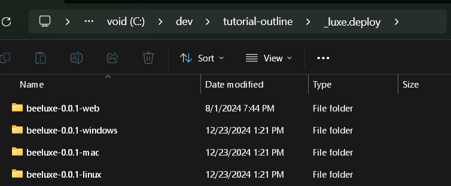
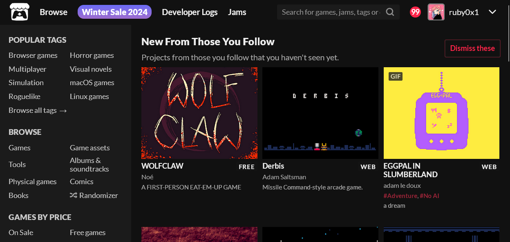
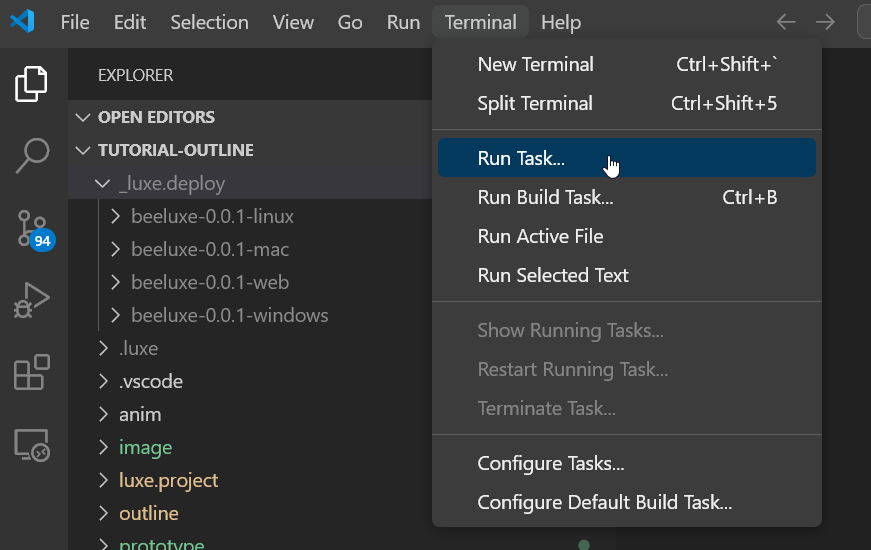
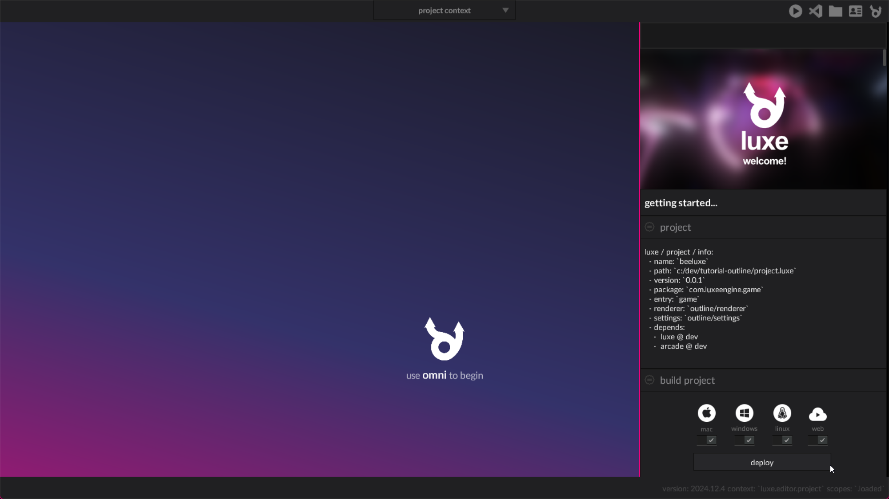
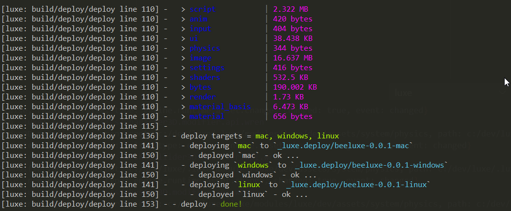

{width="96em"}

# Deploying a build
A quick look at making a build for a luxe game that you can share.

!!! example "outcome"
    In this tutorial we'll **make a build of our bee game**.   
    We'll see how to use the editor, vscode, and the terminal to do it.

## The `_luxe.deploy/` folder

When you deploy a build with luxe, currently it places the builds into a folder called `_luxe.deploy/` inside the project.



The contents of the folder is a versioned build separated by build target/platform. This makes it easy to zip a folder (e.g `beeluxe-0.0.1-windows` -> `beeluxe-0.0.1-windows.zip`) and upload the file directly or share with a friend.

You'll notice that we have multiple platforms here - **You can build for other platforms from the one you are on**, as long as you're on the main path. 

!!! note ""
    The build is cross platform - but there are some nuances (e.g executable flag on linux/mac) to beware of when sharing a build.

## itch.io

A common place to share your games with others is https://itch.io - which is free and allows making your game available for others to play. 



Their system deals with cross platform details mentioned above, so if you made a zip of each of these folders and uploaded it to itch.io following their documentation and guidelines, you're good to go. You can also join game jams or host one and a lot more.

## Versioning

Note that the builds use the project version number in the folder - **but will overwrrite the existing build if you build multiple times with the same version number**.

!!! warning "Versioning is important"
    Update your version inside `luxe.project/version.lx` each time you build, or back up your builds! You can also automate the version number changing every time you deploy - [see this dev log for now](https://luxeengine.com/dev-log-14/#projectluxe-wren-code).

## Deploy from Visual Studio Code

!!! warning "Currently, deploying from vscode only deploys for the target you are developing on"

If you visit the `Terminal` menu on the main menu bar, you'll find a `Run Task...` menu option:



Inside it, there's a category for `luxe`, as well as previously used ones if any (usually none at first). 


And inside the luxe folder, we have some options, one of which is `luxe: deploy - Deploy the project`.


Selecting this option will drop the latest build for the platform you're using into the folder and print some info:


## Deploy from the luxe editor

Inside the editor in the project context (the default one you start on), there's a section for deploying a build for various targets.



If you hit deploy, give it a few seconds to finish up and it should open the folder containing the builds.

## Deploy from a terminal

You can also deploy from the terminal or command line. The syntax is `luxe deploy` with `--target <platform>`.

By default, luxe creates a shortcut to the latest luxe binary inside your user folder, such as:

- `~/.luxe/bin/luxe`
- `C:\Users\USER\.luxe\bin\luxe`

We can use this to always find a luxe binary typically. We can specify more than one target as well, by specifying `--target` multiple times.
You can enter something like this into your terminal of choice, and hit enter to deploy the build. 

`:::bat c:\Users\ruby\.luxe\bin\luxe deploy --target mac --target windows --target linux`

Or on mac/linux:

`:::lua ~/.luxe/bin/luxe deploy --target mac --target windows --target linux`



### Additional flags

Any flags passed to the deploy action will be available inside your `project.luxe` file, allowing you to do different things for different builds. 

For example we use a `--steam` flag to signal that we want to copy additional binaries and bump the version explicitly when deploying for Steam.

[See this dev log for now](https://luxeengine.com/dev-log-14/#projectluxe-wren-code) but here is an example of accessing the flags:

```wren
postdeploy() {

  import "luxe: io" for IO
  var flags: Flags = IO.flags()
  var do_copy = flags.has("copy")

  if(do_copy) {
    //do something
  }

} //postdeploy
```

## Try this

!!! tip "Make a build"
    Make a build of your tutorial progress and share it with a friend or community.