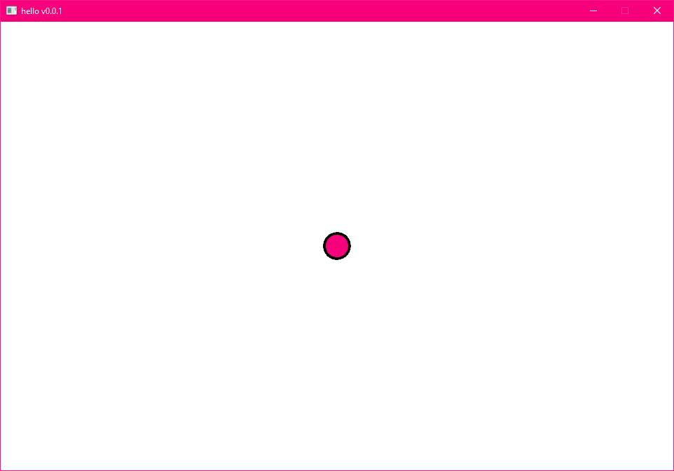
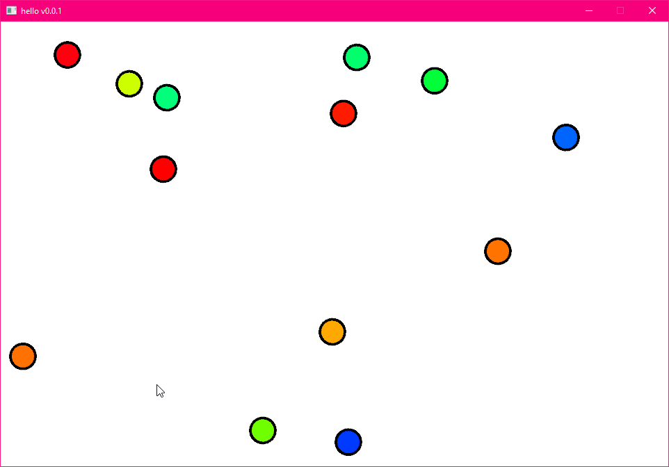
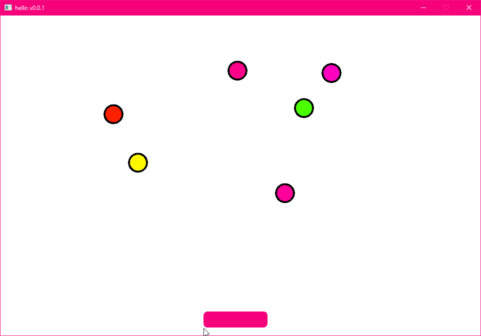
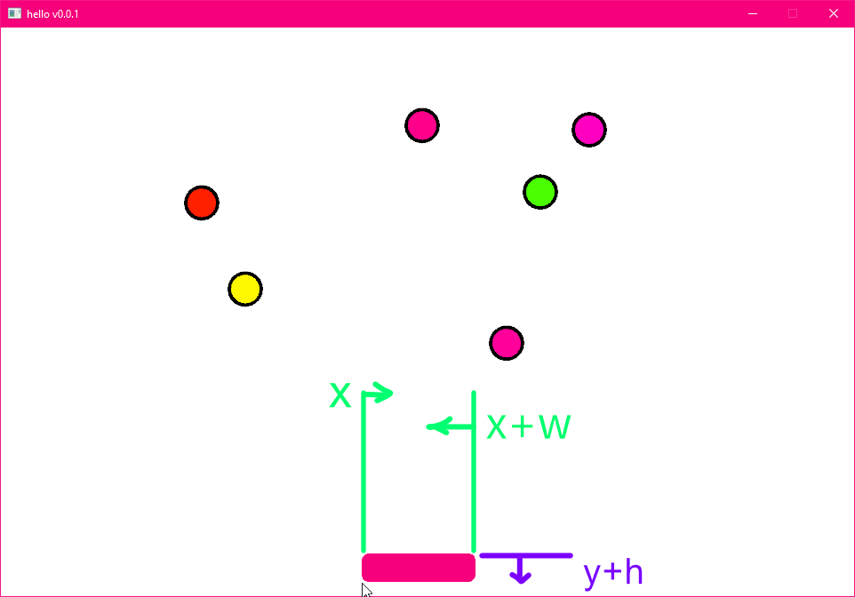
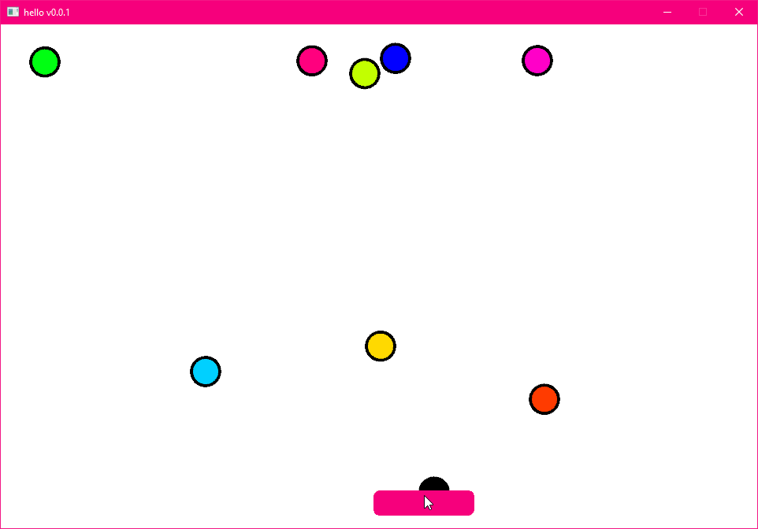

{width="96em"}

# Draw + Input
Drawing primitives and handling basic input.

!!! example "outcome"
    In this step we'll **use the Draw api** to put something on screen.   
    We'll also use the **Input Query API** for handling prototype style input.

    We'll make a simple game where pressing a key will drop   
    a pebble from a random position at the top of the screen.   
    The player will have to catch that pebble with the mouse.

## Play it

Click first, then press ++space++ to create pebbles.

<iframe src="live/index.html" width="100%" height="405px" style="overflow:hidden; display:block; position: relative; border:none;">
</iframe>

## Preparation 

We'll continue from our empty project before, and make it even emptier. We'll take away the logo and the color changing background!

!!! tip "do this"
    **Remove all of these highlighted lines** from your `game.wren` file.


```js hl_lines="3 9 10 11 17 23"
class Game is Ready {

  var logo = Entity.none

  construct ready() {

    super("ready! %(width) x %(height) @ %(scale)x")

    logo = Entity.create(world)
    Transform.create(logo)
    Sprite.create(logo, Assets.material("luxe: material/logo"), 128, 128)

  } //ready

  tick(delta: Num) {

    Transform.set_pos(logo, mouse.x, mouse.y)

    if(Input.key_state_released(Key.escape)) {
      IO.shutdown()
    }

    color.r = color.g = color.b = (IO.timestamp()/40 % 0.15)

  } //tick

} //Game
```

We'll add one line to the background color, and this is what it should look like:

```js hl_lines="7"
class Game is Ready {

  construct ready() {

    super("ready! %(width) x %(height) @ %(scale)x")

    color = Color.white

  } //ready

  tick(delta: Num) {

    if(Input.key_state_released(Key.escape)) {
      IO.shutdown()
    }

  } //tick

} //Game
```

## Game variables

Our game is going to need a few variables to store information, so let's create some. Class variables go before anything else in the class (after the first `{`) and look like this:

```js
var name: Type = value
```

The type is optional, as it can know the type of a lot of the time. For example, `var number = 3` will show up as `var number: Num = 3` with what is called an "inlay hint" telling you it knows that number is well, a number!

Add a variable called pebbles, as a list. The syntax for a list is `[]` which just means, a list with nothing in it (yet).

We'll also add one for our drawing context, which we'll talk about next.

And lastly, we need a random number generator. Let's make one right here, because you can run code to initialize values.

!!! note "variables must be initialized to _some_ value!" 

```js hl_lines="3 4 5 6 7 8"
class Game is Ready {

  //A list of pebbles on screen
  var pebbles: List = []
  //Our drawing context
  var draw: Draw = null 
  //A random number generator
  var random = Random.new()

  construct ready() {
```

## The `Draw` tool

With luxe, there are a bunch of tools and services available to quickly explore ideas and try things out. 

One of those, is called `Draw`, it provides shape drawing, text drawing and more. It can be used for debug visualization, for whole games, and for immediate or cached rendering both.

!!! note "imports"
    When you want to use a tool (an API) in luxe, you need to import it first.   

    In this case, we already have it imported in our `game.wren` at the top:

    ```js
    import "luxe: draw" for Draw, PathStyle
    ```

## Creating a `Draw` context

A context is a bit like a canvas, it remembers the things you drew, and when you're done you can commit the changes to it, which will display it. To create one, we'll have to ask the world for a render set - something you'll learn more about in future - but for now, this is how you do it.

!!! tip "Add a line that initializes our draw variable, to a new `Draw` context."

```js hl_lines="7"
  construct ready() {

    super("ready! %(width) x %(height) @ %(scale)x")

    color = Color.white

    draw = Draw.create(World.render_set(world))

  } //ready
```

## The `tick` method

The `tick` method in our class is called once every frame the game runs. In here, we can do things like, draw our pebbles, check if they went off screen or hit the player, and check if there was any input.

To explore this, let's draw a pebble in the middle of the screen.

```js
  tick(delta: Num) {

    var x = width / 2
    var y = height / 2
    var z = 0
    var radius = 16
    var smooth = 6

    Draw.circle(draw, x, y, z, radius+4, smooth, Color.black)
    Draw.circle(draw, x, y, z, radius, smooth, Color.pink)

    if(Input.key_state_released(Key.escape)) {
      IO.shutdown()
    }

    Draw.commit(draw)

  } //tick
```

{width="50%" loading=lazy}

!!! example "ideas to try"
    - Try using `mouse.x` and `mouse.y` as the x and y values.   
    - What happens if you comment out the commit line? like this: ` // Draw.commit(draw) `

We can remove this code from `tick` for now, as we'll build up our game code next.

## The game code

To start with our game code, we'll block out a few lines of code:

- Add an empty `create_pebble` and `update_pebbles` method
- Add an empty `update_player` method
- Check if the player pressed the ++space++ key, call `create_pebble()`
- call `update_pebbles` to make them move
- commit our Draw context

First add `create_pebble` as an empty method. This is where we will add our code later. And hey, we can already see how to query if a key was released! Let's copy that and and call our new method.

!!! tip "Add the highlighted code changes"

```js hl_lines="1 2 3 4 5 9 10 11 12 13 14 15 16"
  create_pebble() {}

  update_pebbles(delta: Num) {}

  update_player() {}

  tick(delta: Num) {

    if(Input.key_state_released(Key.space)) {
      create_pebble()
    }

    update_pebbles(delta)
    update_player()

    Draw.commit(draw)

    if(Input.key_state_released(Key.escape)) {
      IO.shutdown()
    }

  } //tick
```

## Creating a pebble

Since we're making a simple game in one file, we can use a simple class in the same file to represent a pebble. A pebble is just a few values for now, so just above our game class, we'll add a pebble class:

```js hl_lines="1 2 3 4 5 6 7 8"
class Pebble {
  var x = 0
  var y = 0
  var speed = 20
  var color = Color.pink
  var active = true
  construct new() {}
}

class Game is Ready {

```

Another tool we have in luxe, is the `Log.print()` API, which allows to write information into the log window (and file). This can be very handy for debugging values and figuring out what's happening in our code.

!!! note "using `%( )` we can insert variables into a string to see their contents. This is called string interpolation"

Let's fill in the blank `create_pebble()` method we made! 

!!! tip "Add the highlighted code changes"

```js hl_lines="3 4 5 6 7 8 9 10 11 12 13 14 15"
create_pebble() {

  var pebble = Pebble.new()
  
  // set it up using a random color, 
  // and a random position on the top of the screen
  pebble.color = Color.color_from_hue(random.float())
  pebble.speed = random.int(20, 150)
  pebble.x = random.int(width)
  pebble.y = height - 8

  // add to the list of pebbles
  pebbles.add(pebble)

  Log.print("creating a pebble at `%(pebble.x) , %(pebble.y)`...")

} //create_pebble
```

## Drawing the pebbles

If we ran that code, and press space bar, we'd see the log message but no pebbles yet. Let's redo our drawing inside `update_pebbles` but this time, we'll draw the pebbles in our list using a `for` loop, as we'll see.

!!! tip "Add the highlighted code changes"

```js hl_lines="3 4 5 6 7 8 9 10"
update_pebbles(delta: Num) {

  var z = 0
  var radius = 16
  var smooth = 6

  for(pebble: Pebble in pebbles) {
    Draw.circle(draw, pebble.x, pebble.y, z, radius+4, smooth, Color.black)
    Draw.circle(draw, pebble.x, pebble.y, z, radius, smooth, pebble.color)
  }

} //update_pebbles
```

!!! note "for loop"
    A `for` loop will run the code inside the `{ }` for each pebble in the list. If there are none in the list, nothing happens

    We added a `pebble: Pebble` to our loop variable, this gives us code completion on the pebble variable

This is how it should look, after hitting ++space++ a bunch of times.

{width="50%" loading=lazy}

## Moving the pebbles

Now we can update our pebbles to fall downward. 

To do this, we'll move the y position of our pebble every update, by `pebble.speed` amount. 

!!! example "delta time ([detailed video on the concept](https://www.youtube.com/watch?v=yGhfUcPjXuE))"
    When we do `y = y - speed` the value is in world units. We're moving `speed` world units every update.    
    How often does it update? We don't know, it depends on the computer it is running on! 
    
    In our empty project, world units = window pixel, so we could say it moves at `20 pixels every update`.    
    What we really want is this value to be the same for every player, we want `20 pixels per second` instead. 
    
    To do that, we use that `delta` variable we handed to our method.    
    If we multiply `speed` by `delta` time, we get `units per second` instead of just `units`. 

!!! tip "Add the highlighted line"

```js hl_lines="9"
update_pebbles(delta: Num) {

  var z = 0
  var radius = 16
  var smooth = 6

  for(pebble: Pebble in pebbles) {

    pebble.y = pebble.y - (pebble.speed * delta)

    Draw.circle(draw, pebble.x, pebble.y, z, radius+4, smooth, Color.black)
    Draw.circle(draw, pebble.x, pebble.y, z, radius, smooth, pebble.color)
  }

}
```

And now the pebbles fall!

{width="50%" loading=lazy}

## Player paddle

The player will be a rectangle near the bottom of the screen, and will try to catch the falling pebbles with their paddle. Let's start with drawing the player.

!!! tip "Add the highlighted code changes"

```js hl_lines="3 4 5 6 7 8 9 10 11 12 13 14 15 16 17 18 19 20"
update_player() {

  //player width and height
  var w = 128
  var h = 32

  //centered on the mouse
  var x = (mouse.x - w/2)
  //stop at the right edge of the window
  x = x.min(width - w)
  //stop at the left edge of the window
  x = x.max(0)

  var y = 16
  var z = 0
  var angle = 0
  var radius = [8,8,8,8]
  var smooth = [4,4,4,4]

  Draw.quad_detailed(draw, x, y, z, w, h, angle, radius, smooth, Color.pink)

} //update_player
```

{width="50%" loading=lazy}

## Player collision

Nothing happens when the pebbles hit the player, so we'll have to add a check for that. We're going to keep it really simple and do basic checks to see if the pebble would be overlapping with the player.

Here's how we'll approach it:
- If the `pebble x > player x`
- and `pebble x < player x + player width`
- we know that the pebble is in line with the player horizontally.
- Now we just need to know if the `pebble y < player y + player height`

{width="50%" loading=lazy}

We'll mark the pebble as inactive so we can ignore it next time.

!!! tip "Add the highlighted lines, at the end of update_player()"

```js hl_lines="5 6 7 8 9 10 11 12 13 14 15 16"
update_player() {

  ... //player drawing

  for(pebble: Pebble in pebbles) {

    var inside_x = pebble.x >= x && pebble.x <= x + w
    var inside_y = pebble.y <= y + h
    var was_collected = pebble.active && inside_x && inside_y

    if(was_collected) {
      pebble.color = Color.black
      pebble.active = false
    }

  } //for each pebble

} //update_player
```

And with that, we can see the pebbles turn black when we collect them. Next we'll clean up pebbles we've collected or that have hit the ground below the player.

{width="50%" loading=lazy}

## Pebble cleanup

We can easily tell when a pebble has been missed by using `inside_y` when `inside_x` is false. When that happens, we'll turn the pebble white instead of black.

And, when any pebble hits the edge of the screen, we'll remove it from the game.

!!! tip "Add the highlighted lines

```js hl_lines="5 11 12 17 18 19 20 21 22"
update_player() {

  ... //player drawing

  var to_remove = []
  for(pebble: Pebble in pebbles) {

    var inside_x = pebble.x >= x && pebble.x <= x + w
    var inside_y = pebble.y <= y + h
    var was_collected = pebble.active && inside_x && inside_y 
    var was_missed = pebble.active && inside_x == false && inside_y == true
    var off_screen = pebble.y < -16

    if(was_collected) {
      pebble.color = Color.black
      pebble.active = false
    } else if(was_missed) {
      pebble.color = Color.white
      pebble.active = false
    } else if(off_screen) {
      to_remove.add(pebble)
    }
    
  } //for each pebble

  for(pebble: Pebble in to_remove) {
    pebbles.remove(pebble)
  }

} //update_player
```

## Try this

!!! tip "Add score"
    Add a `score` variable to the game class, add `1` to it each time a pebble is collected. Display the score using `Draw.text` and `Asset.font("luxe: font/lato")`.

!!! tip "Add pause"
    Add a `var paused = false` boolean. This can stop the pebbles from moving and pause the game e.g `if(paused) return`. You can stop the player moving and display the paused state on screen.

!!! tip "Add game over"
    Add a losing condition, like if you have 5 lives and each time you miss, you lose one. When you have 0, display a game over message. You'll probably want to want make ++space++ key restart the game, which will require resetting the state and `pebbles.clear()` 

!!! tip "Add win state"
    Add a win condition, like if you collect 20 pebbles or survive for a certain amount of time. You can use `IO.timestamp()` to get a time in seconds and display it (once at the beginning of the game and then `start - now`)

!!! tip "Automatic pebbles"
    Try making a `var timer = 0` and `if(timer_ready) { create_pebble() }` with a random time value each time. The random time can get faster the more you play. 

## Full code 

```js
import "luxe: draw" for Draw, PathStyle
import "luxe: world" for World, TextAlign
import "luxe: color" for Color
import "luxe: input" for Input, Key
import "luxe: asset" for Asset
import "luxe: io" for IO
import "random" for Random

import "outline/ready" for Ready

class Pebble {
  var x = 0
  var y = 0
  var speed = 10
  var color = Color.pink
  var active = true
  construct new() {}
}

class Game is Ready {

  //A list of pebbles on screen
  var pebbles: List = []
  //Our drawing context
  var draw: Draw = null 
  //A random number generator
  var random = Random.new()

  construct ready() {

    super("ready! %(width) x %(height) @ %(scale)x")

    color = Color.white

    draw = Draw.create(World.render_set(world))

  } //ready

  create_pebble() {

    var pebble = Pebble.new()
    
    //set it up using a random color, 
    //and a random position on the top of the screen
    pebble.color = Color.color_from_hue(random.float())
    pebble.speed = random.int(20, 150)
    pebble.x = random.int(width)
    pebble.y = height - 20

    //add to the list of pebbles
    pebbles.add(pebble)

    Log.print("creating a pebble at `%(pebble.x) , %(pebble.y)`...")

  } //create_pebble

  update_pebbles(delta: Num) {

    var z = 0
    var radius = 16
    var smooth = 6

    for(pebble: Pebble in pebbles) {

      pebble.y = pebble.y - (pebble.speed * delta)

      Draw.circle(draw, pebble.x, pebble.y, z, radius+4, smooth, Color.black)
      Draw.circle(draw, pebble.x, pebble.y, z, radius, smooth, pebble.color)
    }

  } //update_pebbles

  update_player() {

    //player width and height
    var w = 128
    var h = 32

    //centered on the mouse
    var x = (mouse.x - w/2)
    //stop at the right edge of the window
    x = x.min(width - w)
    //stop at the left edge of the window
    x = x.max(0)

    var y = 16
    var z = 0
    var angle = 0
    var radius = [8,8,8,8]
    var smooth = [4,4,4,4]

    Draw.quad_detailed(draw, x, y, z, w, h, angle, radius, smooth, Color.pink)

    var to_remove = []
    for(pebble: Pebble in pebbles) {

      var inside_x = pebble.x >= x && pebble.x <= x + w
      var inside_y = pebble.y <= y + h
      var was_collected = pebble.active && inside_x && inside_y 
      var was_missed = pebble.active && inside_x == false && inside_y == true
      var off_screen = pebble.y < -16

      if(was_collected) {
        pebble.color = Color.black
        pebble.active = false
      } else if(was_missed) {
        pebble.color = Color.white
        pebble.active = false
      } else if(off_screen) {
        to_remove.add(pebble)
      }
      
    }

    for(pebble: Pebble in to_remove) {
      pebbles.remove(pebble)
    }

  } //update_player

  tick(delta: Num) {

    if(Input.key_state_released(Key.space)) {
      create_pebble()
    }

    update_pebbles(delta)
    update_player()

    Draw.commit(draw)

    if(Input.key_state_released(Key.escape)) {
      IO.shutdown()
    }

  } //tick

} //Game
```