{width="96em"}

# The luxe editor

This tutorial is an introduction to working with the luxe editor, not a complete guide.

!!! example "outcome"
    In this tutorial we'll **use the luxe editor** to add content to our bee game.   
    We'll walk through opening a project, viewing content, creating a prototype and more. 

## Opening a project via the launcher

The typical workflow for opening a project in the editor is to click the project in the luxe launcher.
As you hover a project it will show the path and 'select to open in editor' at the bottom.

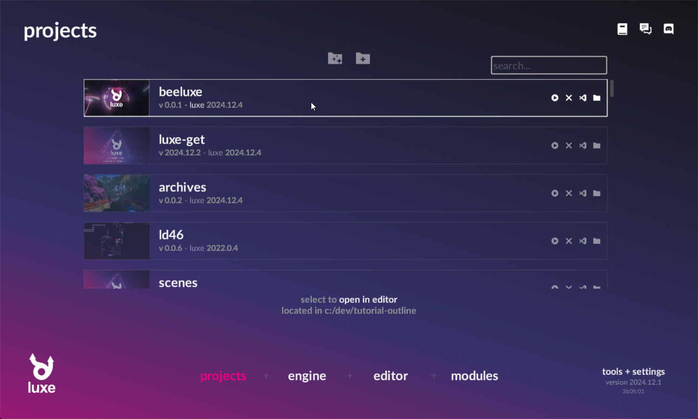

Once you click, you should see the state change to be highlighted and show *running in editor...*.

!!! tip "Open your project in the editor"

And when it launched, you should see the following screen. 

!!! note "omni"
    The sidebar on the right is called 'omni' because it's always around!

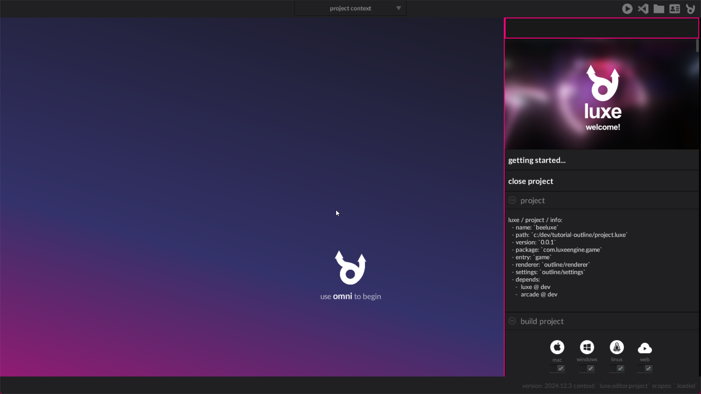

## Open a project manually

If you were to run the editor manually, you typically see the project context without omni open.
If you hover the word omni you get a hint on what to do, but this is unclear and changing soon.

When you do open omni, the sidebar, you'll find the same list of projects sorted by most recent:

Clicking the name of the project will get you to the same screen as opening via the launcher.

!!! note ""
    Sometimes it will take a second to open the project. A progress bar will be added.

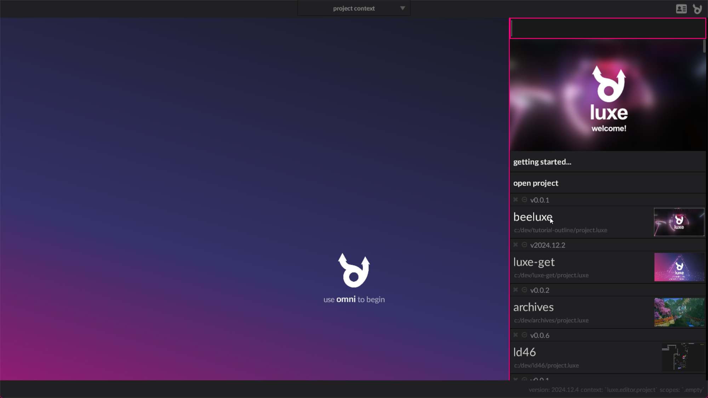

## Editor Contexts

The luxe editor is based on _contextual_ workflows.

The world editor is a _context_ that you work in when editing levels or scenes. Creating tilemaps, managing assets, changing settings: these are all different contexts, as they are contextually _different_ things, and don't overlap with editing scenes. So we put them in separate contexts that you can switch between quickly.

!!! note ""
    Contexts can be added by the game, or by modules, and allow a nice clean workflow separation for each distinct role or workflow.

You can change context in two main ways. The first is the context drop down on the top bar:

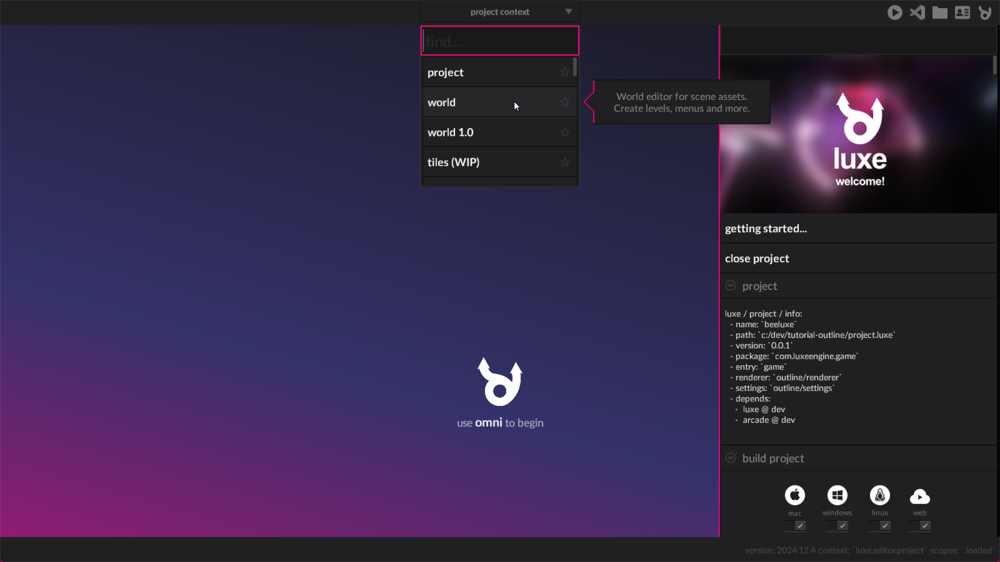

The second behaves a lot like 'alt-tab' or app switching in your OS. When you press meta + backtick ('console key') (++win+grave++ or ++cmd+grave++) it will let you cycle through contexts, and will reorder them when switching. That allows switching back and forth between two workflows quickly.

!!! note ""
    The video has flipping between contexts quickly, flashing between them.  

<video preload="auto" controls="" style="max-width:100%; width:auto; margin:auto; display:block;">  
  <source src="../../images/tutorial/editor/editor.7.mp4" type="video/mp4"></source>
</video>

!!! tip "Switch to the world context to continue"

## The world editor

A significant amount of time will probably be spent in the world editor, as this is where you build a lot of the primary content for games.

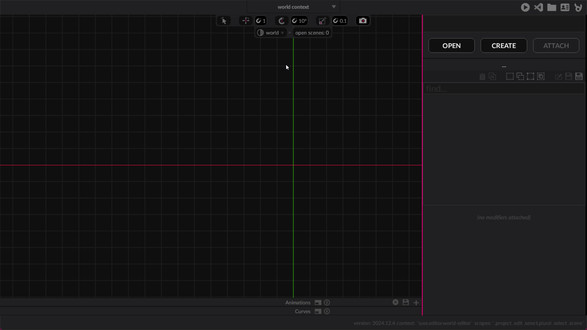

There are a three main actions that are easy to get to:

- Open content to edit
- Create new content to edit
- Attach modifiers to content being edited

### Opening a prototype

Let's open an existing piece of content from our previous tutorial: A prototype.
We first hit the Open button followed by the open button on the Prototype section:

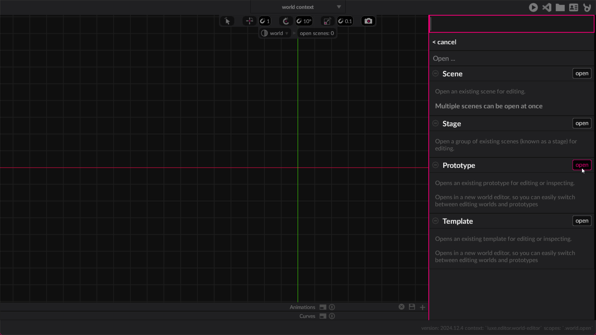

When we do that, we're presented with a list of all the prototypes in the project we could open.

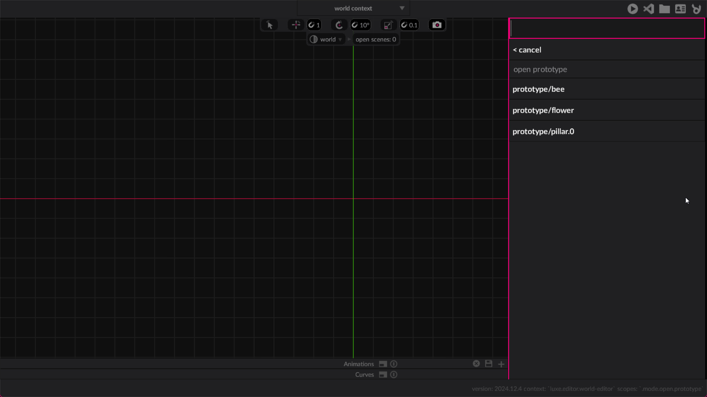

This list is searchable for quickly finding what we're after, and uses a fuzzy search to make it easier to find things:

Once we select the prototype we want (`prototype/bee` in this case) it should open for us to edit.

!!! tip "Open the bee prototype"

### The world outliner

Below the Primary buttons, we have the world outliner. This displays the content in the world and allows us to manage or modify it.

Now that we have some content, we can see a single root entity for the prototype in the outliner:

If we click on the entity in the outliner, it will select it. 

!!! tip "Select the bee entity"

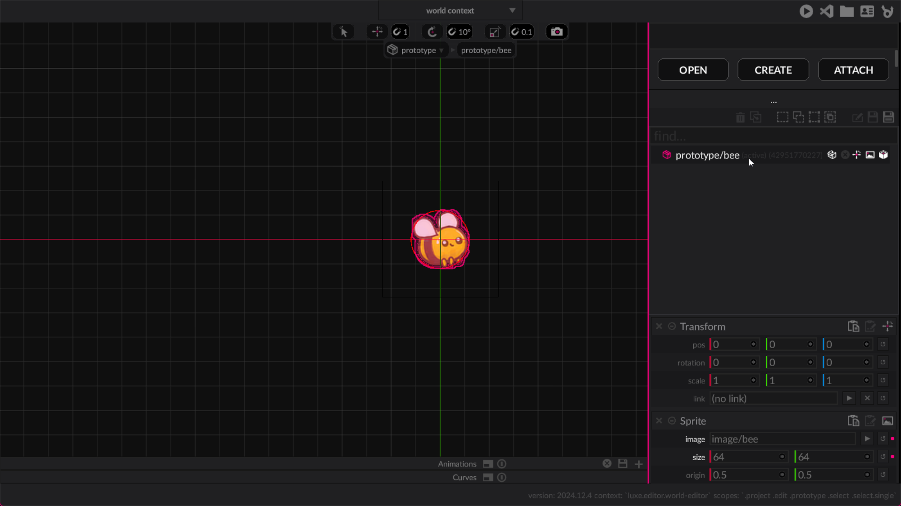

Once selected you'll see the modifiers attached to the entity, if any, below the outliner. There's options on each to copy or paste them, remove them and more. 

### Prototype editing

We're not going to edit this particular entity yet, but we came here to learn about the way protoypes are edited in isolation.

When we open a prototype (or create one) it does so in it's own world. There's a world editor for each one that's open, and one primary one for the scenes. So how do we get back to the main world editor? That's what these little breadcrumbs are here for:

If we select the left side picker, it'll drop down and show any open worlds we have at the moment, so we can switch easily between them:

!!! note ""
    Another way to get back is to open or create a scene, as you can't open a scene inside a prototype world, it'll automatically switch to the expected world to edit from. Same goes if you open a prototype again, it'll switch to the right world if already open.

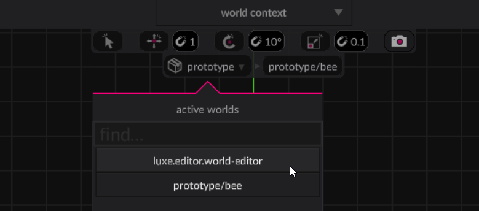

If we switch back manually we'll see the `world` selector is active on the left instead, and it shows 0 open scenes. 

!!! tip "Switch back to the main world"

You can open a scene to inspect it.  

!!! tip "Open the `scene/level` scene for editing"

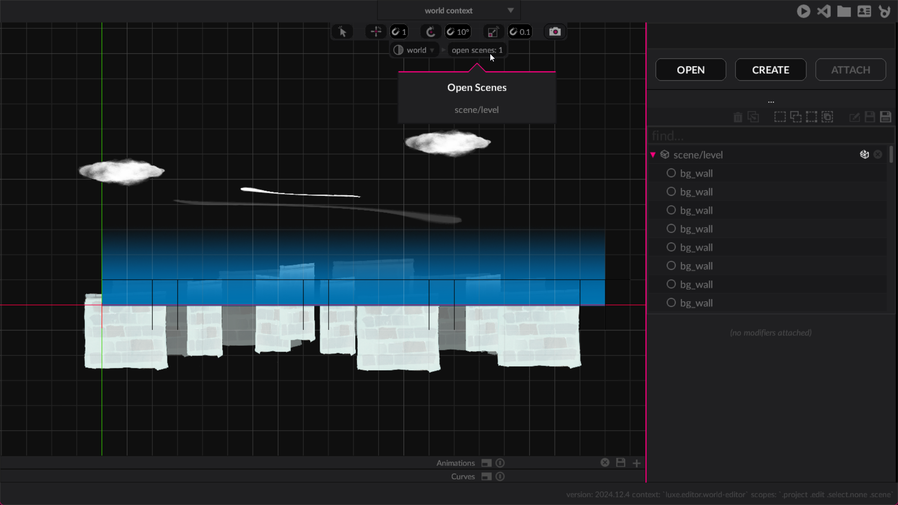

## Extending our game

!!! note "Our goal for this tutorial is to create another pillar to use in our game, so that there's more variety. The project comes with a variety of images ready to use - it's up to your imagination to decide what kind of pillar you want to make, and what kind of collision it will have"

The typical workflow in luxe is to create an entity, and then attach modifiers to it to give it meaning. 

### Creating a prototype

!!! tip " Create a prototype, and name it `pillar.1`" 

We hit the create button:

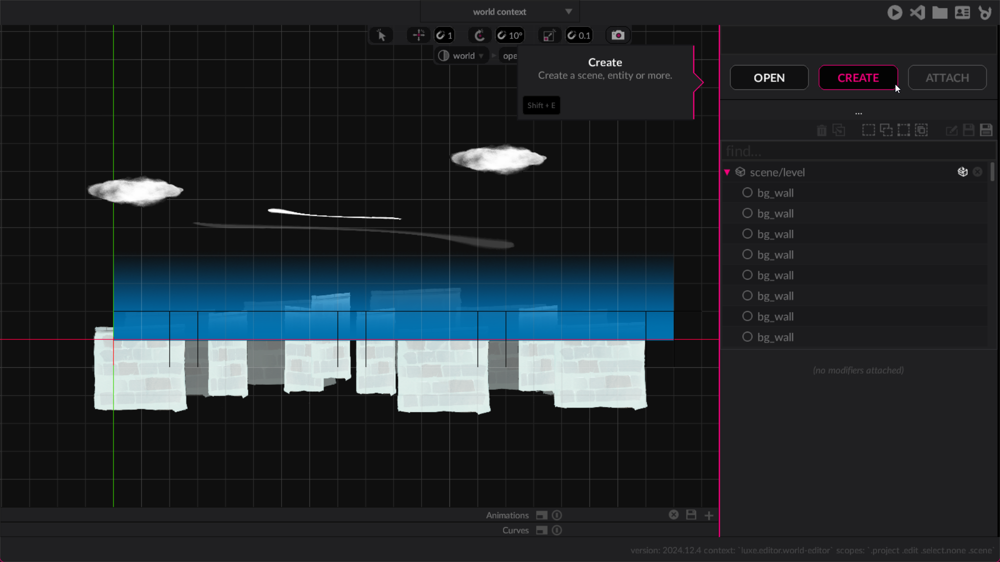

Followed by searching for or scrolling to `Prototype` and selecting create:

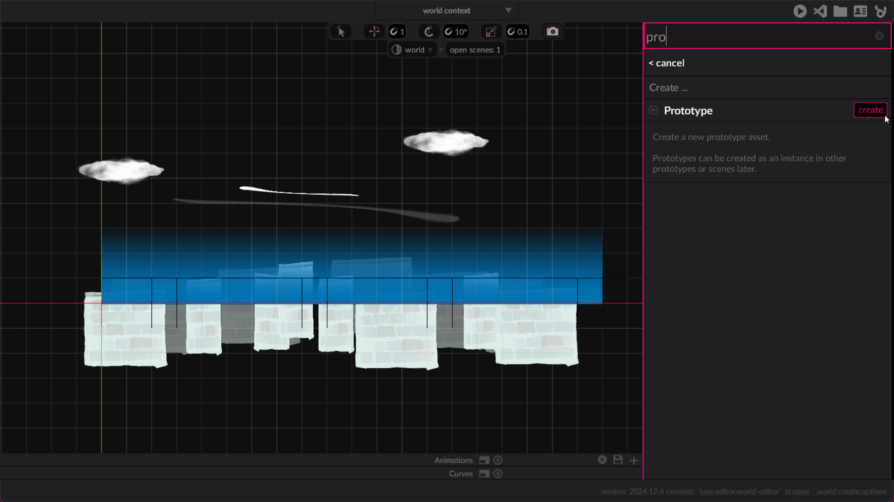

Then we type the name we want to give it. 

!!! note ""
    The default location is convention, but you can of course set that somewhere else in your project.

This brings us back to our familar empty world, a new one for this prototype.

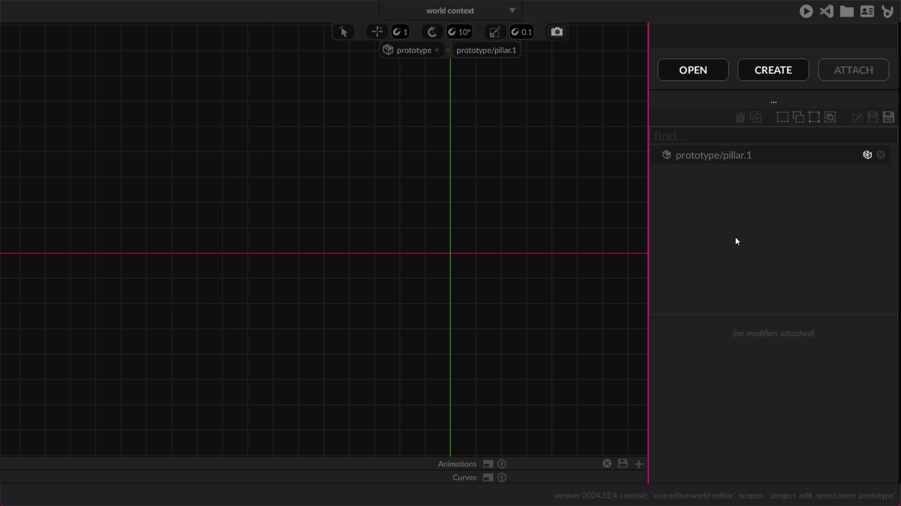

### Creating a base for the pillar

!!! tip "Create a blank entity using the create menu"

Now we'll rename out new entity. Select it first, and the rename button should highlight:

!!! bug "sometimes the rename button doesn't enable on the first click, click again or reselect to try again"

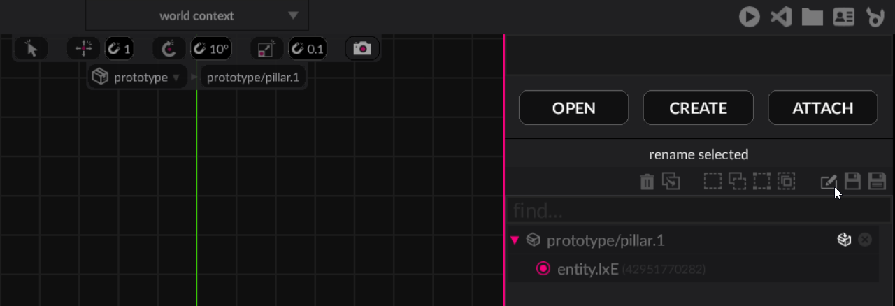

This presents an area to enter a new name:

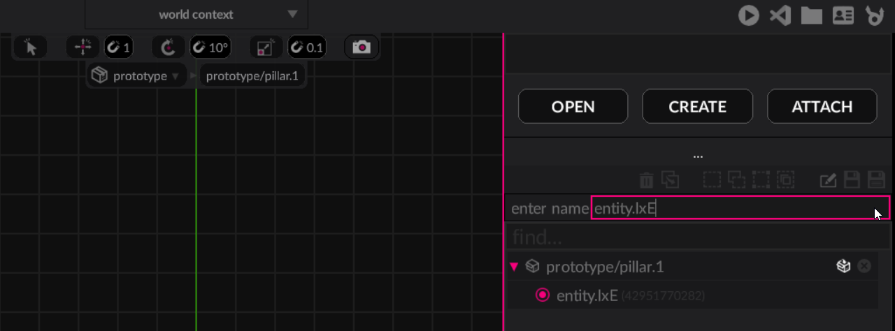

We'll call ours `base`. Hit enter when done, or click the rename icon again.

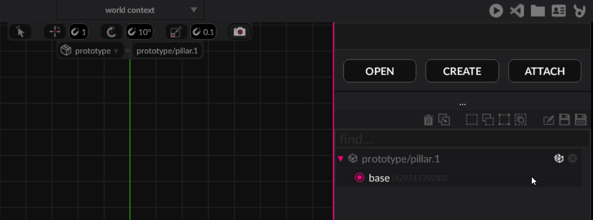

### Attaching modifiers 

!!! tip "Open the modifiers list by selecting the Attach button"

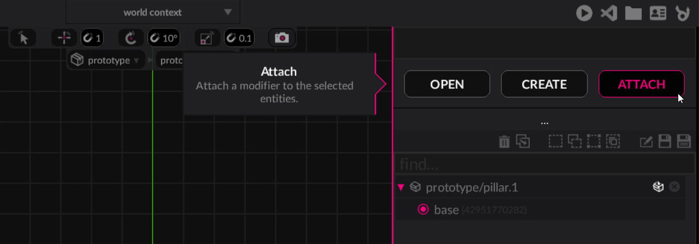

This will present you with a list of all available modifiers in your project. 

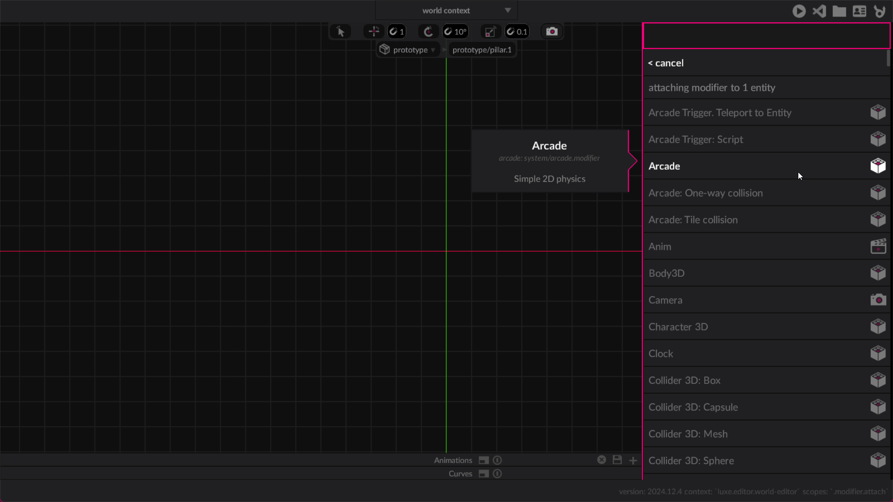

Like always, you can search in this list. We're looking for `Transform. 

!!! tip "Find and attach a `Transform` modifier by selecting it"

!!! tip "Also attach a `Sprite` modifier"

Once we've attached both a `Sprite` and a `Transform` modifier, we're ready to customize it using the inspector.

### Choosing a sprite image

Each modifier has their own properties, a sprite has an image field as the first option.

We're going to customize it to be a wall for the base of our pillar.

!!! tip "Select `image/prop/wall2` for the sprite image"

To do that we first look for the asset selector icon next to the field (It's a right arrow):

This will bring up a list of all the images the project can use:

As always this is searchable, we'll filter for wall and choose `wall2`

This will change our sprite size + visuals to match the selected image:

### Referencing the existing content

In order to know what we're going for, we're going to look at the existing pillar.

!!! tip "Open the `prototype/pillar.0` prototype for inspection."

This will take us to another world, and we'll be able to switch back and forth between them to compare notes.

The first thing we'll note, is that the wall is aligned with the red axis marker. The top of the wall is around the 0 value on the Y axis.

### Transforming entities

Because we attached a `Transform`, we can move the entity down to align (it doesn't really have to be perfect).

First select the entity, either by clicking on the visuals in the world view, or using the outliner.

Then we can press the ++w++ key to enter `Translate` mode for the Transform modifier.  

This presents us with a green and red arrow on the entity. This is the `Transform Gizmo`, and we can grab it by those red and green arrows to move things around. Since we're only interested in moving the sprite up and down, we'll grab the green arrow, and drag downwards:

Notice how the gizmo is in the center of the sprite. The sprite modifier has an alternative way to achieve what we want, by offseting the visuals instead. This is called the sprite origin, and makes the transform origin not centered. 

The values are `0 ... 1` range, where 0,0 is bottom or left, 0.5 is center, and 1 is top or right. 

If we change the y value of the origin to 1 (before we moved it), we'll notice that it is also roughly around the 0 point as well! And now the gizmo is on the top edge of the sprite. It's always situational which you use as we'll only be using this for visuals.

### Instancing a prototype

The last piece we'll do step by step, is creating an instance of the flower prototype. The flower is part of the challenge in the game, to bounce on it, so we'll create one in our pillar. The game already has a prototype created and ready to use, so all we need to do is make an instance of it.

!!! tip "Open the create menu, and select Instance"

If we open the create menu, we can find `Instance` in the list:

That will show a list of prototypes in our game, we'll pick the flower:

There we have it! It looks rather big. 

We compare again with our previous pillar, and notice that the transform scale was set to `0.4` on the x and y value.

!!! tip "Set the transform scale to `0.4 0.4 1` for the flower instance."

Now as the last step we'll cover here, we can use the white square part of the gizmo to translate on the XY axis - both at the same time.
We'll position our flower somewhere on the top of the pillar.

<video preload="auto" autoplay controls="" loop="loop" style="max-width:100%; width:auto; margin:auto; display:block;">  
  <source src="../../images/tutorial/editor/create.instance.3.mp4" type="video/mp4"></source>
</video>

## Your turn

Now it's up to you to finish the pillar and implement it into the game. Take a look at the existing one for reference in the editor. 

Move things around randomly, inspect all the properties, look at the collision modifiers. Use your imagination to make an interesting rooftop space!

## Don't forget to save

When you create content, it often isn't saved automatically so you can experiment without saving. Make sure to save often!

## Try this

!!! tip "Implement the pillar"
    In the game code, use the Random class to randomly pick a pillar to spawn instead of always spawning the same one.

!!! tip "Make a few pillars"
    Make a variety of pillars, some easy, some hard, experiment with multiple flowers, no flowers, tall or short collision etc.

!!! tip "Use pillars as difficulty"
    If you make several pillars, make them spawn progressively so it gets progressively more difficult. Include occasional easier ones for a rest period.

!!! tip "Customize the scene"
    Edit the `scene/level` scene to create various levels. If you implemented score, try change levels every 10 points. Try changing the sky color over time using the Sprite modifier HSV setting.
