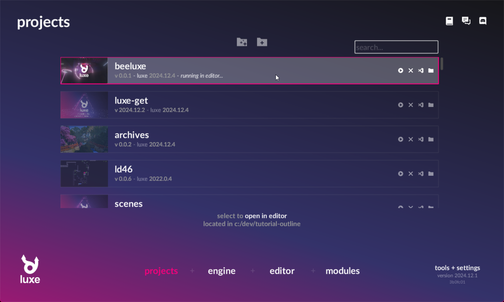
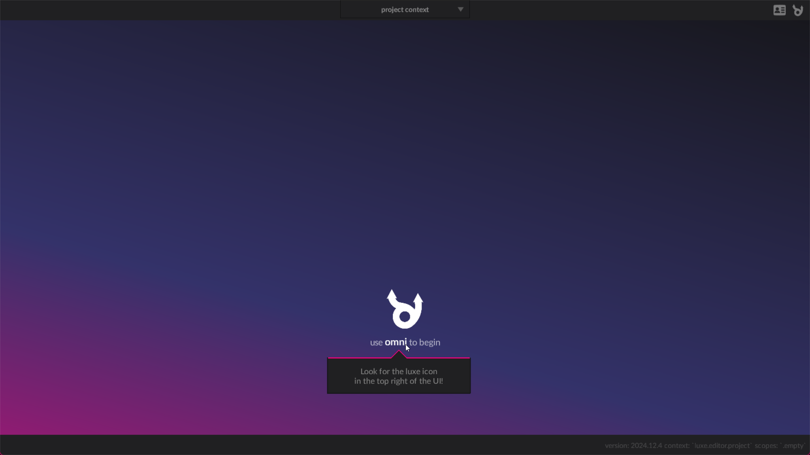

{width="96em"}

# The luxe editor

This tutorial is an introduction to working with the luxe editor, not a complete guide.

!!! example "outcome"
    In this tutorial we'll **use the luxe editor** to add content to our bee game.   
    We'll walk through opening a project, creating a scene, creating a prototype and more. 

## Opening a project via the launcher

The typical workflow for opening a project in the editor is to click the project in the luxe launcher.
As you hover a project it will show the path and 'select to open in editor' at the bottom.

Once you click, you should see the state change to be highlighted and show *running in editor...*.

And when it launched, you should see the following screen. 

!!! note "omni"
    The sidebar on the right is called 'omni' because it's always around!

## Open a project manually

If you were to run the editor manually, you typically see the project context without omni open.
If you hover the word omni you get a hint on what to do, but this is unclear and changing soon.

When you do open omni, the sidebar, you'll find the same list of projects sorted by most recent:

Clicking the name of the project will get you to the same screen as opening via the launcher.

!!! note ""
    Sometimes it will take a second to open the project. A progress bar will be added.

## Editor Contexts

The luxe editor works based on _contextual_ workflows.

The world editor is context that you work in when editing levels or scenes. Creating tilemaps, managing assets, changing settings: these are all contextually _different_ things, and don't overlap with editing scenes. So, we put them in separate contexts that you can flip between quickly.

!!! note ""
    Contexts can be added by the game, or by modules, and allow a nice clean workflow separation for each distinct role or workflow.

You can change context in two main ways. The first is the context drop down on the top bar:

The second behaves a lot like 'alt-tab' or app switching in your OS. When you press meta + backtick ('console key') (++win+grave++ or ++cmd+grave++) it will let you cycle through contexts, and will reorder them when switching. That allows switching back and forth between two workflows quickly.

!!! note ""
    The video has flipping between contexts quickly, which flashes as they change.  

<video preload="auto" controls="" style="max-width:100%; width:auto; margin:auto; display:block;">  
  <source src="../../images/tutorial/editor/editor.7.mp4" type="video/mp4"></source>
</video>
