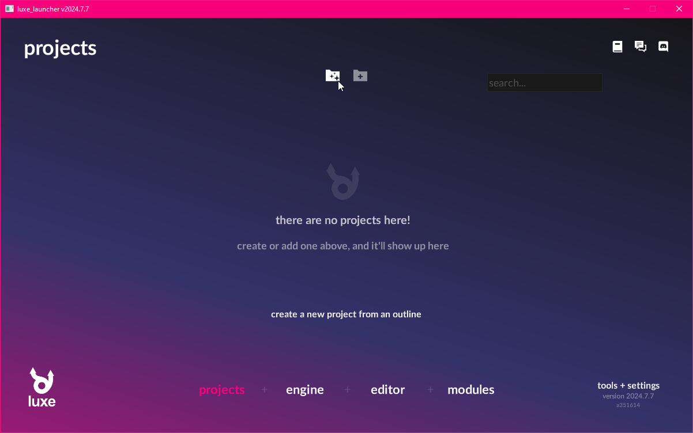
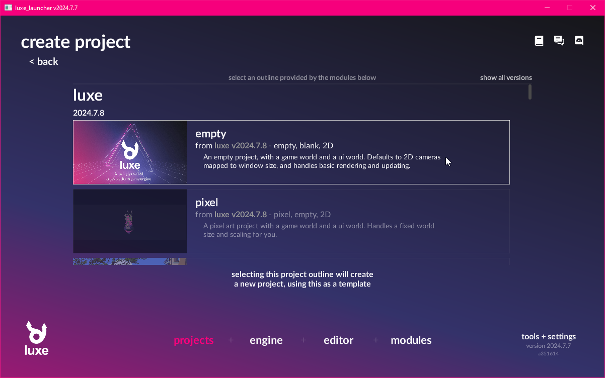
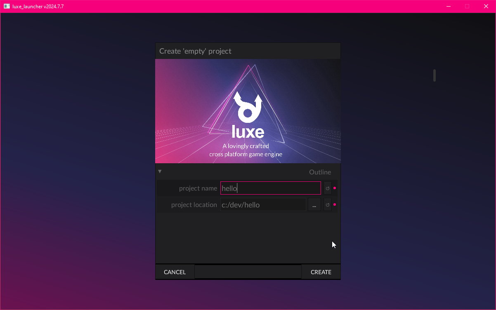
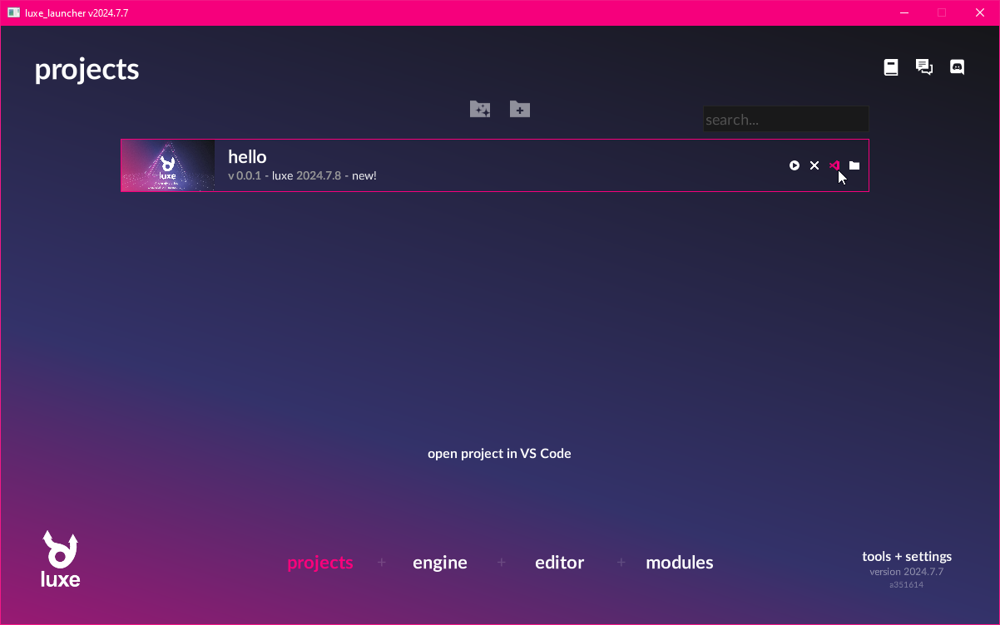
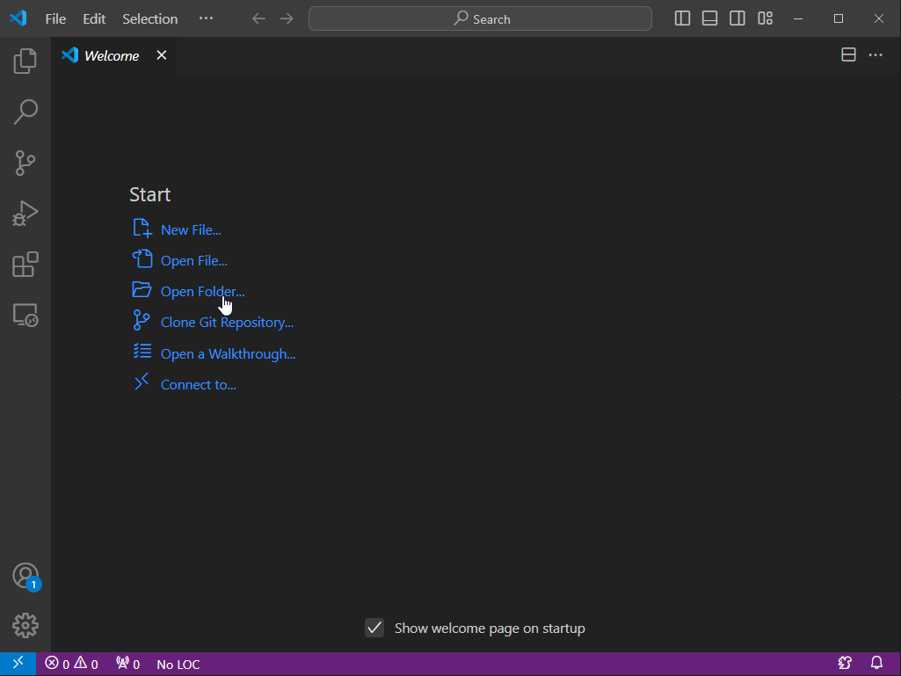
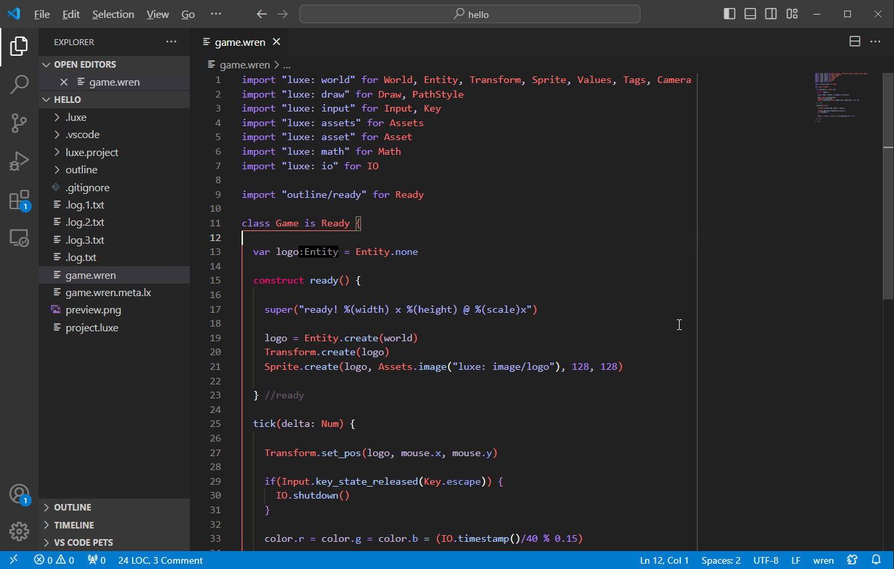
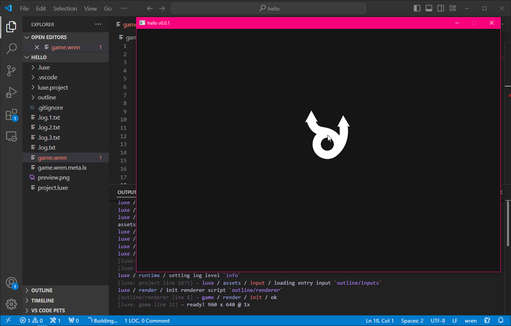

{width="96em"}

# Hello luxe
An introduction to working with luxe.

!!! example "outcome"
    In this step we'll **create a new project using the launcher**.   
    Then, we'll see how to open + run it via Visual Studio Code.

## Creating a new project

In the launcher, we'll find a create button in the middle near the top of the window. 
Click this to choose a project outline to use for the new project.

For this tutorial, we'll make a new project using the `empty` outline.
Select it to be taken to the outline config page. 

In this outline, there aren't many settings! Just a name, and a location to save the project.

!!! note "folder"
    **Create a new folder**, and then select it. You need a **empty folder** for your project root.  

Once you hit create, it will show the project in the project list. 

## Running the project

For the next step, we'll want to open the project in Visual Studio Code.
You can use the small icon that is highlighted in the above image, or use `Open Folder...` in Visual Studio Code, and select the same folder you just created.

Once open, you should click on `game.wren` on the side so we can run the project.

!!! tip "build + run (default keys)"
    Press ++ctrl+shift+b++ for **Windows/Linux**    
    Press ++cmd+shift+b++ for **MacOS** 

The first run might take a little bit to compile all the module content, but the next run will be much quicker. Try it!

If nothing went wrong you should see a window with the luxe logo that follows the mouse. 

## `game.wren` 

Your main entry point for your game is a Wren script called `game.wren`.

In that file you can see the `ready` function, and the `tick` function. This is the entry point of your game and controls what happens next.
Here is where you'll load a level, or make a menu, or code the whole game.

In the next tutorial, we'll learn about input and making a small game.

