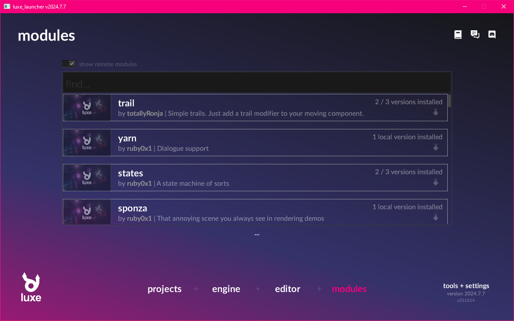
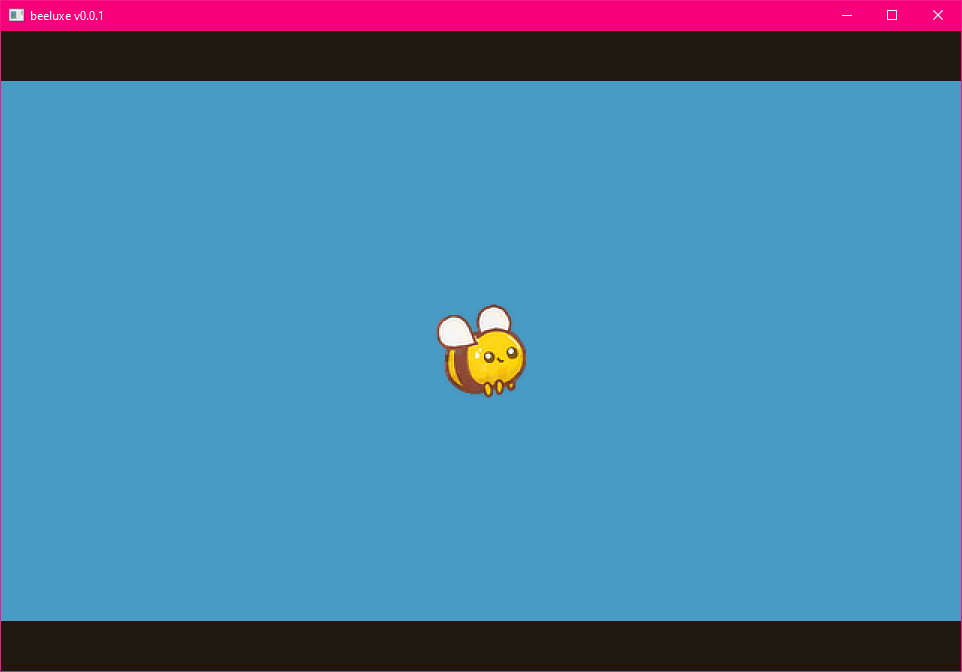
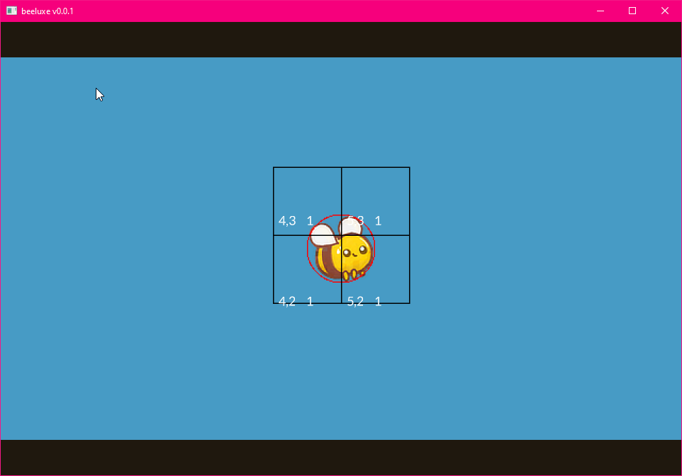
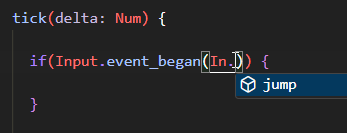

{width="96em"}

# The luxe world

An introduction to working with the luxe world APIs.

!!! example "outcome"
    In this tutorial we'll **use the World api** to put something on screen.   
    We'll also use a module, called **Arcade** for handling physics + collision.
    We'll load scenes and create prototype instances to populate a world,
    and create a custom **Modifier**. 

    We'll make a game where you play as a bee, and have to bounce on flowers.

## Creating the project

For this tutorial, create a new project using the launcher,  
and when choosing an outline, **select the tutorial project outline**.
This project is pre-configured so we can dive right in.

!!! tip "Create a new project from the tutorial project outline"

## Installing a module

In order to run our project, we first need to install a module. If you don't, you'll get errors!

You can use the launcher to install modules. Head over to the module page, and search for the arcade module.
Once you find it, you can click through, and click the download arrow. 

The project is configured to use version `0.0.23`, install that version.

!!! tip "Install `arcade` version `0.0.23` to continue!"




## Using the module in a project

If you look inside of the `luxe.project/modules.lx` file you'll find the `luxe` and `arcade` modules referenced by version. 
You can use the launcher to add a module to the project using the `+` icon, or you can manually add it to this file.

In this case, it's already there from the outline, so let's move on!

## The `Transform` API

In the `Draw` tutorial, we drew a circle in the center of the screen using an immediate style API.

With the world system, we can create things in the world that will continue to draw as long as they're alive.
An Entity in the world can also have modifiers attached that perform logic, and run gameplay code.

!!! note "We saw this in the original empty project template, right before deleting it!"

To create an entity, we do `Entity.create(world)` - this gives us a blank entity, and is ready to be modified to give it meaning.

The first thing we'll do, is attach a `Transform` modifier. Modifiers use the same `create` pattern, 
and some modifiers add `create` methods with convenience arguments, like we'll see below from `Sprite.create`.

Let's create a new `player` variable in our game, and then inside ready we'll create an entity, attach a transform and a sprite to it.

??? note "`world_width/world_height` ?"
    Since our tutorial outline is based on the pixel outline, we have a fixed world size that will auto scale. This size is set in `outline/settings.settings.lx` and the size of the world is available in `world_width` and `world_height`. This is different from `width`/`height`, which is the window size. 

!!! tip "add the highlighted code to `ready`"

```js hl_lines="6 14 15 16"
class Game is Ready {

  var random = Random.new()
  var draw: Draw = null

  var player = Entity.none

  construct ready() {

    super("ready! %(width) x %(height) @ %(scale)x")

    draw = Draw.create(World.render_set(world))

    player = Entity.create(world, "player")
    Transform.create(player, world_width/2, world_height/2)
    Sprite.create(player, Assets.image("image/bee"), 64, 64)

  } //ready
```

And just like that, we have our player in the middle of the screen.



## Arcade physics

The `arcade` module provides collision + physics for a wide range of games, and comes with a bunch of ready to use tools. 

The first important one is the Arcade modifier, which gives an entity a collider shape, and allows you to choose flags like whether it's solid or a trigger, what shape it is, change the velocity and more. It also gives us a callback for when we collide with something, so we can implement a response to overlapping or colliding with something. 

### Arcade import   

We're gonna use the `Arcade` modifier from the `arcade` module to make our bee interact with the world. We'll import that module into the top of our `game.wren` code like this:

```js
import "arcade: system/arcade.modifier" for Arcade, CollisionEvent, ShapeType
```

You'll see the `arcade` prefix on the import, this should be familiar because `luxe` is also a module, and we've seen the `luxe: color` import before. Imports without a prefix are project local.

### Attach an arcade modifier

Much like a `Transform` or `Sprite`, we can attach `Arcade` to an entity using the same create pattern.
Let's tidy up and make a `create_player()`  function, and move our player code into it.

!!! tip "add the highlighted changes"

```js hl_lines="7 11 12 13 14 15 16 17 18 19 20 21 22"
construct ready() {

  super("ready! %(width) x %(height) @ %(scale)x")

  draw = Draw.create(World.render_set(world))

  create_player()

} //ready

create_player() {

  player = Entity.create(world, "player")
  Transform.create(player, world_width/2, world_height/2)
  Sprite.create(player, Assets.image("image/bee"), 64, 64)

  Arcade.create(player)
  Arcade.set_shape_type(player, ShapeType.circle)
  Arcade.set_radius(player, 32)
  
}
```

If we run this, it will look identical to before! That's because there's no gravity or anything on our entity. 
So how do we know it's working? How do we know the radius matches? We can ask `Arcade` to debug draw the physics state. 

!!! tip "add the highlighted line to `create_player`"

```js hl_lines="3"
...
Arcade.set_radius(player, 32)
Arcade.set_debug_draw_enabled(world, true)
```



Gravity is a constant acceleration, so we can use the `Arcade.set_acc` tool to add a downward acceleration. 
The value is relative to your world size, and is game specific. For this game, we'll pick `-200` as that feels good.
You can make it whatever you want!

!!! tip "add the highlighted line to `create_player`"

```js hl_lines="3"
...
Arcade.set_radius(player, 32)
Arcade.set_acc(player, [0, -200])
Arcade.set_debug_draw_enabled(world, true)
```

If you run this now, you should see the bee falling off the bottom of the world!

<video preload="auto" autoplay controls muted playinsline loop="loop" style="max-width:100%; width:auto; margin:auto; display:block;">  
  <source src="../../images/tutorial/world/arcade.2.mp4" type="video/mp4"></source>
</video>

## Loading a scene 

Our outline includes a scene that has been created for us. This scene includes some background details, and a floor collider which will keep our bee on screen.

A scene is a kind of data based asset, a container for pre-configured entities with their modifiers already attached. 
A particular scene can only be loaded once into the same world, but you can load multiple scenes into the same world.
This makes them useful as a tool to layer or keep things loaded in the world, and much more.

!!! example "Scene assets"
    Scenes are typically created with the luxe editor, but they're simple data inside of a folder.
    Take a look inside the `scene/level.scene/` folder, and look inside any `.entity.lx` file!

With `Scene.create` we can load a scene from an asset. We'll use the `Asset.scene(id)` to grab the asset handle of the scene.

!!! note "Work In Progress"
    The `Scene` API is available via `import "luxe: world/scene" for Scene` and is imported already.

    Some assets, like the image above, use the older `Assets.image(id)` API (plural), while the scene and newer assets use `Asset.scene(id)` API (singular). The reason both exist is because we're moving to the new system and some assets aren't done moving yet.

Just before we create our player, we'll load our level scene into the world.

!!! tip "Add the highlighted line in `ready`"

```js hl_lines="7"
construct ready() {

  super("ready! %(width) x %(height) @ %(scale)x")

  draw = Draw.create(World.render_set(world))

  Scene.create(world, Asset.scene("scene/level"))

  create_player()

} //ready
```

With that, we'll see the clouds, some buildings, a gradient and we'll see the floor collider. The bee will bounce off the floor, and we're ready for the next step.

<video preload="auto" autoplay controls muted playinsline loop="loop" style="max-width:100%; width:auto; margin:auto; display:block;">  
  <source src="../../images/tutorial/world/arcade.3.mp4" type="video/mp4"></source>
</video>

## Named input events

In the first tutorial, we used `Input.key_state_released` to directly query a key. 
This is great for quick prototypes but doesn't allow multiple keys, gamepads, or mouse inputs easily.

For that we'll need to use **named input events**. A named input event is what it sounds like, a name assigned to one or more inputs! 
We have a few of these already defined by our project, if you look inside of `outline/input.inputs.lx` you'll see this:

```js
jump = {
  keys = ["key_x", "up", "key_w", "space"]
  mouse = ["left"]
  gamepad = [0]
}
```

If we query this instead of the individual key, any of those inputs will trigger the event. 
Since these are named events we refer to them by a string value, "jump", but using strings all over
our project can lead to code that can be difficult to change.

Instead, what we'll do is make an enum-like class that makes our code easier to use, and gives us code completion and errors if we spell it wrong. The pattern is a static function that returns a string, so we'll make one called `In` and a method called `jump`, so we can use `In.jump` to refer to the event name.



```js hl_lines="1 2 3"
class In {
  static jump { "jump" }
}

class Game is Ready {
...
```

## Implementing jump

Now inside the `tick` method, we'll add a jump method to make the bee jump. To do that, we'll get the current bee velocity, add some to it, and then set it back. We'll also set the x velocity to 0, because we never want the bee to move horizontally.

```js hl_lines="1 2 3 4 5 6 7 8 9 10 14 15 16"
jump() {

  var velocity = Arcade.get_vel(player)

  velocity.x = 0
  velocity.y = velocity.y + 150

  Arcade.set_vel(player, velocity)

} //jump

tick(delta: Num) {

  if(Input.event_began(In.jump)) {
    jump()
  }
  
...
```

Now when we run the game and press ++up++, ++w++, ++x++ or ++space++ the bee will jump upward.

<video preload="auto" autoplay controls muted playinsline loop="loop" style="max-width:100%; width:auto; margin:auto; display:block;">  
  <source src="../../images/tutorial/world/arcade.4.mp4" type="video/mp4"></source>
</video>

## Player position and speed

The bee jump is a little easy to go off screen, so we'll make a minor change to `create_player()` to give them a max speed, and we'll also enforce that the bee is always in the same position on screen, about a quarter of the way in.

```js hl_lines="4"
create_player() {

  Arcade.set_acc(player, [0, -200])
  Arcade.set_max_speed(player, 150)
  Arcade.set_debug_draw_enabled(world, true)

}
```

Inside `tick`, we'll set the player position to `world_width / 4` every frame.

```js hl_lines="3"
tick(delta: Num) {

  Transform.set_pos_x(player, world_width / 4)
```

Now when we play, we have a couple jumps before we leave the screen, and our bee is in a nice place for the game.

<video preload="auto" autoplay controls muted playinsline loop="loop" style="max-width:100%; width:auto; margin:auto; display:block;">  
  <source src="../../images/tutorial/world/arcade.5.mp4" type="video/mp4"></source>
</video>